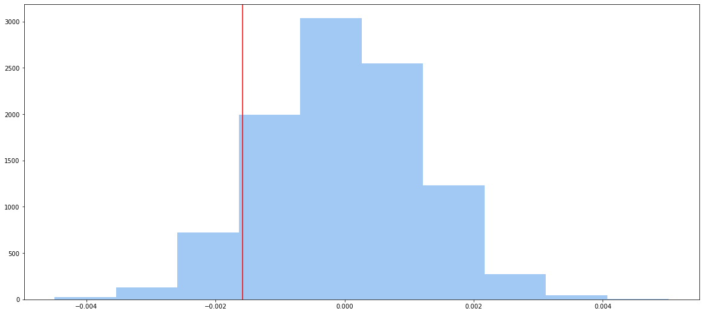

# AB Testing On Landing Page Data

We will try to analyse which landing page version is more popular from the data gathered.


```python
import numpy as np
import pandas as pd
import seaborn as sns
import matplotlib.pyplot as plt
import scipy.stats as stats
import statsmodels.api as sm
from IPython.display import display
sns.set_palette("pastel")
plt.rcParams["figure.figsize"] = (20, 9)
```

### Load dataset


```python
df = pd.read_csv('data/ab_data.csv')
```

### Display the usual data about this dataset


```python
display(df.head())
```


<div>
<style scoped>
    .dataframe tbody tr th:only-of-type {
        vertical-align: middle;
    }

    .dataframe tbody tr th {
        vertical-align: top;
    }

    .dataframe thead th {
        text-align: right;
    }
</style>
<table border="1" class="dataframe">
  <thead>
    <tr style="text-align: right;">
      <th></th>
      <th>user_id</th>
      <th>timestamp</th>
      <th>group</th>
      <th>landing_page</th>
      <th>converted</th>
    </tr>
  </thead>
  <tbody>
    <tr>
      <th>0</th>
      <td>851104</td>
      <td>2017-01-21 22:11:48.556739</td>
      <td>control</td>
      <td>old_page</td>
      <td>0</td>
    </tr>
    <tr>
      <th>1</th>
      <td>804228</td>
      <td>2017-01-12 08:01:45.159739</td>
      <td>control</td>
      <td>old_page</td>
      <td>0</td>
    </tr>
    <tr>
      <th>2</th>
      <td>661590</td>
      <td>2017-01-11 16:55:06.154213</td>
      <td>treatment</td>
      <td>new_page</td>
      <td>0</td>
    </tr>
    <tr>
      <th>3</th>
      <td>853541</td>
      <td>2017-01-08 18:28:03.143765</td>
      <td>treatment</td>
      <td>new_page</td>
      <td>0</td>
    </tr>
    <tr>
      <th>4</th>
      <td>864975</td>
      <td>2017-01-21 01:52:26.210827</td>
      <td>control</td>
      <td>old_page</td>
      <td>1</td>
    </tr>
  </tbody>
</table>
</div>


```python
display(df.info())
```

    <class 'pandas.core.frame.DataFrame'>
    RangeIndex: 294478 entries, 0 to 294477
    Data columns (total 5 columns):
     #   Column        Non-Null Count   Dtype 
    ---  ------        --------------   ----- 
     0   user_id       294478 non-null  int64 
     1   timestamp     294478 non-null  object
     2   group         294478 non-null  object
     3   landing_page  294478 non-null  object
     4   converted     294478 non-null  int64 
    dtypes: int64(2), object(3)
    memory usage: 11.2+ MB


    None


```python
display(df.columns)
```


    Index(['user_id', 'timestamp', 'group', 'landing_page', 'converted'], dtype='object')


```python
display(df.nunique())
```


    user_id         290584
    timestamp       294478
    group                2
    landing_page         2
    converted            2
    dtype: int64


```python
display(df.describe())
```


<div>
<style scoped>
    .dataframe tbody tr th:only-of-type {
        vertical-align: middle;
    }

    .dataframe tbody tr th {
        vertical-align: top;
    }

    .dataframe thead th {
        text-align: right;
    }
</style>
<table border="1" class="dataframe">
  <thead>
    <tr style="text-align: right;">
      <th></th>
      <th>user_id</th>
      <th>converted</th>
    </tr>
  </thead>
  <tbody>
    <tr>
      <th>count</th>
      <td>294478.000000</td>
      <td>294478.000000</td>
    </tr>
    <tr>
      <th>mean</th>
      <td>787974.124733</td>
      <td>0.119659</td>
    </tr>
    <tr>
      <th>std</th>
      <td>91210.823776</td>
      <td>0.324563</td>
    </tr>
    <tr>
      <th>min</th>
      <td>630000.000000</td>
      <td>0.000000</td>
    </tr>
    <tr>
      <th>25%</th>
      <td>709032.250000</td>
      <td>0.000000</td>
    </tr>
    <tr>
      <th>50%</th>
      <td>787933.500000</td>
      <td>0.000000</td>
    </tr>
    <tr>
      <th>75%</th>
      <td>866911.750000</td>
      <td>0.000000</td>
    </tr>
    <tr>
      <th>max</th>
      <td>945999.000000</td>
      <td>1.000000</td>
    </tr>
  </tbody>
</table>
</div>


#### Check for null values


```python
assert df.isnull().values.sum() == 0, 'error null values'
display('no null value')
```


    'no null value'


# Clean up data and remove duplcates


```python
display(df.query('group == "treatment"').shape[0])
display(df.query('landing_page == "new_page"').shape[0])
```


    147276


    147239


#### Drop rows that do not have the correct data


```python
false_index = df[((df['group'] == 'treatment') == (df['landing_page'] == 'new_page')) == False].index
display(false_index.shape[0])
df2 = df.drop(false_index)
```


    3893


```python
display(df2.query('group == "treatment"').shape[0])
display(df2.query('landing_page == "new_page"').shape[0])
assert df2[((df2['group'] == 'treatment') == (df2['landing_page'] == 'new_page')) == False].shape[0] == 0
```


    145311


    145311


#### Total unique users


```python
display(df2['user_id'].nunique())
```


    290584


#### Check duplicated users


```python
dup_u = df2[df2.duplicated(['user_id'], keep=False)]
print(dup_u)
```

          user_id                   timestamp      group landing_page  converted
    1899   773192  2017-01-09 05:37:58.781806  treatment     new_page          0
    2893   773192  2017-01-14 02:55:59.590927  treatment     new_page          0


#### Drop the first duplicate user


```python
df2.drop(dup_u.index[0], inplace=True)
dup_u = df2[df2.duplicated(['user_id'], keep=False)]
assert len(dup_u) == 0
```

#### Overall conversion rate


```python
p_overall = len(df2.query('converted == 1')) / len(df2)
display(p_overall)
```


    0.11959708724499628


#### Control Group Conversion Rate


```python
p_control = len(df2.query('group == "control" & converted == 1')) / len(df2.query('group == "control"'))
display(p_control)
```


    0.1203863045004612


#### Treatment Group Conversion Rate


```python
p_treat = len(df2.query('group == "treatment" & converted == 1')) / len(df2.query('group == "treatment"'))
display(p_treat)
```


    0.11880806551510564


#### The probability of landing on the new page


```python
p_new = len(df2.query('landing_page == "new_page"')) / len(df2)
display(p_new)
```


    0.5000619442226688


## A/B Testing

We need to do A/B testing by comparing two independent population proportions

#### Hypothesis<br>
* H0: p_old = p_new<br>
* H1: p_new - p_old > 0

At 5% significance level the test statistics would have to larger than critical value of


```python
critical_val = stats.norm.ppf(1-(0.05/2))
print(critical_val)
```

    1.959963984540054


#### Method 1 - by calculation


```python
n_old = df2.query('group == "control"').shape[0]
n_old_converted = df2.query('group == "control" & converted == 1').shape[0]
n_new = df2.query('group == "treatment"').shape[0]
n_new_converted = df2.query('group == "treatment" & converted == 1').shape[0]
print(n_old)
print(n_new)
print(n_old_converted)
print(n_new_converted)
```

    145274
    145310
    17489
    17264


```python
p_c = (n_old_converted + n_new_converted) / (n_old + n_new)
print(p_c)
```

    0.11959708724499628


```python
p_old = n_old_converted / n_old
p_new = n_new_converted / n_new
```


```python
test_stat = (p_new - p_old) / np.sqrt(p_c * (1-p_c) * (1/n_old+1/n_new))
print(test_stat)
```

    -1.3109241984234394


```python
p_value = stats.norm.sf(test_stat)
print(p_value)
```

    0.9050583127590245


### Method 2 - by statistical package


```python
z_score, p_value = sm.stats.proportions_ztest([n_new_converted, n_old_converted], [n_new, n_old], alternative='larger')
print(z_score, p_value)
```

    -1.3109241984234394 0.9050583127590245


### Method 3 - by sampling under the null hypothsis

conversion rate under the null hypothesis


```python
p_null = len(df2.query('converted == 1')) / len(df2)
p_old = p_null
p_new = p_null
p_diffs = list()
for i in range(0, 10000):
    n_old_converted = np.random.choice([1, 0], size=n_new, replace=True, p=(p_old, 1-p_old))
    n_new_converted = np.random.choice([1, 0], size=n_new, replace=True, p=(p_new, 1-p_new))
    p_diffs.append(n_new_converted.mean() - n_old_converted.mean())
```


```python
observed_diff = p_treat - p_control
p_diffs = np.array(p_diffs)
null_vals = np.random.normal(0, p_diffs.std(), p_diffs.size)
plt.hist(null_vals)
plt.axvline(observed_diff, color='r')
plt.show()
p_value = (p_diffs > observed_diff).mean()
print(p_value)
```


    

    


    0.908


* test statistics is lower than critical value<br>
* p value is larger than 0.05<br>
* There is not enough evidence to reject the null hypothesis
