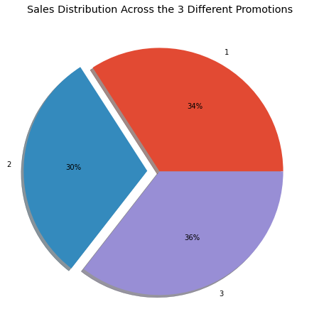
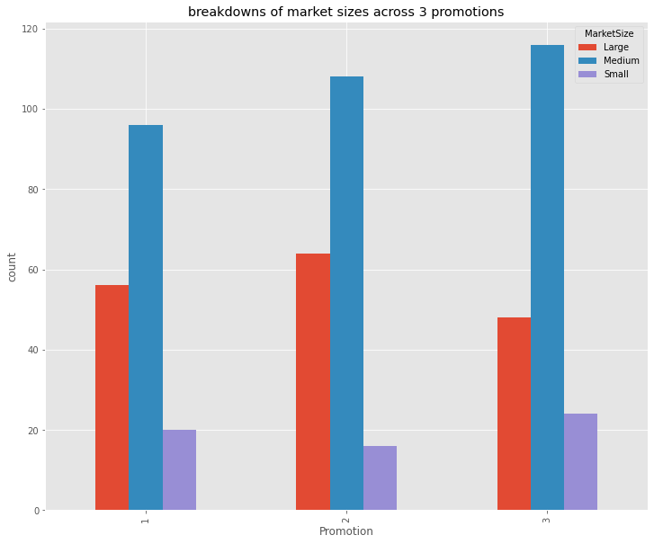
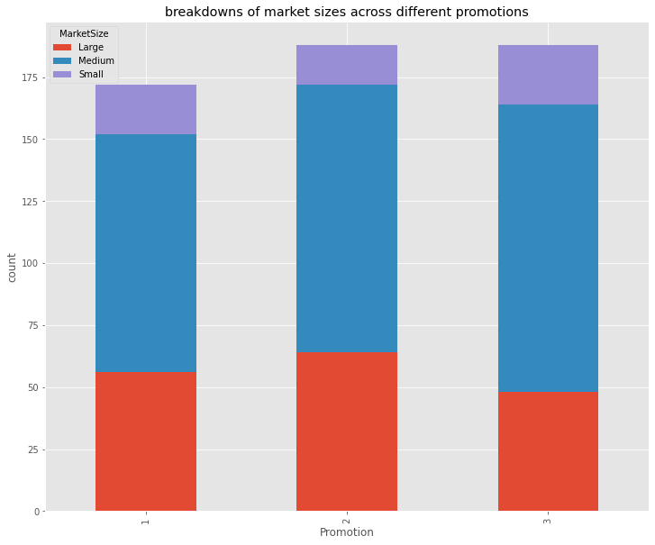
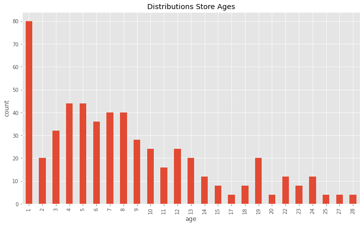
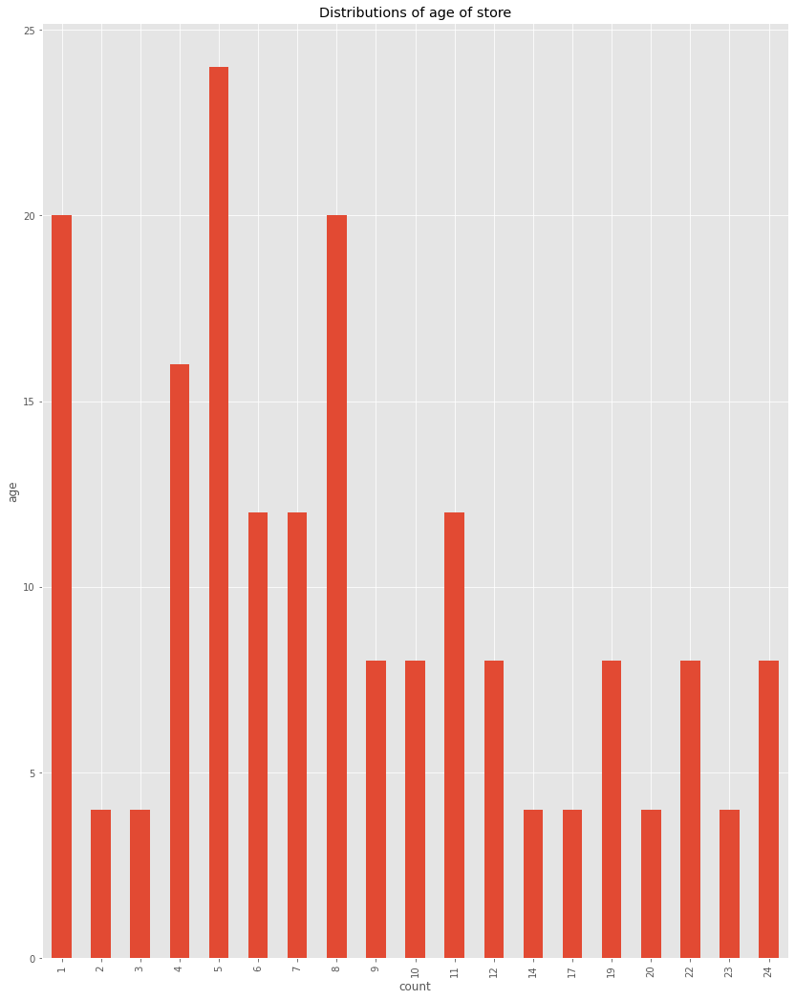
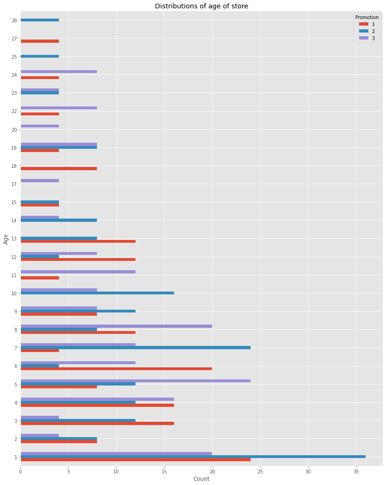
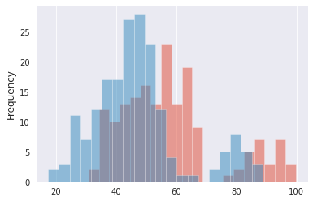
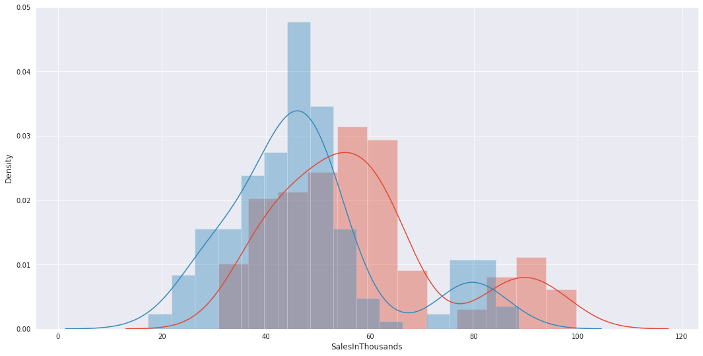
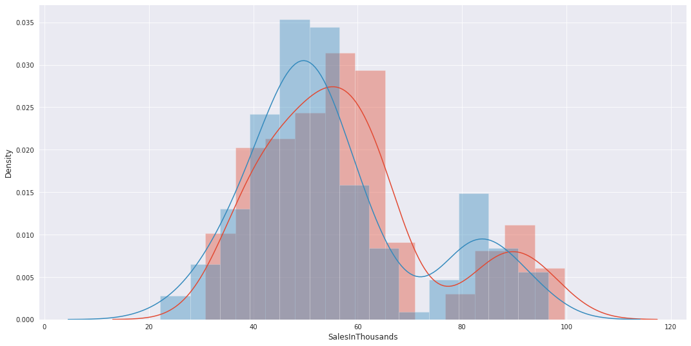

# A/B Testing Marketing Promotion Analysis

We want to find out which promotion was the most effective?

The data set consists of 548 entries and the columns are the following:
- MarketId: an inhouse tag used to describe market types, we won't be using it
- AgeOfStores: Age of store in years (1–28). The mean age of a store is 8.5 years.
- LocationID: Unique identifier for store location. Each location is identified by a number. The total number of stores is 137.
- Promotion: One of three promotions that were tested (1, 2, 3). We don’t really know the specifics of each promotion.
- Sales in Thousands: Sales amount for a specific LocationID, Promotion and week. The mean amount of sales are 53.5 thousand dollars.
- Market size: there are three types of market size: small, medium and large.
- Week: One of four weeks when the promotions were run (1–4).


```python
import pandas as pd
import matplotlib.pyplot as plt
import seaborn as sns
from scipy.stats import skew, norm, probplot
sns.set_style('darkgrid')
from scipy import stats
```


```python
df = pd.read_csv('data/WA_Fn-UseC_-Marketing-Campaign-Eff-UseC_-FastF.csv')
df.head(10)
```


<div>

<table border="1" class="dataframe">
  <thead>
    <tr style="text-align: right;">
      <th></th>
      <th>MarketID</th>
      <th>MarketSize</th>
      <th>LocationID</th>
      <th>AgeOfStore</th>
      <th>Promotion</th>
      <th>week</th>
      <th>SalesInThousands</th>
    </tr>
  </thead>
  <tbody>
    <tr>
      <th>0</th>
      <td>1</td>
      <td>Medium</td>
      <td>1</td>
      <td>4</td>
      <td>3</td>
      <td>1</td>
      <td>33.73</td>
    </tr>
    <tr>
      <th>1</th>
      <td>1</td>
      <td>Medium</td>
      <td>1</td>
      <td>4</td>
      <td>3</td>
      <td>2</td>
      <td>35.67</td>
    </tr>
    <tr>
      <th>2</th>
      <td>1</td>
      <td>Medium</td>
      <td>1</td>
      <td>4</td>
      <td>3</td>
      <td>3</td>
      <td>29.03</td>
    </tr>
    <tr>
      <th>3</th>
      <td>1</td>
      <td>Medium</td>
      <td>1</td>
      <td>4</td>
      <td>3</td>
      <td>4</td>
      <td>39.25</td>
    </tr>
    <tr>
      <th>4</th>
      <td>1</td>
      <td>Medium</td>
      <td>2</td>
      <td>5</td>
      <td>2</td>
      <td>1</td>
      <td>27.81</td>
    </tr>
    <tr>
      <th>5</th>
      <td>1</td>
      <td>Medium</td>
      <td>2</td>
      <td>5</td>
      <td>2</td>
      <td>2</td>
      <td>34.67</td>
    </tr>
    <tr>
      <th>6</th>
      <td>1</td>
      <td>Medium</td>
      <td>2</td>
      <td>5</td>
      <td>2</td>
      <td>3</td>
      <td>27.98</td>
    </tr>
    <tr>
      <th>7</th>
      <td>1</td>
      <td>Medium</td>
      <td>2</td>
      <td>5</td>
      <td>2</td>
      <td>4</td>
      <td>27.72</td>
    </tr>
    <tr>
      <th>8</th>
      <td>1</td>
      <td>Medium</td>
      <td>3</td>
      <td>12</td>
      <td>1</td>
      <td>1</td>
      <td>44.54</td>
    </tr>
    <tr>
      <th>9</th>
      <td>1</td>
      <td>Medium</td>
      <td>3</td>
      <td>12</td>
      <td>1</td>
      <td>2</td>
      <td>37.94</td>
    </tr>
  </tbody>
</table>
</div>


```python
df.info()
```

    <class 'pandas.core.frame.DataFrame'>
    RangeIndex: 548 entries, 0 to 547
    Data columns (total 7 columns):
     #   Column            Non-Null Count  Dtype  
    ---  ------            --------------  -----  
     0   MarketID          548 non-null    int64  
     1   MarketSize        548 non-null    object 
     2   LocationID        548 non-null    int64  
     3   AgeOfStore        548 non-null    int64  
     4   Promotion         548 non-null    int64  
     5   week              548 non-null    int64  
     6   SalesInThousands  548 non-null    float64
    dtypes: float64(1), int64(5), object(1)
    memory usage: 30.1+ KB


```python
df.describe()
```


<div>

<table border="1" class="dataframe">
  <thead>
    <tr style="text-align: right;">
      <th></th>
      <th>MarketID</th>
      <th>LocationID</th>
      <th>AgeOfStore</th>
      <th>Promotion</th>
      <th>week</th>
      <th>SalesInThousands</th>
    </tr>
  </thead>
  <tbody>
    <tr>
      <th>count</th>
      <td>548.000000</td>
      <td>548.000000</td>
      <td>548.000000</td>
      <td>548.000000</td>
      <td>548.000000</td>
      <td>548.000000</td>
    </tr>
    <tr>
      <th>mean</th>
      <td>5.715328</td>
      <td>479.656934</td>
      <td>8.503650</td>
      <td>2.029197</td>
      <td>2.500000</td>
      <td>53.466204</td>
    </tr>
    <tr>
      <th>std</th>
      <td>2.877001</td>
      <td>287.973679</td>
      <td>6.638345</td>
      <td>0.810729</td>
      <td>1.119055</td>
      <td>16.755216</td>
    </tr>
    <tr>
      <th>min</th>
      <td>1.000000</td>
      <td>1.000000</td>
      <td>1.000000</td>
      <td>1.000000</td>
      <td>1.000000</td>
      <td>17.340000</td>
    </tr>
    <tr>
      <th>25%</th>
      <td>3.000000</td>
      <td>216.000000</td>
      <td>4.000000</td>
      <td>1.000000</td>
      <td>1.750000</td>
      <td>42.545000</td>
    </tr>
    <tr>
      <th>50%</th>
      <td>6.000000</td>
      <td>504.000000</td>
      <td>7.000000</td>
      <td>2.000000</td>
      <td>2.500000</td>
      <td>50.200000</td>
    </tr>
    <tr>
      <th>75%</th>
      <td>8.000000</td>
      <td>708.000000</td>
      <td>12.000000</td>
      <td>3.000000</td>
      <td>3.250000</td>
      <td>60.477500</td>
    </tr>
    <tr>
      <th>max</th>
      <td>10.000000</td>
      <td>920.000000</td>
      <td>28.000000</td>
      <td>3.000000</td>
      <td>4.000000</td>
      <td>99.650000</td>
    </tr>
  </tbody>
</table>
</div>


```python
print("data shape: " , df.shape)
print("")
print("Features: ", df.columns.tolist())
print("")
print("Missing values:  ", df.isnull().sum().values.sum())
print("")
print("Unique values: \n", df.nunique())
```

    data shape:  (548, 7)
    
    Features:  ['MarketID', 'MarketSize', 'LocationID', 'AgeOfStore', 'Promotion', 'week', 'SalesInThousands']
    
    Missing values:   0
    
    Unique values: 
     MarketID             10
    MarketSize            3
    LocationID          137
    AgeOfStore           25
    Promotion             3
    week                  4
    SalesInThousands    517
    dtype: int64


# Visualizations


```python
plt.style.use('ggplot')
ax = df.groupby('Promotion').sum()['SalesInThousands'].plot.pie(figsize=(8,8),
                                                                autopct='%1.0f%%',
                                                                shadow=True,
                                                                explode = (0, 0.1, 0))
ax.set_ylabel('')
ax.set_title('Sales Distribution Across the 3 Different Promotions')

plt.show()
```


    

    


### The sales number of the 3 promotions are similar


```python
df.groupby(['Promotion', 'MarketSize']).count()['MarketID']
```


    Promotion  MarketSize
    1          Large          56
               Medium         96
               Small          20
    2          Large          64
               Medium        108
               Small          16
    3          Large          48
               Medium        116
               Small          24
    Name: MarketID, dtype: int64


```python
df.groupby(['Promotion', 'MarketSize']).count()['MarketID'].unstack('MarketSize')
```


<div>

<table border="1" class="dataframe">
  <thead>
    <tr style="text-align: right;">
      <th>MarketSize</th>
      <th>Large</th>
      <th>Medium</th>
      <th>Small</th>
    </tr>
    <tr>
      <th>Promotion</th>
      <th></th>
      <th></th>
      <th></th>
    </tr>
  </thead>
  <tbody>
    <tr>
      <th>1</th>
      <td>56</td>
      <td>96</td>
      <td>20</td>
    </tr>
    <tr>
      <th>2</th>
      <td>64</td>
      <td>108</td>
      <td>16</td>
    </tr>
    <tr>
      <th>3</th>
      <td>48</td>
      <td>116</td>
      <td>24</td>
    </tr>
  </tbody>
</table>
</div>


```python
ax = df.groupby(['Promotion', 'MarketSize']).count()['MarketID'].unstack('MarketSize').plot(
    kind='bar',
    figsize=(12,10),
    grid=True)

ax.set_ylabel('count')
ax.set_title('breakdowns of market sizes across 3 promotions')

plt.show()
```


    

    


```python
ax = df.groupby(['Promotion', 'MarketSize']).count()['MarketID'].unstack('MarketSize').plot(
    kind='bar',
    figsize=(12,10),
    grid=True,
    stacked=True)

ax.set_ylabel('count')
ax.set_title('breakdowns of market sizes across different promotions')

plt.show()
```


    

    


### The breakdown of market types for different market sizes in the 3 promotions are similar


```python
ax = df.groupby('AgeOfStore').count()['MarketID'].plot(
    kind='bar', 
    figsize=(12,7),
    grid=True)

ax.set_xlabel('age')
ax.set_ylabel('count')
ax.set_title('Distributions Store Ages')

plt.show()
```


    

    


```python
df.groupby(['AgeOfStore', 'Promotion']).count()['MarketID']
```


    AgeOfStore  Promotion
    1           1            24
                2            36
                3            20
    2           1             8
                2             8
                3             4
    3           1            16
                2            12
                3             4
    4           1            16
                2            12
                3            16
    5           1             8
                2            12
                3            24
    6           1            20
                2             4
                3            12
    7           1             4
                2            24
                3            12
    8           1            12
                2             8
                3            20
    9           1             8
                2            12
                3             8
    10          2            16
                3             8
    11          1             4
                3            12
    12          1            12
                2             4
                3             8
    13          1            12
                2             8
    14          2             8
                3             4
    15          1             4
                2             4
    17          3             4
    18          1             8
    19          1             4
                2             8
                3             8
    20          3             4
    22          1             4
                3             8
    23          2             4
                3             4
    24          1             4
                3             8
    25          2             4
    27          1             4
    28          2             4
    Name: MarketID, dtype: int64


```python
ax = df.loc[df['Promotion'] == 3].groupby(['AgeOfStore']).count()['MarketID'].plot(
    kind='bar', 
    figsize=(14,18),
    grid=True)

ax.set_ylabel('age')
ax.set_xlabel('count')
ax.set_title('Distributions of age of store')

plt.show()
```


    

    


```python
ax = df.groupby(['AgeOfStore', 'Promotion']).count()['MarketID'].unstack('Promotion').plot(
    kind='barh', 
    figsize=(14, 18),
    grid=True)

ax.set_ylabel('Age')
ax.set_xlabel('Count')
ax.set_title('Distributions of age of store')

plt.show()
```


    

    


```python
df.groupby('Promotion').describe()['AgeOfStore']
```


<div>

<table border="1" class="dataframe">
  <thead>
    <tr style="text-align: right;">
      <th></th>
      <th>count</th>
      <th>mean</th>
      <th>std</th>
      <th>min</th>
      <th>25%</th>
      <th>50%</th>
      <th>75%</th>
      <th>max</th>
    </tr>
    <tr>
      <th>Promotion</th>
      <th></th>
      <th></th>
      <th></th>
      <th></th>
      <th></th>
      <th></th>
      <th></th>
      <th></th>
    </tr>
  </thead>
  <tbody>
    <tr>
      <th>1</th>
      <td>172.0</td>
      <td>8.279070</td>
      <td>6.636160</td>
      <td>1.0</td>
      <td>3.0</td>
      <td>6.0</td>
      <td>12.0</td>
      <td>27.0</td>
    </tr>
    <tr>
      <th>2</th>
      <td>188.0</td>
      <td>7.978723</td>
      <td>6.597648</td>
      <td>1.0</td>
      <td>3.0</td>
      <td>7.0</td>
      <td>10.0</td>
      <td>28.0</td>
    </tr>
    <tr>
      <th>3</th>
      <td>188.0</td>
      <td>9.234043</td>
      <td>6.651646</td>
      <td>1.0</td>
      <td>5.0</td>
      <td>8.0</td>
      <td>12.0</td>
      <td>24.0</td>
    </tr>
  </tbody>
</table>
</div>


* We want to make sure that the groups are similar to each other in terms of profiles
* The profiles are similar in terms of number of count, mean store age of 8 to 9 and similar and maximum age values
* We can reliably perform a/b testing analysis on these groups

# Performing A/B Testing


```python
means = df.groupby('Promotion').mean()['SalesInThousands']
stds = df.groupby('Promotion').std()['SalesInThousands']
ns = df.groupby('Promotion').count()['SalesInThousands']
print(means)
print(stds)
print(ns)
```

    Promotion
    1    58.099012
    2    47.329415
    3    55.364468
    Name: SalesInThousands, dtype: float64
    Promotion
    1    16.553782
    2    15.108955
    3    16.766231
    Name: SalesInThousands, dtype: float64
    Promotion
    1    172
    2    188
    3    188
    Name: SalesInThousands, dtype: int64


**T-Value**

The t-value measures the degree of difference relative to the variation in our data groups. Large t-values indicate a higher degree of difference between the groups. 

**P-Value**

P-value measures the probability that the results would occur by random chance. Therefore the smaller the p-value is, the more statistically significant difference there will be between the two groups

# Comparing Promotion 1 and Promotion 2 in an A/B Test


```python
t, p = stats.ttest_ind(df.loc[df['Promotion'] == 1, 'SalesInThousands'].values,
                       df.loc[df['Promotion'] == 2, 'SalesInThousands'].values, 
                       equal_var=False)
print("t-value = " + str(t))
print("p-value = " + "%.15f" % p)
```

    t-value = 6.42752867090748
    p-value = 0.000000000429037


# Analysis of t-value and p-value

* **P-Value is close to 0** which indicates we should consider rejecting the null hypothesis. It also means that there is a statistical difference between the two groups.

* **t-value** shows that the marketing performances for the 2 promotions are significantly different and that promotion 1 outperforms promotion 2. 


```python
df.loc[df['Promotion'] == 1, 'SalesInThousands'].plot.hist(bins=20, alpha=0.5)
df.loc[df['Promotion'] == 2, 'SalesInThousands'].plot.hist(bins=20, alpha=0.5)
```


    <AxesSubplot:ylabel='Frequency'>


    

    


```python
# sns plot
plt.subplots(1, 1, figsize=(18, 9))
df1 = df.loc[df['Promotion'] == 1]
df2 = df.loc[df['Promotion'] == 2]
sns.distplot(df1['SalesInThousands'])
sns.distplot(df2['SalesInThousands'])
```

    /opt/conda/lib/python3.9/site-packages/seaborn/distributions.py:2619: FutureWarning: `distplot` is a deprecated function and will be removed in a future version. Please adapt your code to use either `displot` (a figure-level function with similar flexibility) or `histplot` (an axes-level function for histograms).
      warnings.warn(msg, FutureWarning)
    /opt/conda/lib/python3.9/site-packages/seaborn/distributions.py:2619: FutureWarning: `distplot` is a deprecated function and will be removed in a future version. Please adapt your code to use either `displot` (a figure-level function with similar flexibility) or `histplot` (an axes-level function for histograms).
      warnings.warn(msg, FutureWarning)


    <AxesSubplot:xlabel='SalesInThousands', ylabel='Density'>


    

    


# Comparing Promotion 1 and Promotion 3 in an A/B Test

However, if we run a t-test between the promotion group 1 and promotion group 3, we see different results:


```python
t, p = stats.ttest_ind(
    df.loc[df['Promotion'] == 1, 'SalesInThousands'].values, 
    df.loc[df['Promotion'] == 3, 'SalesInThousands'].values, 
    equal_var=False)

print("t-value = " + str(t))
print("p-value = " + "%.5f" % p)
```

    t-value = 1.5560224307758634
    p-value = 0.12059


# Analysis of t-value and p-value

* **p-value is over 0.05** which indicates that we should not reject the null hypothesis. It also means that there does not seem to have statistical difference between the two groups.


```python
plt.subplots(1, 1, figsize=(18, 9))
df1 = df.loc[df['Promotion'] == 1]
df2 = df.loc[df['Promotion'] == 3]
sns.distplot(df1['SalesInThousands'])
sns.distplot(df2['SalesInThousands'])
```

    /opt/conda/lib/python3.9/site-packages/seaborn/distributions.py:2619: FutureWarning: `distplot` is a deprecated function and will be removed in a future version. Please adapt your code to use either `displot` (a figure-level function with similar flexibility) or `histplot` (an axes-level function for histograms).
      warnings.warn(msg, FutureWarning)
    /opt/conda/lib/python3.9/site-packages/seaborn/distributions.py:2619: FutureWarning: `distplot` is a deprecated function and will be removed in a future version. Please adapt your code to use either `displot` (a figure-level function with similar flexibility) or `histplot` (an axes-level function for histograms).
      warnings.warn(msg, FutureWarning)


    <AxesSubplot:xlabel='SalesInThousands', ylabel='Density'>


    

    


```python

```
