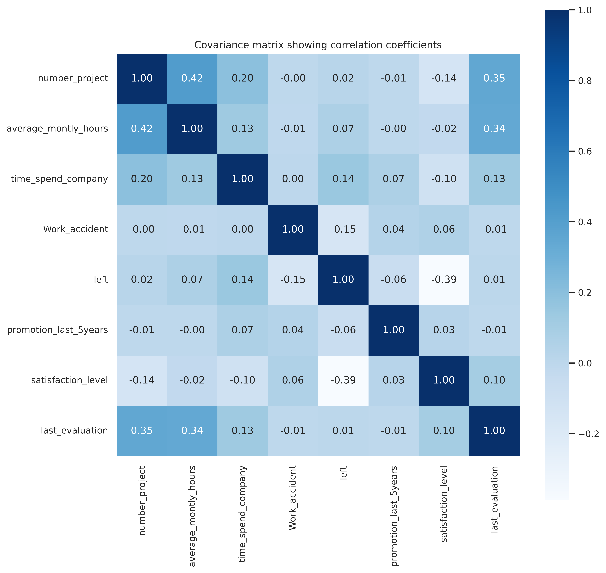
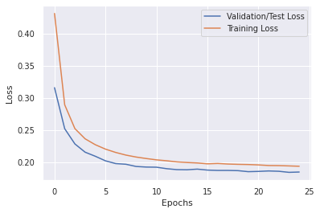
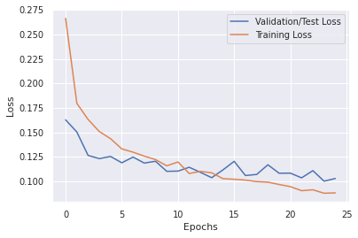
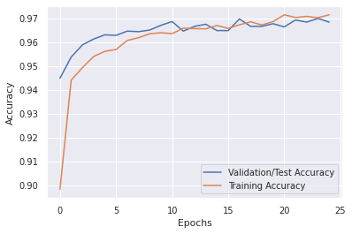

# Employee Retention Prediction

* In this notebook we are going to build 4 different models and compare their performances, the models are:
* LogisticRegression
* RandomeForestClassifier
* Simple tensorflow model
* Deeper tensorflow model

In conclusion, the RandomForestClassifier model and the Deeper tensorflow model perform relatively better than the other models.


```python
import pandas as pd
import matplotlib.pyplot as plt
import seaborn as sns
from sklearn.preprocessing import OneHotEncoder
from sklearn.preprocessing import StandardScaler

from sklearn.linear_model import LogisticRegression
from sklearn.ensemble import RandomForestClassifier

from sklearn.metrics import confusion_matrix
from sklearn.metrics import classification_report
from sklearn.metrics import accuracy_score

import tensorflow.keras
from tensorflow.keras.models import Sequential
from tensorflow.keras.layers import Dense
from tensorflow.keras.layers import Dropout
from sklearn.model_selection import train_test_split
```


```python
!pip install openpyxl
```

    Collecting openpyxl
      Downloading openpyxl-3.0.10-py2.py3-none-any.whl (242 kB)
         ━━━━━━━━━━━━━━━━━━━━━━━━━━━━━━━━━━━━━ 242.1/242.1 KB 794.1 kB/s eta 0:00:00a 0:00:01
    [?25hCollecting et-xmlfile
      Downloading et_xmlfile-1.1.0-py3-none-any.whl (4.7 kB)
    Installing collected packages: et-xmlfile, openpyxl
    Successfully installed et-xmlfile-1.1.0 openpyxl-3.0.10


```python
import openpyxl
```


```python
hr_df = pd.read_csv('data/hr_data.csv', index_col=0) 
hr_df.head(10)
```


<div>
<table border="1" class="dataframe">
  <thead>
    <tr style="text-align: right;">
      <th></th>
      <th>employee_id</th>
      <th>number_project</th>
      <th>average_montly_hours</th>
      <th>time_spend_company</th>
      <th>Work_accident</th>
      <th>left</th>
      <th>promotion_last_5years</th>
      <th>department</th>
      <th>salary</th>
    </tr>
  </thead>
  <tbody>
    <tr>
      <th>0</th>
      <td>1003</td>
      <td>2</td>
      <td>157</td>
      <td>3</td>
      <td>0</td>
      <td>1</td>
      <td>0</td>
      <td>sales</td>
      <td>low</td>
    </tr>
    <tr>
      <th>1</th>
      <td>1005</td>
      <td>5</td>
      <td>262</td>
      <td>6</td>
      <td>0</td>
      <td>1</td>
      <td>0</td>
      <td>sales</td>
      <td>medium</td>
    </tr>
    <tr>
      <th>2</th>
      <td>1486</td>
      <td>7</td>
      <td>272</td>
      <td>4</td>
      <td>0</td>
      <td>1</td>
      <td>0</td>
      <td>sales</td>
      <td>medium</td>
    </tr>
    <tr>
      <th>3</th>
      <td>1038</td>
      <td>5</td>
      <td>223</td>
      <td>5</td>
      <td>0</td>
      <td>1</td>
      <td>0</td>
      <td>sales</td>
      <td>low</td>
    </tr>
    <tr>
      <th>4</th>
      <td>1057</td>
      <td>2</td>
      <td>159</td>
      <td>3</td>
      <td>0</td>
      <td>1</td>
      <td>0</td>
      <td>sales</td>
      <td>low</td>
    </tr>
    <tr>
      <th>5</th>
      <td>1060</td>
      <td>2</td>
      <td>153</td>
      <td>3</td>
      <td>0</td>
      <td>1</td>
      <td>0</td>
      <td>sales</td>
      <td>low</td>
    </tr>
    <tr>
      <th>6</th>
      <td>1061</td>
      <td>6</td>
      <td>247</td>
      <td>4</td>
      <td>0</td>
      <td>1</td>
      <td>0</td>
      <td>sales</td>
      <td>low</td>
    </tr>
    <tr>
      <th>7</th>
      <td>1576</td>
      <td>5</td>
      <td>259</td>
      <td>5</td>
      <td>0</td>
      <td>1</td>
      <td>0</td>
      <td>sales</td>
      <td>low</td>
    </tr>
    <tr>
      <th>8</th>
      <td>1752</td>
      <td>5</td>
      <td>224</td>
      <td>5</td>
      <td>0</td>
      <td>1</td>
      <td>0</td>
      <td>sales</td>
      <td>low</td>
    </tr>
    <tr>
      <th>9</th>
      <td>1988</td>
      <td>2</td>
      <td>142</td>
      <td>3</td>
      <td>0</td>
      <td>1</td>
      <td>0</td>
      <td>sales</td>
      <td>low</td>
    </tr>
  </tbody>
</table>
</div>


```python
hr_df.tail()
```


<div>

<table border="1" class="dataframe">
  <thead>
    <tr style="text-align: right;">
      <th></th>
      <th>employee_id</th>
      <th>number_project</th>
      <th>average_montly_hours</th>
      <th>time_spend_company</th>
      <th>Work_accident</th>
      <th>left</th>
      <th>promotion_last_5years</th>
      <th>department</th>
      <th>salary</th>
    </tr>
  </thead>
  <tbody>
    <tr>
      <th>14994</th>
      <td>87670</td>
      <td>2</td>
      <td>151</td>
      <td>3</td>
      <td>0</td>
      <td>1</td>
      <td>0</td>
      <td>support</td>
      <td>low</td>
    </tr>
    <tr>
      <th>14995</th>
      <td>87673</td>
      <td>2</td>
      <td>160</td>
      <td>3</td>
      <td>0</td>
      <td>1</td>
      <td>0</td>
      <td>support</td>
      <td>low</td>
    </tr>
    <tr>
      <th>14996</th>
      <td>87679</td>
      <td>2</td>
      <td>143</td>
      <td>3</td>
      <td>0</td>
      <td>1</td>
      <td>0</td>
      <td>support</td>
      <td>low</td>
    </tr>
    <tr>
      <th>14997</th>
      <td>87681</td>
      <td>6</td>
      <td>280</td>
      <td>4</td>
      <td>0</td>
      <td>1</td>
      <td>0</td>
      <td>support</td>
      <td>low</td>
    </tr>
    <tr>
      <th>14998</th>
      <td>87684</td>
      <td>2</td>
      <td>158</td>
      <td>3</td>
      <td>0</td>
      <td>1</td>
      <td>0</td>
      <td>support</td>
      <td>low</td>
    </tr>
  </tbody>
</table>
</div>


```python
hr_df.info()
```

    <class 'pandas.core.frame.DataFrame'>
    Int64Index: 14999 entries, 0 to 14998
    Data columns (total 9 columns):
     #   Column                 Non-Null Count  Dtype 
    ---  ------                 --------------  ----- 
     0   employee_id            14999 non-null  int64 
     1   number_project         14999 non-null  int64 
     2   average_montly_hours   14999 non-null  int64 
     3   time_spend_company     14999 non-null  int64 
     4   Work_accident          14999 non-null  int64 
     5   left                   14999 non-null  int64 
     6   promotion_last_5years  14999 non-null  int64 
     7   department             14999 non-null  object
     8   salary                 14999 non-null  object
    dtypes: int64(7), object(2)
    memory usage: 1.1+ MB


### Categorical columns


```python
hr_df.select_dtypes(exclude=['int', 'float']).columns
```


    Index(['department', 'salary'], dtype='object')


```python
print(hr_df['department'].unique())
print(hr_df['salary'].unique())
```

    ['sales' 'accounting' 'hr' 'technical' 'support' 'management' 'IT'
     'product_mng' 'marketing' 'RandD']
    ['low' 'medium' 'high']


```python
hr_df.describe()
```


<div>

<table border="1" class="dataframe">
  <thead>
    <tr style="text-align: right;">
      <th></th>
      <th>employee_id</th>
      <th>number_project</th>
      <th>average_montly_hours</th>
      <th>time_spend_company</th>
      <th>Work_accident</th>
      <th>left</th>
      <th>promotion_last_5years</th>
    </tr>
  </thead>
  <tbody>
    <tr>
      <th>count</th>
      <td>14999.000000</td>
      <td>14999.000000</td>
      <td>14999.000000</td>
      <td>14999.000000</td>
      <td>14999.000000</td>
      <td>14999.000000</td>
      <td>14999.000000</td>
    </tr>
    <tr>
      <th>mean</th>
      <td>45424.627575</td>
      <td>3.803054</td>
      <td>201.050337</td>
      <td>3.498233</td>
      <td>0.144610</td>
      <td>0.238083</td>
      <td>0.021268</td>
    </tr>
    <tr>
      <th>std</th>
      <td>25915.900127</td>
      <td>1.232592</td>
      <td>49.943099</td>
      <td>1.460136</td>
      <td>0.351719</td>
      <td>0.425924</td>
      <td>0.144281</td>
    </tr>
    <tr>
      <th>min</th>
      <td>1003.000000</td>
      <td>2.000000</td>
      <td>96.000000</td>
      <td>2.000000</td>
      <td>0.000000</td>
      <td>0.000000</td>
      <td>0.000000</td>
    </tr>
    <tr>
      <th>25%</th>
      <td>22872.500000</td>
      <td>3.000000</td>
      <td>156.000000</td>
      <td>3.000000</td>
      <td>0.000000</td>
      <td>0.000000</td>
      <td>0.000000</td>
    </tr>
    <tr>
      <th>50%</th>
      <td>45448.000000</td>
      <td>4.000000</td>
      <td>200.000000</td>
      <td>3.000000</td>
      <td>0.000000</td>
      <td>0.000000</td>
      <td>0.000000</td>
    </tr>
    <tr>
      <th>75%</th>
      <td>67480.500000</td>
      <td>5.000000</td>
      <td>245.000000</td>
      <td>4.000000</td>
      <td>0.000000</td>
      <td>0.000000</td>
      <td>0.000000</td>
    </tr>
    <tr>
      <th>max</th>
      <td>99815.000000</td>
      <td>7.000000</td>
      <td>310.000000</td>
      <td>10.000000</td>
      <td>1.000000</td>
      <td>1.000000</td>
      <td>1.000000</td>
    </tr>
  </tbody>
</table>
</div>


```python
hr_df.shape
```


    (14999, 9)


```python
cols = hr_df.columns
cols
```


    Index(['employee_id', 'number_project', 'average_montly_hours',
           'time_spend_company', 'Work_accident', 'left', 'promotion_last_5years',
           'department', 'salary'],
          dtype='object')


### Load Evaluation and Employee Satisfaction Data


```python

```


```python
emp_satis_eval = pd.read_excel('data/employee_satisfaction_evaluation.xlsx') 
emp_satis_eval.head()
```


<div>

<table border="1" class="dataframe">
  <thead>
    <tr style="text-align: right;">
      <th></th>
      <th>EMPLOYEE #</th>
      <th>satisfaction_level</th>
      <th>last_evaluation</th>
    </tr>
  </thead>
  <tbody>
    <tr>
      <th>0</th>
      <td>1003</td>
      <td>0.38</td>
      <td>0.53</td>
    </tr>
    <tr>
      <th>1</th>
      <td>1005</td>
      <td>0.80</td>
      <td>0.86</td>
    </tr>
    <tr>
      <th>2</th>
      <td>1486</td>
      <td>0.11</td>
      <td>0.88</td>
    </tr>
    <tr>
      <th>3</th>
      <td>1038</td>
      <td>0.72</td>
      <td>0.87</td>
    </tr>
    <tr>
      <th>4</th>
      <td>1057</td>
      <td>0.37</td>
      <td>0.52</td>
    </tr>
  </tbody>
</table>
</div>


```python
emp_satis_eval.shape
```


    (14999, 3)


### Merge tables


```python
emp_satis_eval.columns = ['employee_id', 'satisfaction_level', 'last_evaluation']
main_df = pd.merge(hr_df, emp_satis_eval, on="employee_id")
print(main_df.shape)
main_df.head()
```

    (14999, 11)


<div>

<table border="1" class="dataframe">
  <thead>
    <tr style="text-align: right;">
      <th></th>
      <th>employee_id</th>
      <th>number_project</th>
      <th>average_montly_hours</th>
      <th>time_spend_company</th>
      <th>Work_accident</th>
      <th>left</th>
      <th>promotion_last_5years</th>
      <th>department</th>
      <th>salary</th>
      <th>satisfaction_level</th>
      <th>last_evaluation</th>
    </tr>
  </thead>
  <tbody>
    <tr>
      <th>0</th>
      <td>1003</td>
      <td>2</td>
      <td>157</td>
      <td>3</td>
      <td>0</td>
      <td>1</td>
      <td>0</td>
      <td>sales</td>
      <td>low</td>
      <td>0.38</td>
      <td>0.53</td>
    </tr>
    <tr>
      <th>1</th>
      <td>1005</td>
      <td>5</td>
      <td>262</td>
      <td>6</td>
      <td>0</td>
      <td>1</td>
      <td>0</td>
      <td>sales</td>
      <td>medium</td>
      <td>0.80</td>
      <td>0.86</td>
    </tr>
    <tr>
      <th>2</th>
      <td>1486</td>
      <td>7</td>
      <td>272</td>
      <td>4</td>
      <td>0</td>
      <td>1</td>
      <td>0</td>
      <td>sales</td>
      <td>medium</td>
      <td>0.11</td>
      <td>0.88</td>
    </tr>
    <tr>
      <th>3</th>
      <td>1038</td>
      <td>5</td>
      <td>223</td>
      <td>5</td>
      <td>0</td>
      <td>1</td>
      <td>0</td>
      <td>sales</td>
      <td>low</td>
      <td>0.72</td>
      <td>0.87</td>
    </tr>
    <tr>
      <th>4</th>
      <td>1057</td>
      <td>2</td>
      <td>159</td>
      <td>3</td>
      <td>0</td>
      <td>1</td>
      <td>0</td>
      <td>sales</td>
      <td>low</td>
      <td>0.37</td>
      <td>0.52</td>
    </tr>
  </tbody>
</table>
</div>


```python
main_df.isnull().values.any()
```


    True


### Is our dataset good? Are there missing values?


```python
main_df[main_df.isnull().any(axis=1)]
```


<div>

<table border="1" class="dataframe">
  <thead>
    <tr style="text-align: right;">
      <th></th>
      <th>employee_id</th>
      <th>number_project</th>
      <th>average_montly_hours</th>
      <th>time_spend_company</th>
      <th>Work_accident</th>
      <th>left</th>
      <th>promotion_last_5years</th>
      <th>department</th>
      <th>salary</th>
      <th>satisfaction_level</th>
      <th>last_evaluation</th>
    </tr>
  </thead>
  <tbody>
    <tr>
      <th>18</th>
      <td>3794</td>
      <td>2</td>
      <td>160</td>
      <td>3</td>
      <td>1</td>
      <td>1</td>
      <td>1</td>
      <td>sales</td>
      <td>low</td>
      <td>NaN</td>
      <td>NaN</td>
    </tr>
    <tr>
      <th>19</th>
      <td>1140</td>
      <td>5</td>
      <td>262</td>
      <td>5</td>
      <td>0</td>
      <td>1</td>
      <td>0</td>
      <td>sales</td>
      <td>low</td>
      <td>NaN</td>
      <td>0.89</td>
    </tr>
    <tr>
      <th>33</th>
      <td>1230</td>
      <td>2</td>
      <td>140</td>
      <td>3</td>
      <td>0</td>
      <td>1</td>
      <td>0</td>
      <td>hr</td>
      <td>low</td>
      <td>NaN</td>
      <td>NaN</td>
    </tr>
    <tr>
      <th>53</th>
      <td>1340</td>
      <td>2</td>
      <td>132</td>
      <td>3</td>
      <td>0</td>
      <td>1</td>
      <td>0</td>
      <td>support</td>
      <td>low</td>
      <td>NaN</td>
      <td>NaN</td>
    </tr>
    <tr>
      <th>72</th>
      <td>22316</td>
      <td>2</td>
      <td>149</td>
      <td>3</td>
      <td>0</td>
      <td>1</td>
      <td>0</td>
      <td>product_mng</td>
      <td>high</td>
      <td>NaN</td>
      <td>NaN</td>
    </tr>
    <tr>
      <th>92</th>
      <td>1581</td>
      <td>2</td>
      <td>143</td>
      <td>3</td>
      <td>0</td>
      <td>1</td>
      <td>0</td>
      <td>sales</td>
      <td>low</td>
      <td>NaN</td>
      <td>NaN</td>
    </tr>
    <tr>
      <th>107</th>
      <td>17376</td>
      <td>2</td>
      <td>148</td>
      <td>3</td>
      <td>0</td>
      <td>1</td>
      <td>0</td>
      <td>accounting</td>
      <td>medium</td>
      <td>NaN</td>
      <td>NaN</td>
    </tr>
    <tr>
      <th>120</th>
      <td>1739</td>
      <td>4</td>
      <td>158</td>
      <td>4</td>
      <td>1</td>
      <td>1</td>
      <td>0</td>
      <td>technical</td>
      <td>low</td>
      <td>NaN</td>
      <td>NaN</td>
    </tr>
    <tr>
      <th>137</th>
      <td>1847</td>
      <td>2</td>
      <td>129</td>
      <td>3</td>
      <td>0</td>
      <td>1</td>
      <td>0</td>
      <td>management</td>
      <td>low</td>
      <td>NaN</td>
      <td>NaN</td>
    </tr>
    <tr>
      <th>175</th>
      <td>32923</td>
      <td>4</td>
      <td>164</td>
      <td>2</td>
      <td>0</td>
      <td>1</td>
      <td>0</td>
      <td>sales</td>
      <td>low</td>
      <td>NaN</td>
      <td>NaN</td>
    </tr>
    <tr>
      <th>191</th>
      <td>2160</td>
      <td>4</td>
      <td>226</td>
      <td>6</td>
      <td>1</td>
      <td>1</td>
      <td>0</td>
      <td>technical</td>
      <td>medium</td>
      <td>0.92</td>
      <td>NaN</td>
    </tr>
    <tr>
      <th>352</th>
      <td>3150</td>
      <td>4</td>
      <td>262</td>
      <td>6</td>
      <td>0</td>
      <td>1</td>
      <td>0</td>
      <td>support</td>
      <td>low</td>
      <td>NaN</td>
      <td>0.91</td>
    </tr>
    <tr>
      <th>376</th>
      <td>3250</td>
      <td>4</td>
      <td>296</td>
      <td>2</td>
      <td>0</td>
      <td>1</td>
      <td>0</td>
      <td>IT</td>
      <td>medium</td>
      <td>0.56</td>
      <td>NaN</td>
    </tr>
    <tr>
      <th>402</th>
      <td>3405</td>
      <td>5</td>
      <td>275</td>
      <td>5</td>
      <td>0</td>
      <td>1</td>
      <td>0</td>
      <td>sales</td>
      <td>low</td>
      <td>NaN</td>
      <td>1.00</td>
    </tr>
    <tr>
      <th>427</th>
      <td>78130</td>
      <td>3</td>
      <td>180</td>
      <td>4</td>
      <td>0</td>
      <td>1</td>
      <td>0</td>
      <td>technical</td>
      <td>medium</td>
      <td>NaN</td>
      <td>0.60</td>
    </tr>
    <tr>
      <th>442</th>
      <td>3635</td>
      <td>5</td>
      <td>229</td>
      <td>5</td>
      <td>0</td>
      <td>1</td>
      <td>0</td>
      <td>management</td>
      <td>low</td>
      <td>0.77</td>
      <td>NaN</td>
    </tr>
    <tr>
      <th>468</th>
      <td>3755</td>
      <td>5</td>
      <td>245</td>
      <td>5</td>
      <td>0</td>
      <td>1</td>
      <td>0</td>
      <td>sales</td>
      <td>low</td>
      <td>NaN</td>
      <td>0.92</td>
    </tr>
    <tr>
      <th>543</th>
      <td>4150</td>
      <td>5</td>
      <td>237</td>
      <td>5</td>
      <td>0</td>
      <td>1</td>
      <td>0</td>
      <td>sales</td>
      <td>medium</td>
      <td>0.89</td>
      <td>NaN</td>
    </tr>
    <tr>
      <th>892</th>
      <td>43615</td>
      <td>4</td>
      <td>276</td>
      <td>5</td>
      <td>0</td>
      <td>1</td>
      <td>0</td>
      <td>support</td>
      <td>low</td>
      <td>0.74</td>
      <td>NaN</td>
    </tr>
    <tr>
      <th>1588</th>
      <td>42185</td>
      <td>5</td>
      <td>264</td>
      <td>5</td>
      <td>0</td>
      <td>1</td>
      <td>0</td>
      <td>IT</td>
      <td>medium</td>
      <td>NaN</td>
      <td>0.81</td>
    </tr>
    <tr>
      <th>1934</th>
      <td>11895</td>
      <td>4</td>
      <td>225</td>
      <td>5</td>
      <td>0</td>
      <td>1</td>
      <td>0</td>
      <td>sales</td>
      <td>medium</td>
      <td>0.78</td>
      <td>NaN</td>
    </tr>
    <tr>
      <th>2343</th>
      <td>14170</td>
      <td>3</td>
      <td>115</td>
      <td>2</td>
      <td>1</td>
      <td>0</td>
      <td>0</td>
      <td>support</td>
      <td>low</td>
      <td>NaN</td>
      <td>0.97</td>
    </tr>
    <tr>
      <th>2743</th>
      <td>16445</td>
      <td>5</td>
      <td>149</td>
      <td>2</td>
      <td>0</td>
      <td>0</td>
      <td>0</td>
      <td>RandD</td>
      <td>low</td>
      <td>0.62</td>
      <td>NaN</td>
    </tr>
    <tr>
      <th>3170</th>
      <td>18980</td>
      <td>5</td>
      <td>186</td>
      <td>2</td>
      <td>0</td>
      <td>0</td>
      <td>0</td>
      <td>technical</td>
      <td>medium</td>
      <td>NaN</td>
      <td>NaN</td>
    </tr>
    <tr>
      <th>3609</th>
      <td>21580</td>
      <td>3</td>
      <td>263</td>
      <td>2</td>
      <td>1</td>
      <td>0</td>
      <td>0</td>
      <td>sales</td>
      <td>medium</td>
      <td>0.95</td>
      <td>NaN</td>
    </tr>
    <tr>
      <th>3776</th>
      <td>22555</td>
      <td>4</td>
      <td>214</td>
      <td>3</td>
      <td>0</td>
      <td>0</td>
      <td>0</td>
      <td>technical</td>
      <td>medium</td>
      <td>NaN</td>
      <td>0.68</td>
    </tr>
    <tr>
      <th>4122</th>
      <td>24505</td>
      <td>3</td>
      <td>192</td>
      <td>3</td>
      <td>0</td>
      <td>0</td>
      <td>0</td>
      <td>marketing</td>
      <td>high</td>
      <td>0.86</td>
      <td>NaN</td>
    </tr>
    <tr>
      <th>4740</th>
      <td>27950</td>
      <td>3</td>
      <td>253</td>
      <td>3</td>
      <td>0</td>
      <td>0</td>
      <td>0</td>
      <td>marketing</td>
      <td>medium</td>
      <td>NaN</td>
      <td>0.95</td>
    </tr>
    <tr>
      <th>5028</th>
      <td>29640</td>
      <td>4</td>
      <td>180</td>
      <td>4</td>
      <td>0</td>
      <td>0</td>
      <td>0</td>
      <td>product_mng</td>
      <td>medium</td>
      <td>0.64</td>
      <td>NaN</td>
    </tr>
    <tr>
      <th>6453</th>
      <td>38090</td>
      <td>5</td>
      <td>166</td>
      <td>2</td>
      <td>0</td>
      <td>0</td>
      <td>0</td>
      <td>technical</td>
      <td>high</td>
      <td>NaN</td>
      <td>0.78</td>
    </tr>
    <tr>
      <th>7005</th>
      <td>41535</td>
      <td>4</td>
      <td>150</td>
      <td>3</td>
      <td>0</td>
      <td>0</td>
      <td>0</td>
      <td>technical</td>
      <td>low</td>
      <td>0.82</td>
      <td>NaN</td>
    </tr>
    <tr>
      <th>7516</th>
      <td>44460</td>
      <td>4</td>
      <td>264</td>
      <td>3</td>
      <td>0</td>
      <td>0</td>
      <td>0</td>
      <td>technical</td>
      <td>low</td>
      <td>NaN</td>
      <td>0.97</td>
    </tr>
    <tr>
      <th>8630</th>
      <td>50960</td>
      <td>4</td>
      <td>167</td>
      <td>3</td>
      <td>1</td>
      <td>0</td>
      <td>0</td>
      <td>technical</td>
      <td>low</td>
      <td>0.90</td>
      <td>NaN</td>
    </tr>
    <tr>
      <th>9455</th>
      <td>55770</td>
      <td>4</td>
      <td>270</td>
      <td>3</td>
      <td>0</td>
      <td>0</td>
      <td>0</td>
      <td>product_mng</td>
      <td>low</td>
      <td>NaN</td>
      <td>0.88</td>
    </tr>
    <tr>
      <th>9901</th>
      <td>58630</td>
      <td>5</td>
      <td>252</td>
      <td>3</td>
      <td>0</td>
      <td>0</td>
      <td>0</td>
      <td>support</td>
      <td>medium</td>
      <td>0.92</td>
      <td>NaN</td>
    </tr>
    <tr>
      <th>10647</th>
      <td>62595</td>
      <td>4</td>
      <td>165</td>
      <td>3</td>
      <td>0</td>
      <td>0</td>
      <td>0</td>
      <td>technical</td>
      <td>low</td>
      <td>NaN</td>
      <td>0.69</td>
    </tr>
    <tr>
      <th>10962</th>
      <td>64350</td>
      <td>5</td>
      <td>233</td>
      <td>3</td>
      <td>0</td>
      <td>0</td>
      <td>0</td>
      <td>support</td>
      <td>low</td>
      <td>0.65</td>
      <td>NaN</td>
    </tr>
    <tr>
      <th>11575</th>
      <td>20215</td>
      <td>3</td>
      <td>192</td>
      <td>7</td>
      <td>0</td>
      <td>0</td>
      <td>0</td>
      <td>management</td>
      <td>high</td>
      <td>NaN</td>
      <td>NaN</td>
    </tr>
    <tr>
      <th>11967</th>
      <td>70005</td>
      <td>3</td>
      <td>148</td>
      <td>3</td>
      <td>0</td>
      <td>0</td>
      <td>0</td>
      <td>IT</td>
      <td>low</td>
      <td>0.82</td>
      <td>NaN</td>
    </tr>
    <tr>
      <th>12422</th>
      <td>72475</td>
      <td>5</td>
      <td>257</td>
      <td>5</td>
      <td>0</td>
      <td>1</td>
      <td>0</td>
      <td>technical</td>
      <td>medium</td>
      <td>NaN</td>
      <td>1.00</td>
    </tr>
    <tr>
      <th>12853</th>
      <td>74880</td>
      <td>3</td>
      <td>136</td>
      <td>2</td>
      <td>0</td>
      <td>0</td>
      <td>0</td>
      <td>hr</td>
      <td>high</td>
      <td>NaN</td>
      <td>0.70</td>
    </tr>
    <tr>
      <th>13482</th>
      <td>78780</td>
      <td>3</td>
      <td>207</td>
      <td>7</td>
      <td>0</td>
      <td>0</td>
      <td>1</td>
      <td>management</td>
      <td>medium</td>
      <td>0.58</td>
      <td>NaN</td>
    </tr>
    <tr>
      <th>13925</th>
      <td>81315</td>
      <td>3</td>
      <td>133</td>
      <td>3</td>
      <td>0</td>
      <td>0</td>
      <td>0</td>
      <td>sales</td>
      <td>medium</td>
      <td>NaN</td>
      <td>0.75</td>
    </tr>
  </tbody>
</table>
</div>


### Let's fill in the missing blanks with the aveage values


```python
main_df.describe()
```


<div>

<table border="1" class="dataframe">
  <thead>
    <tr style="text-align: right;">
      <th></th>
      <th>employee_id</th>
      <th>number_project</th>
      <th>average_montly_hours</th>
      <th>time_spend_company</th>
      <th>Work_accident</th>
      <th>left</th>
      <th>promotion_last_5years</th>
      <th>satisfaction_level</th>
      <th>last_evaluation</th>
    </tr>
  </thead>
  <tbody>
    <tr>
      <th>count</th>
      <td>14999.000000</td>
      <td>14999.000000</td>
      <td>14999.000000</td>
      <td>14999.000000</td>
      <td>14999.000000</td>
      <td>14999.000000</td>
      <td>14999.000000</td>
      <td>14972.000000</td>
      <td>14972.000000</td>
    </tr>
    <tr>
      <th>mean</th>
      <td>45424.627575</td>
      <td>3.803054</td>
      <td>201.050337</td>
      <td>3.498233</td>
      <td>0.144610</td>
      <td>0.238083</td>
      <td>0.021268</td>
      <td>0.612830</td>
      <td>0.716125</td>
    </tr>
    <tr>
      <th>std</th>
      <td>25915.900127</td>
      <td>1.232592</td>
      <td>49.943099</td>
      <td>1.460136</td>
      <td>0.351719</td>
      <td>0.425924</td>
      <td>0.144281</td>
      <td>0.248714</td>
      <td>0.171138</td>
    </tr>
    <tr>
      <th>min</th>
      <td>1003.000000</td>
      <td>2.000000</td>
      <td>96.000000</td>
      <td>2.000000</td>
      <td>0.000000</td>
      <td>0.000000</td>
      <td>0.000000</td>
      <td>0.090000</td>
      <td>0.360000</td>
    </tr>
    <tr>
      <th>25%</th>
      <td>22872.500000</td>
      <td>3.000000</td>
      <td>156.000000</td>
      <td>3.000000</td>
      <td>0.000000</td>
      <td>0.000000</td>
      <td>0.000000</td>
      <td>0.440000</td>
      <td>0.560000</td>
    </tr>
    <tr>
      <th>50%</th>
      <td>45448.000000</td>
      <td>4.000000</td>
      <td>200.000000</td>
      <td>3.000000</td>
      <td>0.000000</td>
      <td>0.000000</td>
      <td>0.000000</td>
      <td>0.640000</td>
      <td>0.720000</td>
    </tr>
    <tr>
      <th>75%</th>
      <td>67480.500000</td>
      <td>5.000000</td>
      <td>245.000000</td>
      <td>4.000000</td>
      <td>0.000000</td>
      <td>0.000000</td>
      <td>0.000000</td>
      <td>0.820000</td>
      <td>0.870000</td>
    </tr>
    <tr>
      <th>max</th>
      <td>99815.000000</td>
      <td>7.000000</td>
      <td>310.000000</td>
      <td>10.000000</td>
      <td>1.000000</td>
      <td>1.000000</td>
      <td>1.000000</td>
      <td>1.000000</td>
      <td>1.000000</td>
    </tr>
  </tbody>
</table>
</div>


### Impute missing values with mean


```python
main_df.fillna(main_df.mean(), inplace=True)
main_df.head()
```

    /tmp/ipykernel_91/2431407480.py:1: FutureWarning: Dropping of nuisance columns in DataFrame reductions (with 'numeric_only=None') is deprecated; in a future version this will raise TypeError.  Select only valid columns before calling the reduction.
      main_df.fillna(main_df.mean(), inplace=True)


<div>

<table border="1" class="dataframe">
  <thead>
    <tr style="text-align: right;">
      <th></th>
      <th>employee_id</th>
      <th>number_project</th>
      <th>average_montly_hours</th>
      <th>time_spend_company</th>
      <th>Work_accident</th>
      <th>left</th>
      <th>promotion_last_5years</th>
      <th>department</th>
      <th>salary</th>
      <th>satisfaction_level</th>
      <th>last_evaluation</th>
    </tr>
  </thead>
  <tbody>
    <tr>
      <th>0</th>
      <td>1003</td>
      <td>2</td>
      <td>157</td>
      <td>3</td>
      <td>0</td>
      <td>1</td>
      <td>0</td>
      <td>sales</td>
      <td>low</td>
      <td>0.38</td>
      <td>0.53</td>
    </tr>
    <tr>
      <th>1</th>
      <td>1005</td>
      <td>5</td>
      <td>262</td>
      <td>6</td>
      <td>0</td>
      <td>1</td>
      <td>0</td>
      <td>sales</td>
      <td>medium</td>
      <td>0.80</td>
      <td>0.86</td>
    </tr>
    <tr>
      <th>2</th>
      <td>1486</td>
      <td>7</td>
      <td>272</td>
      <td>4</td>
      <td>0</td>
      <td>1</td>
      <td>0</td>
      <td>sales</td>
      <td>medium</td>
      <td>0.11</td>
      <td>0.88</td>
    </tr>
    <tr>
      <th>3</th>
      <td>1038</td>
      <td>5</td>
      <td>223</td>
      <td>5</td>
      <td>0</td>
      <td>1</td>
      <td>0</td>
      <td>sales</td>
      <td>low</td>
      <td>0.72</td>
      <td>0.87</td>
    </tr>
    <tr>
      <th>4</th>
      <td>1057</td>
      <td>2</td>
      <td>159</td>
      <td>3</td>
      <td>0</td>
      <td>1</td>
      <td>0</td>
      <td>sales</td>
      <td>low</td>
      <td>0.37</td>
      <td>0.52</td>
    </tr>
  </tbody>
</table>
</div>


```python
main_df.loc[main_df['employee_id'] == 1003]
```


<div>

<table border="1" class="dataframe">
  <thead>
    <tr style="text-align: right;">
      <th></th>
      <th>employee_id</th>
      <th>number_project</th>
      <th>average_montly_hours</th>
      <th>time_spend_company</th>
      <th>Work_accident</th>
      <th>left</th>
      <th>promotion_last_5years</th>
      <th>department</th>
      <th>salary</th>
      <th>satisfaction_level</th>
      <th>last_evaluation</th>
    </tr>
  </thead>
  <tbody>
    <tr>
      <th>0</th>
      <td>1003</td>
      <td>2</td>
      <td>157</td>
      <td>3</td>
      <td>0</td>
      <td>1</td>
      <td>0</td>
      <td>sales</td>
      <td>low</td>
      <td>0.38</td>
      <td>0.53</td>
    </tr>
  </tbody>
</table>
</div>


```python
main_df.head()
```


<div>

<table border="1" class="dataframe">
  <thead>
    <tr style="text-align: right;">
      <th></th>
      <th>employee_id</th>
      <th>number_project</th>
      <th>average_montly_hours</th>
      <th>time_spend_company</th>
      <th>Work_accident</th>
      <th>left</th>
      <th>promotion_last_5years</th>
      <th>department</th>
      <th>salary</th>
      <th>satisfaction_level</th>
      <th>last_evaluation</th>
    </tr>
  </thead>
  <tbody>
    <tr>
      <th>0</th>
      <td>1003</td>
      <td>2</td>
      <td>157</td>
      <td>3</td>
      <td>0</td>
      <td>1</td>
      <td>0</td>
      <td>sales</td>
      <td>low</td>
      <td>0.38</td>
      <td>0.53</td>
    </tr>
    <tr>
      <th>1</th>
      <td>1005</td>
      <td>5</td>
      <td>262</td>
      <td>6</td>
      <td>0</td>
      <td>1</td>
      <td>0</td>
      <td>sales</td>
      <td>medium</td>
      <td>0.80</td>
      <td>0.86</td>
    </tr>
    <tr>
      <th>2</th>
      <td>1486</td>
      <td>7</td>
      <td>272</td>
      <td>4</td>
      <td>0</td>
      <td>1</td>
      <td>0</td>
      <td>sales</td>
      <td>medium</td>
      <td>0.11</td>
      <td>0.88</td>
    </tr>
    <tr>
      <th>3</th>
      <td>1038</td>
      <td>5</td>
      <td>223</td>
      <td>5</td>
      <td>0</td>
      <td>1</td>
      <td>0</td>
      <td>sales</td>
      <td>low</td>
      <td>0.72</td>
      <td>0.87</td>
    </tr>
    <tr>
      <th>4</th>
      <td>1057</td>
      <td>2</td>
      <td>159</td>
      <td>3</td>
      <td>0</td>
      <td>1</td>
      <td>0</td>
      <td>sales</td>
      <td>low</td>
      <td>0.37</td>
      <td>0.52</td>
    </tr>
  </tbody>
</table>
</div>


```python
# Removing employee ID
main_df_final = main_df.drop(columns='employee_id')
main_df_final.head()
#main_df_final['salary'].value_counts()
```


<div>

<table border="1" class="dataframe">
  <thead>
    <tr style="text-align: right;">
      <th></th>
      <th>number_project</th>
      <th>average_montly_hours</th>
      <th>time_spend_company</th>
      <th>Work_accident</th>
      <th>left</th>
      <th>promotion_last_5years</th>
      <th>department</th>
      <th>salary</th>
      <th>satisfaction_level</th>
      <th>last_evaluation</th>
    </tr>
  </thead>
  <tbody>
    <tr>
      <th>0</th>
      <td>2</td>
      <td>157</td>
      <td>3</td>
      <td>0</td>
      <td>1</td>
      <td>0</td>
      <td>sales</td>
      <td>low</td>
      <td>0.38</td>
      <td>0.53</td>
    </tr>
    <tr>
      <th>1</th>
      <td>5</td>
      <td>262</td>
      <td>6</td>
      <td>0</td>
      <td>1</td>
      <td>0</td>
      <td>sales</td>
      <td>medium</td>
      <td>0.80</td>
      <td>0.86</td>
    </tr>
    <tr>
      <th>2</th>
      <td>7</td>
      <td>272</td>
      <td>4</td>
      <td>0</td>
      <td>1</td>
      <td>0</td>
      <td>sales</td>
      <td>medium</td>
      <td>0.11</td>
      <td>0.88</td>
    </tr>
    <tr>
      <th>3</th>
      <td>5</td>
      <td>223</td>
      <td>5</td>
      <td>0</td>
      <td>1</td>
      <td>0</td>
      <td>sales</td>
      <td>low</td>
      <td>0.72</td>
      <td>0.87</td>
    </tr>
    <tr>
      <th>4</th>
      <td>2</td>
      <td>159</td>
      <td>3</td>
      <td>0</td>
      <td>1</td>
      <td>0</td>
      <td>sales</td>
      <td>low</td>
      <td>0.37</td>
      <td>0.52</td>
    </tr>
  </tbody>
</table>
</div>


```python
main_df_final.groupby('department').sum()
```


<div>

<table border="1" class="dataframe">
  <thead>
    <tr style="text-align: right;">
      <th></th>
      <th>number_project</th>
      <th>average_montly_hours</th>
      <th>time_spend_company</th>
      <th>Work_accident</th>
      <th>left</th>
      <th>promotion_last_5years</th>
      <th>satisfaction_level</th>
      <th>last_evaluation</th>
    </tr>
    <tr>
      <th>department</th>
      <th></th>
      <th></th>
      <th></th>
      <th></th>
      <th></th>
      <th></th>
      <th></th>
      <th></th>
    </tr>
  </thead>
  <tbody>
    <tr>
      <th>IT</th>
      <td>4683</td>
      <td>248119</td>
      <td>4256</td>
      <td>164</td>
      <td>273</td>
      <td>3</td>
      <td>758.17283</td>
      <td>879.452250</td>
    </tr>
    <tr>
      <th>RandD</th>
      <td>3033</td>
      <td>158030</td>
      <td>2650</td>
      <td>134</td>
      <td>121</td>
      <td>27</td>
      <td>487.80000</td>
      <td>560.446125</td>
    </tr>
    <tr>
      <th>accounting</th>
      <td>2934</td>
      <td>154292</td>
      <td>2702</td>
      <td>96</td>
      <td>204</td>
      <td>14</td>
      <td>446.68283</td>
      <td>550.706125</td>
    </tr>
    <tr>
      <th>hr</th>
      <td>2701</td>
      <td>146828</td>
      <td>2480</td>
      <td>89</td>
      <td>215</td>
      <td>15</td>
      <td>442.53566</td>
      <td>524.006125</td>
    </tr>
    <tr>
      <th>management</th>
      <td>2432</td>
      <td>126787</td>
      <td>2711</td>
      <td>103</td>
      <td>91</td>
      <td>69</td>
      <td>391.76566</td>
      <td>456.234499</td>
    </tr>
    <tr>
      <th>marketing</th>
      <td>3164</td>
      <td>171073</td>
      <td>3063</td>
      <td>138</td>
      <td>203</td>
      <td>43</td>
      <td>530.62283</td>
      <td>613.946125</td>
    </tr>
    <tr>
      <th>product_mng</th>
      <td>3434</td>
      <td>180369</td>
      <td>3135</td>
      <td>132</td>
      <td>198</td>
      <td>0</td>
      <td>559.19566</td>
      <td>644.662250</td>
    </tr>
    <tr>
      <th>sales</th>
      <td>15634</td>
      <td>831773</td>
      <td>14631</td>
      <td>587</td>
      <td>1014</td>
      <td>100</td>
      <td>2543.77981</td>
      <td>2938.236749</td>
    </tr>
    <tr>
      <th>support</th>
      <td>8479</td>
      <td>447490</td>
      <td>7563</td>
      <td>345</td>
      <td>555</td>
      <td>20</td>
      <td>1377.90849</td>
      <td>1611.534499</td>
    </tr>
    <tr>
      <th>technical</th>
      <td>10548</td>
      <td>550793</td>
      <td>9279</td>
      <td>381</td>
      <td>697</td>
      <td>28</td>
      <td>1653.37264</td>
      <td>1961.930624</td>
    </tr>
  </tbody>
</table>
</div>


```python
main_df_final.groupby('department').mean()
```


<div>

<table border="1" class="dataframe">
  <thead>
    <tr style="text-align: right;">
      <th></th>
      <th>number_project</th>
      <th>average_montly_hours</th>
      <th>time_spend_company</th>
      <th>Work_accident</th>
      <th>left</th>
      <th>promotion_last_5years</th>
      <th>satisfaction_level</th>
      <th>last_evaluation</th>
    </tr>
    <tr>
      <th>department</th>
      <th></th>
      <th></th>
      <th></th>
      <th></th>
      <th></th>
      <th></th>
      <th></th>
      <th></th>
    </tr>
  </thead>
  <tbody>
    <tr>
      <th>IT</th>
      <td>3.816626</td>
      <td>202.215974</td>
      <td>3.468623</td>
      <td>0.133659</td>
      <td>0.222494</td>
      <td>0.002445</td>
      <td>0.617908</td>
      <td>0.716750</td>
    </tr>
    <tr>
      <th>RandD</th>
      <td>3.853875</td>
      <td>200.800508</td>
      <td>3.367217</td>
      <td>0.170267</td>
      <td>0.153748</td>
      <td>0.034307</td>
      <td>0.619822</td>
      <td>0.712130</td>
    </tr>
    <tr>
      <th>accounting</th>
      <td>3.825293</td>
      <td>201.162973</td>
      <td>3.522816</td>
      <td>0.125163</td>
      <td>0.265971</td>
      <td>0.018253</td>
      <td>0.582377</td>
      <td>0.718000</td>
    </tr>
    <tr>
      <th>hr</th>
      <td>3.654939</td>
      <td>198.684709</td>
      <td>3.355886</td>
      <td>0.120433</td>
      <td>0.290934</td>
      <td>0.020298</td>
      <td>0.598830</td>
      <td>0.709075</td>
    </tr>
    <tr>
      <th>management</th>
      <td>3.860317</td>
      <td>201.249206</td>
      <td>4.303175</td>
      <td>0.163492</td>
      <td>0.144444</td>
      <td>0.109524</td>
      <td>0.621850</td>
      <td>0.724182</td>
    </tr>
    <tr>
      <th>marketing</th>
      <td>3.687646</td>
      <td>199.385781</td>
      <td>3.569930</td>
      <td>0.160839</td>
      <td>0.236597</td>
      <td>0.050117</td>
      <td>0.618442</td>
      <td>0.715555</td>
    </tr>
    <tr>
      <th>product_mng</th>
      <td>3.807095</td>
      <td>199.965632</td>
      <td>3.475610</td>
      <td>0.146341</td>
      <td>0.219512</td>
      <td>0.000000</td>
      <td>0.619951</td>
      <td>0.714703</td>
    </tr>
    <tr>
      <th>sales</th>
      <td>3.776329</td>
      <td>200.911353</td>
      <td>3.534058</td>
      <td>0.141787</td>
      <td>0.244928</td>
      <td>0.024155</td>
      <td>0.614440</td>
      <td>0.709719</td>
    </tr>
    <tr>
      <th>support</th>
      <td>3.803948</td>
      <td>200.758188</td>
      <td>3.393001</td>
      <td>0.154778</td>
      <td>0.248991</td>
      <td>0.008973</td>
      <td>0.618173</td>
      <td>0.722985</td>
    </tr>
    <tr>
      <th>technical</th>
      <td>3.877941</td>
      <td>202.497426</td>
      <td>3.411397</td>
      <td>0.140074</td>
      <td>0.256250</td>
      <td>0.010294</td>
      <td>0.607858</td>
      <td>0.721298</td>
    </tr>
  </tbody>
</table>
</div>


```python
main_df_final['department'].value_counts()
```


    sales          4140
    technical      2720
    support        2229
    IT             1227
    product_mng     902
    marketing       858
    RandD           787
    accounting      767
    hr              739
    management      630
    Name: department, dtype: int64


```python
main_df_final['left'].value_counts()
```


    0    11428
    1     3571
    Name: left, dtype: int64


### Displaying Your Correlation Matrix


```python
corr = main_df_final.corr()
corr
```


<div>

<table border="1" class="dataframe">
  <thead>
    <tr style="text-align: right;">
      <th></th>
      <th>number_project</th>
      <th>average_montly_hours</th>
      <th>time_spend_company</th>
      <th>Work_accident</th>
      <th>left</th>
      <th>promotion_last_5years</th>
      <th>satisfaction_level</th>
      <th>last_evaluation</th>
    </tr>
  </thead>
  <tbody>
    <tr>
      <th>number_project</th>
      <td>1.000000</td>
      <td>0.417211</td>
      <td>0.196786</td>
      <td>-0.004741</td>
      <td>0.023787</td>
      <td>-0.006064</td>
      <td>-0.143895</td>
      <td>0.348776</td>
    </tr>
    <tr>
      <th>average_montly_hours</th>
      <td>0.417211</td>
      <td>1.000000</td>
      <td>0.127755</td>
      <td>-0.010143</td>
      <td>0.071287</td>
      <td>-0.003544</td>
      <td>-0.020886</td>
      <td>0.339014</td>
    </tr>
    <tr>
      <th>time_spend_company</th>
      <td>0.196786</td>
      <td>0.127755</td>
      <td>1.000000</td>
      <td>0.002120</td>
      <td>0.144822</td>
      <td>0.067433</td>
      <td>-0.101165</td>
      <td>0.131078</td>
    </tr>
    <tr>
      <th>Work_accident</th>
      <td>-0.004741</td>
      <td>-0.010143</td>
      <td>0.002120</td>
      <td>1.000000</td>
      <td>-0.154622</td>
      <td>0.039245</td>
      <td>0.059063</td>
      <td>-0.006779</td>
    </tr>
    <tr>
      <th>left</th>
      <td>0.023787</td>
      <td>0.071287</td>
      <td>0.144822</td>
      <td>-0.154622</td>
      <td>1.000000</td>
      <td>-0.061788</td>
      <td>-0.388282</td>
      <td>0.006876</td>
    </tr>
    <tr>
      <th>promotion_last_5years</th>
      <td>-0.006064</td>
      <td>-0.003544</td>
      <td>0.067433</td>
      <td>0.039245</td>
      <td>-0.061788</td>
      <td>1.000000</td>
      <td>0.025925</td>
      <td>-0.007815</td>
    </tr>
    <tr>
      <th>satisfaction_level</th>
      <td>-0.143895</td>
      <td>-0.020886</td>
      <td>-0.101165</td>
      <td>0.059063</td>
      <td>-0.388282</td>
      <td>0.025925</td>
      <td>1.000000</td>
      <td>0.103783</td>
    </tr>
    <tr>
      <th>last_evaluation</th>
      <td>0.348776</td>
      <td>0.339014</td>
      <td>0.131078</td>
      <td>-0.006779</td>
      <td>0.006876</td>
      <td>-0.007815</td>
      <td>0.103783</td>
      <td>1.000000</td>
    </tr>
  </tbody>
</table>
</div>


```python
corr_cols = ['number_project', 'average_montly_hours', 'time_spend_company', 'Work_accident', 'left', 'promotion_last_5years', 'satisfaction_level', 'last_evaluation']
plt.figure(figsize=(10, 10), dpi=600)
sns.set(font_scale=0.9)
hm = sns.heatmap(corr,
                 cbar=True,
                 annot=True,
                 square=True,
                 cmap="Blues",
                 fmt='.2f',
                 annot_kws={'size': 11},
                 yticklabels=corr_cols,
                 xticklabels=corr_cols)
plt.title('Covariance matrix showing correlation coefficients')
plt.show()
```


    

    


### One hot encode the categorical columns


```python
def one_hot_encode(df, cat_cols, enc=None, drop=True):
    if not enc:
        enc = OneHotEncoder(handle_unknown='ignore')
        enc.fit(df[cat_cols])

    arry = enc.transform(df[cat_cols]).toarray()
    cat_columns = enc.get_feature_names_out(cat_cols)
    tmp_df = pd.DataFrame(arry, columns=cat_columns)

    df.reset_index(inplace=True, drop=True)
    df = pd.concat([df, tmp_df], axis=1)

    if drop:
        df.drop(cat_cols, axis=1, inplace=True)
    return enc, df


encoder, tmp = one_hot_encode(main_df_final, ['department','salary'])
tmp.head(10)
```


<div>

<table border="1" class="dataframe">
  <thead>
    <tr style="text-align: right;">
      <th></th>
      <th>number_project</th>
      <th>average_montly_hours</th>
      <th>time_spend_company</th>
      <th>Work_accident</th>
      <th>left</th>
      <th>promotion_last_5years</th>
      <th>satisfaction_level</th>
      <th>last_evaluation</th>
      <th>department_IT</th>
      <th>department_RandD</th>
      <th>...</th>
      <th>department_hr</th>
      <th>department_management</th>
      <th>department_marketing</th>
      <th>department_product_mng</th>
      <th>department_sales</th>
      <th>department_support</th>
      <th>department_technical</th>
      <th>salary_high</th>
      <th>salary_low</th>
      <th>salary_medium</th>
    </tr>
  </thead>
  <tbody>
    <tr>
      <th>0</th>
      <td>2</td>
      <td>157</td>
      <td>3</td>
      <td>0</td>
      <td>1</td>
      <td>0</td>
      <td>0.38</td>
      <td>0.53</td>
      <td>0.0</td>
      <td>0.0</td>
      <td>...</td>
      <td>0.0</td>
      <td>0.0</td>
      <td>0.0</td>
      <td>0.0</td>
      <td>1.0</td>
      <td>0.0</td>
      <td>0.0</td>
      <td>0.0</td>
      <td>1.0</td>
      <td>0.0</td>
    </tr>
    <tr>
      <th>1</th>
      <td>5</td>
      <td>262</td>
      <td>6</td>
      <td>0</td>
      <td>1</td>
      <td>0</td>
      <td>0.80</td>
      <td>0.86</td>
      <td>0.0</td>
      <td>0.0</td>
      <td>...</td>
      <td>0.0</td>
      <td>0.0</td>
      <td>0.0</td>
      <td>0.0</td>
      <td>1.0</td>
      <td>0.0</td>
      <td>0.0</td>
      <td>0.0</td>
      <td>0.0</td>
      <td>1.0</td>
    </tr>
    <tr>
      <th>2</th>
      <td>7</td>
      <td>272</td>
      <td>4</td>
      <td>0</td>
      <td>1</td>
      <td>0</td>
      <td>0.11</td>
      <td>0.88</td>
      <td>0.0</td>
      <td>0.0</td>
      <td>...</td>
      <td>0.0</td>
      <td>0.0</td>
      <td>0.0</td>
      <td>0.0</td>
      <td>1.0</td>
      <td>0.0</td>
      <td>0.0</td>
      <td>0.0</td>
      <td>0.0</td>
      <td>1.0</td>
    </tr>
    <tr>
      <th>3</th>
      <td>5</td>
      <td>223</td>
      <td>5</td>
      <td>0</td>
      <td>1</td>
      <td>0</td>
      <td>0.72</td>
      <td>0.87</td>
      <td>0.0</td>
      <td>0.0</td>
      <td>...</td>
      <td>0.0</td>
      <td>0.0</td>
      <td>0.0</td>
      <td>0.0</td>
      <td>1.0</td>
      <td>0.0</td>
      <td>0.0</td>
      <td>0.0</td>
      <td>1.0</td>
      <td>0.0</td>
    </tr>
    <tr>
      <th>4</th>
      <td>2</td>
      <td>159</td>
      <td>3</td>
      <td>0</td>
      <td>1</td>
      <td>0</td>
      <td>0.37</td>
      <td>0.52</td>
      <td>0.0</td>
      <td>0.0</td>
      <td>...</td>
      <td>0.0</td>
      <td>0.0</td>
      <td>0.0</td>
      <td>0.0</td>
      <td>1.0</td>
      <td>0.0</td>
      <td>0.0</td>
      <td>0.0</td>
      <td>1.0</td>
      <td>0.0</td>
    </tr>
    <tr>
      <th>5</th>
      <td>2</td>
      <td>153</td>
      <td>3</td>
      <td>0</td>
      <td>1</td>
      <td>0</td>
      <td>0.41</td>
      <td>0.50</td>
      <td>0.0</td>
      <td>0.0</td>
      <td>...</td>
      <td>0.0</td>
      <td>0.0</td>
      <td>0.0</td>
      <td>0.0</td>
      <td>1.0</td>
      <td>0.0</td>
      <td>0.0</td>
      <td>0.0</td>
      <td>1.0</td>
      <td>0.0</td>
    </tr>
    <tr>
      <th>6</th>
      <td>6</td>
      <td>247</td>
      <td>4</td>
      <td>0</td>
      <td>1</td>
      <td>0</td>
      <td>0.10</td>
      <td>0.77</td>
      <td>0.0</td>
      <td>0.0</td>
      <td>...</td>
      <td>0.0</td>
      <td>0.0</td>
      <td>0.0</td>
      <td>0.0</td>
      <td>1.0</td>
      <td>0.0</td>
      <td>0.0</td>
      <td>0.0</td>
      <td>1.0</td>
      <td>0.0</td>
    </tr>
    <tr>
      <th>7</th>
      <td>5</td>
      <td>259</td>
      <td>5</td>
      <td>0</td>
      <td>1</td>
      <td>0</td>
      <td>0.92</td>
      <td>0.85</td>
      <td>0.0</td>
      <td>0.0</td>
      <td>...</td>
      <td>0.0</td>
      <td>0.0</td>
      <td>0.0</td>
      <td>0.0</td>
      <td>1.0</td>
      <td>0.0</td>
      <td>0.0</td>
      <td>0.0</td>
      <td>1.0</td>
      <td>0.0</td>
    </tr>
    <tr>
      <th>8</th>
      <td>5</td>
      <td>224</td>
      <td>5</td>
      <td>0</td>
      <td>1</td>
      <td>0</td>
      <td>0.89</td>
      <td>1.00</td>
      <td>0.0</td>
      <td>0.0</td>
      <td>...</td>
      <td>0.0</td>
      <td>0.0</td>
      <td>0.0</td>
      <td>0.0</td>
      <td>1.0</td>
      <td>0.0</td>
      <td>0.0</td>
      <td>0.0</td>
      <td>1.0</td>
      <td>0.0</td>
    </tr>
    <tr>
      <th>9</th>
      <td>2</td>
      <td>142</td>
      <td>3</td>
      <td>0</td>
      <td>1</td>
      <td>0</td>
      <td>0.42</td>
      <td>0.53</td>
      <td>0.0</td>
      <td>0.0</td>
      <td>...</td>
      <td>0.0</td>
      <td>0.0</td>
      <td>0.0</td>
      <td>0.0</td>
      <td>1.0</td>
      <td>0.0</td>
      <td>0.0</td>
      <td>0.0</td>
      <td>1.0</td>
      <td>0.0</td>
    </tr>
  </tbody>
</table>
<p>10 rows × 21 columns</p>
</div>


## Preparing out  Dataset for ML


```python
main_df_final_old = main_df_final
main_df_final = tmp
main_df_final.head()
```


<div>

<table border="1" class="dataframe">
  <thead>
    <tr style="text-align: right;">
      <th></th>
      <th>number_project</th>
      <th>average_montly_hours</th>
      <th>time_spend_company</th>
      <th>Work_accident</th>
      <th>left</th>
      <th>promotion_last_5years</th>
      <th>satisfaction_level</th>
      <th>last_evaluation</th>
      <th>department_IT</th>
      <th>department_RandD</th>
      <th>...</th>
      <th>department_hr</th>
      <th>department_management</th>
      <th>department_marketing</th>
      <th>department_product_mng</th>
      <th>department_sales</th>
      <th>department_support</th>
      <th>department_technical</th>
      <th>salary_high</th>
      <th>salary_low</th>
      <th>salary_medium</th>
    </tr>
  </thead>
  <tbody>
    <tr>
      <th>0</th>
      <td>2</td>
      <td>157</td>
      <td>3</td>
      <td>0</td>
      <td>1</td>
      <td>0</td>
      <td>0.38</td>
      <td>0.53</td>
      <td>0.0</td>
      <td>0.0</td>
      <td>...</td>
      <td>0.0</td>
      <td>0.0</td>
      <td>0.0</td>
      <td>0.0</td>
      <td>1.0</td>
      <td>0.0</td>
      <td>0.0</td>
      <td>0.0</td>
      <td>1.0</td>
      <td>0.0</td>
    </tr>
    <tr>
      <th>1</th>
      <td>5</td>
      <td>262</td>
      <td>6</td>
      <td>0</td>
      <td>1</td>
      <td>0</td>
      <td>0.80</td>
      <td>0.86</td>
      <td>0.0</td>
      <td>0.0</td>
      <td>...</td>
      <td>0.0</td>
      <td>0.0</td>
      <td>0.0</td>
      <td>0.0</td>
      <td>1.0</td>
      <td>0.0</td>
      <td>0.0</td>
      <td>0.0</td>
      <td>0.0</td>
      <td>1.0</td>
    </tr>
    <tr>
      <th>2</th>
      <td>7</td>
      <td>272</td>
      <td>4</td>
      <td>0</td>
      <td>1</td>
      <td>0</td>
      <td>0.11</td>
      <td>0.88</td>
      <td>0.0</td>
      <td>0.0</td>
      <td>...</td>
      <td>0.0</td>
      <td>0.0</td>
      <td>0.0</td>
      <td>0.0</td>
      <td>1.0</td>
      <td>0.0</td>
      <td>0.0</td>
      <td>0.0</td>
      <td>0.0</td>
      <td>1.0</td>
    </tr>
    <tr>
      <th>3</th>
      <td>5</td>
      <td>223</td>
      <td>5</td>
      <td>0</td>
      <td>1</td>
      <td>0</td>
      <td>0.72</td>
      <td>0.87</td>
      <td>0.0</td>
      <td>0.0</td>
      <td>...</td>
      <td>0.0</td>
      <td>0.0</td>
      <td>0.0</td>
      <td>0.0</td>
      <td>1.0</td>
      <td>0.0</td>
      <td>0.0</td>
      <td>0.0</td>
      <td>1.0</td>
      <td>0.0</td>
    </tr>
    <tr>
      <th>4</th>
      <td>2</td>
      <td>159</td>
      <td>3</td>
      <td>0</td>
      <td>1</td>
      <td>0</td>
      <td>0.37</td>
      <td>0.52</td>
      <td>0.0</td>
      <td>0.0</td>
      <td>...</td>
      <td>0.0</td>
      <td>0.0</td>
      <td>0.0</td>
      <td>0.0</td>
      <td>1.0</td>
      <td>0.0</td>
      <td>0.0</td>
      <td>0.0</td>
      <td>1.0</td>
      <td>0.0</td>
    </tr>
  </tbody>
</table>
<p>5 rows × 21 columns</p>
</div>


### Number of columns, target column included


```python
len(main_df_final.columns)
```


    21


### The number of employees who have left


```python
len(main_df_final.loc[main_df_final['left'] == 1])
```


    3571


```python
main_df_final.head()
```


<div>

<table border="1" class="dataframe">
  <thead>
    <tr style="text-align: right;">
      <th></th>
      <th>number_project</th>
      <th>average_montly_hours</th>
      <th>time_spend_company</th>
      <th>Work_accident</th>
      <th>left</th>
      <th>promotion_last_5years</th>
      <th>satisfaction_level</th>
      <th>last_evaluation</th>
      <th>department_IT</th>
      <th>department_RandD</th>
      <th>...</th>
      <th>department_hr</th>
      <th>department_management</th>
      <th>department_marketing</th>
      <th>department_product_mng</th>
      <th>department_sales</th>
      <th>department_support</th>
      <th>department_technical</th>
      <th>salary_high</th>
      <th>salary_low</th>
      <th>salary_medium</th>
    </tr>
  </thead>
  <tbody>
    <tr>
      <th>0</th>
      <td>2</td>
      <td>157</td>
      <td>3</td>
      <td>0</td>
      <td>1</td>
      <td>0</td>
      <td>0.38</td>
      <td>0.53</td>
      <td>0.0</td>
      <td>0.0</td>
      <td>...</td>
      <td>0.0</td>
      <td>0.0</td>
      <td>0.0</td>
      <td>0.0</td>
      <td>1.0</td>
      <td>0.0</td>
      <td>0.0</td>
      <td>0.0</td>
      <td>1.0</td>
      <td>0.0</td>
    </tr>
    <tr>
      <th>1</th>
      <td>5</td>
      <td>262</td>
      <td>6</td>
      <td>0</td>
      <td>1</td>
      <td>0</td>
      <td>0.80</td>
      <td>0.86</td>
      <td>0.0</td>
      <td>0.0</td>
      <td>...</td>
      <td>0.0</td>
      <td>0.0</td>
      <td>0.0</td>
      <td>0.0</td>
      <td>1.0</td>
      <td>0.0</td>
      <td>0.0</td>
      <td>0.0</td>
      <td>0.0</td>
      <td>1.0</td>
    </tr>
    <tr>
      <th>2</th>
      <td>7</td>
      <td>272</td>
      <td>4</td>
      <td>0</td>
      <td>1</td>
      <td>0</td>
      <td>0.11</td>
      <td>0.88</td>
      <td>0.0</td>
      <td>0.0</td>
      <td>...</td>
      <td>0.0</td>
      <td>0.0</td>
      <td>0.0</td>
      <td>0.0</td>
      <td>1.0</td>
      <td>0.0</td>
      <td>0.0</td>
      <td>0.0</td>
      <td>0.0</td>
      <td>1.0</td>
    </tr>
    <tr>
      <th>3</th>
      <td>5</td>
      <td>223</td>
      <td>5</td>
      <td>0</td>
      <td>1</td>
      <td>0</td>
      <td>0.72</td>
      <td>0.87</td>
      <td>0.0</td>
      <td>0.0</td>
      <td>...</td>
      <td>0.0</td>
      <td>0.0</td>
      <td>0.0</td>
      <td>0.0</td>
      <td>1.0</td>
      <td>0.0</td>
      <td>0.0</td>
      <td>0.0</td>
      <td>1.0</td>
      <td>0.0</td>
    </tr>
    <tr>
      <th>4</th>
      <td>2</td>
      <td>159</td>
      <td>3</td>
      <td>0</td>
      <td>1</td>
      <td>0</td>
      <td>0.37</td>
      <td>0.52</td>
      <td>0.0</td>
      <td>0.0</td>
      <td>...</td>
      <td>0.0</td>
      <td>0.0</td>
      <td>0.0</td>
      <td>0.0</td>
      <td>1.0</td>
      <td>0.0</td>
      <td>0.0</td>
      <td>0.0</td>
      <td>1.0</td>
      <td>0.0</td>
    </tr>
  </tbody>
</table>
<p>5 rows × 21 columns</p>
</div>


```python
main_df_final.info()
```

    <class 'pandas.core.frame.DataFrame'>
    RangeIndex: 14999 entries, 0 to 14998
    Data columns (total 21 columns):
     #   Column                  Non-Null Count  Dtype  
    ---  ------                  --------------  -----  
     0   number_project          14999 non-null  int64  
     1   average_montly_hours    14999 non-null  int64  
     2   time_spend_company      14999 non-null  int64  
     3   Work_accident           14999 non-null  int64  
     4   left                    14999 non-null  int64  
     5   promotion_last_5years   14999 non-null  int64  
     6   satisfaction_level      14999 non-null  float64
     7   last_evaluation         14999 non-null  float64
     8   department_IT           14999 non-null  float64
     9   department_RandD        14999 non-null  float64
     10  department_accounting   14999 non-null  float64
     11  department_hr           14999 non-null  float64
     12  department_management   14999 non-null  float64
     13  department_marketing    14999 non-null  float64
     14  department_product_mng  14999 non-null  float64
     15  department_sales        14999 non-null  float64
     16  department_support      14999 non-null  float64
     17  department_technical    14999 non-null  float64
     18  salary_high             14999 non-null  float64
     19  salary_low              14999 non-null  float64
     20  salary_medium           14999 non-null  float64
    dtypes: float64(15), int64(6)
    memory usage: 2.4 MB


## Preparing our Dataset for Machine Learning


```python
# We remove the label values from our training data
X = main_df_final.drop(['left'], axis=1).values

# We assigned those label values to our Y dataset
y = main_df_final['left'].values

```


```python
cols = main_df_final.drop(['left'], axis=1).columns
```


```python
# Split it to a 70:30 Ratio Train:Test

X_train, X_test, y_train, y_test = train_test_split(X, y, test_size=0.3)
```


```python
sc = StandardScaler()
X_train = sc.fit_transform(X_train)
X_test = sc.transform(X_test)

# fit(raw_documents[, y]): Learn a vocabulary dictionary of all tokens in the raw documents.
# fit_transform(raw_documents[, y]): Learn the vocabulary dictionary and return term-document matrix. This is equivalent to fit followed by the transform, but more efficiently implemented.
```


```python
df_train = pd.DataFrame(X_train)
df_train.head()
```


<div>

<table border="1" class="dataframe">
  <thead>
    <tr style="text-align: right;">
      <th></th>
      <th>0</th>
      <th>1</th>
      <th>2</th>
      <th>3</th>
      <th>4</th>
      <th>5</th>
      <th>6</th>
      <th>7</th>
      <th>8</th>
      <th>9</th>
      <th>10</th>
      <th>11</th>
      <th>12</th>
      <th>13</th>
      <th>14</th>
      <th>15</th>
      <th>16</th>
      <th>17</th>
      <th>18</th>
      <th>19</th>
    </tr>
  </thead>
  <tbody>
    <tr>
      <th>0</th>
      <td>-0.650837</td>
      <td>-0.777713</td>
      <td>0.340641</td>
      <td>2.437046</td>
      <td>-0.146636</td>
      <td>-0.369380</td>
      <td>-0.215764</td>
      <td>-0.297183</td>
      <td>-0.234217</td>
      <td>-0.234895</td>
      <td>-0.220311</td>
      <td>-0.21284</td>
      <td>-0.245978</td>
      <td>-0.252018</td>
      <td>-0.617026</td>
      <td>-0.420421</td>
      <td>2.118546</td>
      <td>-0.302841</td>
      <td>1.027132</td>
      <td>-0.867446</td>
    </tr>
    <tr>
      <th>1</th>
      <td>1.767117</td>
      <td>2.000324</td>
      <td>1.023940</td>
      <td>-0.410333</td>
      <td>-0.146636</td>
      <td>-2.053603</td>
      <td>0.427144</td>
      <td>-0.297183</td>
      <td>4.269536</td>
      <td>-0.234895</td>
      <td>-0.220311</td>
      <td>-0.21284</td>
      <td>-0.245978</td>
      <td>-0.252018</td>
      <td>-0.617026</td>
      <td>-0.420421</td>
      <td>-0.472022</td>
      <td>-0.302841</td>
      <td>-0.973584</td>
      <td>1.152810</td>
    </tr>
    <tr>
      <th>2</th>
      <td>0.961132</td>
      <td>-0.397981</td>
      <td>0.340641</td>
      <td>-0.410333</td>
      <td>-0.146636</td>
      <td>1.074240</td>
      <td>0.018021</td>
      <td>-0.297183</td>
      <td>-0.234217</td>
      <td>-0.234895</td>
      <td>-0.220311</td>
      <td>-0.21284</td>
      <td>-0.245978</td>
      <td>-0.252018</td>
      <td>-0.617026</td>
      <td>-0.420421</td>
      <td>2.118546</td>
      <td>-0.302841</td>
      <td>1.027132</td>
      <td>-0.867446</td>
    </tr>
    <tr>
      <th>3</th>
      <td>0.155148</td>
      <td>0.321510</td>
      <td>-1.025957</td>
      <td>2.437046</td>
      <td>-0.146636</td>
      <td>0.071726</td>
      <td>0.251806</td>
      <td>3.364932</td>
      <td>-0.234217</td>
      <td>-0.234895</td>
      <td>-0.220311</td>
      <td>-0.21284</td>
      <td>-0.245978</td>
      <td>-0.252018</td>
      <td>-0.617026</td>
      <td>-0.420421</td>
      <td>-0.472022</td>
      <td>-0.302841</td>
      <td>-0.973584</td>
      <td>1.152810</td>
    </tr>
    <tr>
      <th>4</th>
      <td>-1.456822</td>
      <td>-1.097487</td>
      <td>-0.342658</td>
      <td>-0.410333</td>
      <td>-0.146636</td>
      <td>-0.890687</td>
      <td>-0.975566</td>
      <td>-0.297183</td>
      <td>-0.234217</td>
      <td>-0.234895</td>
      <td>-0.220311</td>
      <td>-0.21284</td>
      <td>-0.245978</td>
      <td>-0.252018</td>
      <td>1.620678</td>
      <td>-0.420421</td>
      <td>-0.472022</td>
      <td>-0.302841</td>
      <td>1.027132</td>
      <td>-0.867446</td>
    </tr>
  </tbody>
</table>
</div>


```python
df_train.describe()
```


<div>

<table border="1" class="dataframe">
  <thead>
    <tr style="text-align: right;">
      <th></th>
      <th>0</th>
      <th>1</th>
      <th>2</th>
      <th>3</th>
      <th>4</th>
      <th>5</th>
      <th>6</th>
      <th>7</th>
      <th>8</th>
      <th>9</th>
      <th>10</th>
      <th>11</th>
      <th>12</th>
      <th>13</th>
      <th>14</th>
      <th>15</th>
      <th>16</th>
      <th>17</th>
      <th>18</th>
      <th>19</th>
    </tr>
  </thead>
  <tbody>
    <tr>
      <th>count</th>
      <td>1.049900e+04</td>
      <td>1.049900e+04</td>
      <td>1.049900e+04</td>
      <td>1.049900e+04</td>
      <td>1.049900e+04</td>
      <td>1.049900e+04</td>
      <td>1.049900e+04</td>
      <td>1.049900e+04</td>
      <td>1.049900e+04</td>
      <td>1.049900e+04</td>
      <td>1.049900e+04</td>
      <td>1.049900e+04</td>
      <td>1.049900e+04</td>
      <td>1.049900e+04</td>
      <td>1.049900e+04</td>
      <td>1.049900e+04</td>
      <td>1.049900e+04</td>
      <td>1.049900e+04</td>
      <td>1.049900e+04</td>
      <td>1.049900e+04</td>
    </tr>
    <tr>
      <th>mean</th>
      <td>3.744134e-16</td>
      <td>1.823583e-16</td>
      <td>-4.647730e-16</td>
      <td>-1.305990e-15</td>
      <td>-3.715530e-16</td>
      <td>3.287693e-14</td>
      <td>1.732390e-14</td>
      <td>1.103878e-16</td>
      <td>1.018177e-15</td>
      <td>-2.422843e-16</td>
      <td>-1.455815e-15</td>
      <td>-2.915670e-16</td>
      <td>4.271118e-16</td>
      <td>1.328165e-16</td>
      <td>1.826248e-15</td>
      <td>1.234580e-15</td>
      <td>-7.011145e-16</td>
      <td>2.765882e-16</td>
      <td>-2.862322e-16</td>
      <td>2.817063e-16</td>
    </tr>
    <tr>
      <th>std</th>
      <td>1.000048e+00</td>
      <td>1.000048e+00</td>
      <td>1.000048e+00</td>
      <td>1.000048e+00</td>
      <td>1.000048e+00</td>
      <td>1.000048e+00</td>
      <td>1.000048e+00</td>
      <td>1.000048e+00</td>
      <td>1.000048e+00</td>
      <td>1.000048e+00</td>
      <td>1.000048e+00</td>
      <td>1.000048e+00</td>
      <td>1.000048e+00</td>
      <td>1.000048e+00</td>
      <td>1.000048e+00</td>
      <td>1.000048e+00</td>
      <td>1.000048e+00</td>
      <td>1.000048e+00</td>
      <td>1.000048e+00</td>
      <td>1.000048e+00</td>
    </tr>
    <tr>
      <th>min</th>
      <td>-1.456822e+00</td>
      <td>-2.096781e+00</td>
      <td>-1.025957e+00</td>
      <td>-4.103328e-01</td>
      <td>-1.466364e-01</td>
      <td>-2.093703e+00</td>
      <td>-2.086044e+00</td>
      <td>-2.971828e-01</td>
      <td>-2.342175e-01</td>
      <td>-2.348955e-01</td>
      <td>-2.203109e-01</td>
      <td>-2.128396e-01</td>
      <td>-2.459777e-01</td>
      <td>-2.520178e-01</td>
      <td>-6.170257e-01</td>
      <td>-4.204213e-01</td>
      <td>-4.720218e-01</td>
      <td>-3.028409e-01</td>
      <td>-9.735843e-01</td>
      <td>-8.674457e-01</td>
    </tr>
    <tr>
      <th>25%</th>
      <td>-6.508371e-01</td>
      <td>-8.976283e-01</td>
      <td>-3.426583e-01</td>
      <td>-4.103328e-01</td>
      <td>-1.466364e-01</td>
      <td>-6.901841e-01</td>
      <td>-9.171194e-01</td>
      <td>-2.971828e-01</td>
      <td>-2.342175e-01</td>
      <td>-2.348955e-01</td>
      <td>-2.203109e-01</td>
      <td>-2.128396e-01</td>
      <td>-2.459777e-01</td>
      <td>-2.520178e-01</td>
      <td>-6.170257e-01</td>
      <td>-4.204213e-01</td>
      <td>-4.720218e-01</td>
      <td>-3.028409e-01</td>
      <td>-9.735843e-01</td>
      <td>-8.674457e-01</td>
    </tr>
    <tr>
      <th>50%</th>
      <td>1.551477e-01</td>
      <td>-1.824979e-02</td>
      <td>-3.426583e-01</td>
      <td>-4.103328e-01</td>
      <td>-1.466364e-01</td>
      <td>1.118270e-01</td>
      <td>1.802063e-02</td>
      <td>-2.971828e-01</td>
      <td>-2.342175e-01</td>
      <td>-2.348955e-01</td>
      <td>-2.203109e-01</td>
      <td>-2.128396e-01</td>
      <td>-2.459777e-01</td>
      <td>-2.520178e-01</td>
      <td>-6.170257e-01</td>
      <td>-4.204213e-01</td>
      <td>-4.720218e-01</td>
      <td>-3.028409e-01</td>
      <td>-9.735843e-01</td>
      <td>-8.674457e-01</td>
    </tr>
    <tr>
      <th>75%</th>
      <td>9.611324e-01</td>
      <td>8.811146e-01</td>
      <td>3.406408e-01</td>
      <td>-4.103328e-01</td>
      <td>-1.466364e-01</td>
      <td>8.336369e-01</td>
      <td>8.947144e-01</td>
      <td>-2.971828e-01</td>
      <td>-2.342175e-01</td>
      <td>-2.348955e-01</td>
      <td>-2.203109e-01</td>
      <td>-2.128396e-01</td>
      <td>-2.459777e-01</td>
      <td>-2.520178e-01</td>
      <td>1.620678e+00</td>
      <td>-4.204213e-01</td>
      <td>-4.720218e-01</td>
      <td>-3.028409e-01</td>
      <td>1.027132e+00</td>
      <td>1.152810e+00</td>
    </tr>
    <tr>
      <th>max</th>
      <td>2.573102e+00</td>
      <td>2.180196e+00</td>
      <td>4.440435e+00</td>
      <td>2.437046e+00</td>
      <td>6.819589e+00</td>
      <td>1.555447e+00</td>
      <td>1.654516e+00</td>
      <td>3.364932e+00</td>
      <td>4.269536e+00</td>
      <td>4.257213e+00</td>
      <td>4.539040e+00</td>
      <td>4.698375e+00</td>
      <td>4.065408e+00</td>
      <td>3.967974e+00</td>
      <td>1.620678e+00</td>
      <td>2.378566e+00</td>
      <td>2.118546e+00</td>
      <td>3.302064e+00</td>
      <td>1.027132e+00</td>
      <td>1.152810e+00</td>
    </tr>
  </tbody>
</table>
</div>


## Logistic Regression Model


```python
model = LogisticRegression(solver='lbfgs')
model.fit(X_train, y_train)

predictions = model.predict(X_test)

print("Accuracy {0:.2f}%".format(100*accuracy_score(predictions, y_test)))
print(confusion_matrix(y_test, predictions))
print(classification_report(y_test, predictions))
```

    Accuracy 79.24%
    [[3187  253]
     [ 681  379]]
                  precision    recall  f1-score   support
    
               0       0.82      0.93      0.87      3440
               1       0.60      0.36      0.45      1060
    
        accuracy                           0.79      4500
       macro avg       0.71      0.64      0.66      4500
    weighted avg       0.77      0.79      0.77      4500
    


## Random Forest Classifer Model


```python
model = RandomForestClassifier()
model.fit(X_train, y_train)

y_test_pred = model.predict(X_test)
score = model.score(X_test, y_test)

print("Accuracy {0:.2f}%".format(100*accuracy_score(y_test_pred, y_test)))
print(confusion_matrix(y_test, y_test_pred))
print(classification_report(y_test, y_test_pred))
```

    Accuracy 98.98%
    [[3429   11]
     [  35 1025]]
                  precision    recall  f1-score   support
    
               0       0.99      1.00      0.99      3440
               1       0.99      0.97      0.98      1060
    
        accuracy                           0.99      4500
       macro avg       0.99      0.98      0.99      4500
    weighted avg       0.99      0.99      0.99      4500
    


```python
hr_df.head()
```


<div>

<table border="1" class="dataframe">
  <thead>
    <tr style="text-align: right;">
      <th></th>
      <th>employee_id</th>
      <th>number_project</th>
      <th>average_montly_hours</th>
      <th>time_spend_company</th>
      <th>Work_accident</th>
      <th>left</th>
      <th>promotion_last_5years</th>
      <th>department</th>
      <th>salary</th>
    </tr>
  </thead>
  <tbody>
    <tr>
      <th>0</th>
      <td>1003</td>
      <td>2</td>
      <td>157</td>
      <td>3</td>
      <td>0</td>
      <td>1</td>
      <td>0</td>
      <td>sales</td>
      <td>low</td>
    </tr>
    <tr>
      <th>1</th>
      <td>1005</td>
      <td>5</td>
      <td>262</td>
      <td>6</td>
      <td>0</td>
      <td>1</td>
      <td>0</td>
      <td>sales</td>
      <td>medium</td>
    </tr>
    <tr>
      <th>2</th>
      <td>1486</td>
      <td>7</td>
      <td>272</td>
      <td>4</td>
      <td>0</td>
      <td>1</td>
      <td>0</td>
      <td>sales</td>
      <td>medium</td>
    </tr>
    <tr>
      <th>3</th>
      <td>1038</td>
      <td>5</td>
      <td>223</td>
      <td>5</td>
      <td>0</td>
      <td>1</td>
      <td>0</td>
      <td>sales</td>
      <td>low</td>
    </tr>
    <tr>
      <th>4</th>
      <td>1057</td>
      <td>2</td>
      <td>159</td>
      <td>3</td>
      <td>0</td>
      <td>1</td>
      <td>0</td>
      <td>sales</td>
      <td>low</td>
    </tr>
  </tbody>
</table>
</div>


```python
main_df_final.drop(['left'], axis=1).columns
print(len(main_df_final.drop(['left'], axis=1).columns))
```

    20


```python
def feature_importances(model, col_indexes, col_names):
    df = pd.DataFrame(model.feature_importances_,
                      index = col_indexes,
                      columns=['importance']).sort_values('importance', ascending=False)
    df['feature'] = df.index
    df['feature'] = df['feature'].apply(lambda x : col_names[x])
    return df
    
importances = feature_importances(model, pd.DataFrame(X_train).columns, main_df_final.drop(['left'], axis=1).columns)
importances
```


<div>

<table border="1" class="dataframe">
  <thead>
    <tr style="text-align: right;">
      <th></th>
      <th>importance</th>
      <th>feature</th>
    </tr>
  </thead>
  <tbody>
    <tr>
      <th>5</th>
      <td>0.287995</td>
      <td>satisfaction_level</td>
    </tr>
    <tr>
      <th>2</th>
      <td>0.188006</td>
      <td>time_spend_company</td>
    </tr>
    <tr>
      <th>0</th>
      <td>0.178922</td>
      <td>number_project</td>
    </tr>
    <tr>
      <th>1</th>
      <td>0.167633</td>
      <td>average_montly_hours</td>
    </tr>
    <tr>
      <th>6</th>
      <td>0.125918</td>
      <td>last_evaluation</td>
    </tr>
    <tr>
      <th>3</th>
      <td>0.010856</td>
      <td>Work_accident</td>
    </tr>
    <tr>
      <th>18</th>
      <td>0.006740</td>
      <td>salary_low</td>
    </tr>
    <tr>
      <th>17</th>
      <td>0.005613</td>
      <td>salary_high</td>
    </tr>
    <tr>
      <th>16</th>
      <td>0.004161</td>
      <td>department_technical</td>
    </tr>
    <tr>
      <th>19</th>
      <td>0.003700</td>
      <td>salary_medium</td>
    </tr>
    <tr>
      <th>14</th>
      <td>0.003427</td>
      <td>department_sales</td>
    </tr>
    <tr>
      <th>15</th>
      <td>0.003370</td>
      <td>department_support</td>
    </tr>
    <tr>
      <th>11</th>
      <td>0.002020</td>
      <td>department_management</td>
    </tr>
    <tr>
      <th>7</th>
      <td>0.001900</td>
      <td>department_IT</td>
    </tr>
    <tr>
      <th>9</th>
      <td>0.001830</td>
      <td>department_accounting</td>
    </tr>
    <tr>
      <th>8</th>
      <td>0.001807</td>
      <td>department_RandD</td>
    </tr>
    <tr>
      <th>4</th>
      <td>0.001753</td>
      <td>promotion_last_5years</td>
    </tr>
    <tr>
      <th>12</th>
      <td>0.001524</td>
      <td>department_marketing</td>
    </tr>
    <tr>
      <th>10</th>
      <td>0.001466</td>
      <td>department_hr</td>
    </tr>
    <tr>
      <th>13</th>
      <td>0.001360</td>
      <td>department_product_mng</td>
    </tr>
  </tbody>
</table>
</div>


```python
print(main_df_final.drop(['left'], axis=1).columns)
X_train.shape
```

    Index(['number_project', 'average_montly_hours', 'time_spend_company',
           'Work_accident', 'promotion_last_5years', 'satisfaction_level',
           'last_evaluation', 'department_IT', 'department_RandD',
           'department_accounting', 'department_hr', 'department_management',
           'department_marketing', 'department_product_mng', 'department_sales',
           'department_support', 'department_technical', 'salary_high',
           'salary_low', 'salary_medium'],
          dtype='object')


    (10499, 20)


```python
model = Sequential()

model.add(Dense(9, kernel_initializer="uniform", activation = "relu", input_dim=20))
model.add(Dense(1, kernel_initializer="uniform", activation = "sigmoid"))

model.compile(optimizer="adam", loss="binary_crossentropy", metrics=["accuracy"])
model.summary()
```

    Model: "sequential_3"
    _________________________________________________________________
    Layer (type)                 Output Shape              Param #   
    =================================================================
    dense_6 (Dense)              (None, 9)                 189       
    _________________________________________________________________
    dense_7 (Dense)              (None, 1)                 10        
    =================================================================
    Total params: 199
    Trainable params: 199
    Non-trainable params: 0
    _________________________________________________________________


```python
batch_size = 10
epochs = 25

history = model.fit(X_train,
                    y_train,
                    batch_size=batch_size,
                    epochs=epochs,
                    verbose=1,
                    validation_data=(X_test, y_test))

score = model.evaluate(X_test, y_test, verbose=0)
print('Test loss:', score[0])
print('Test accuracy:', score[1])
```

    Epoch 1/25
    1050/1050 [==============================] - 2s 2ms/step - loss: 0.4311 - accuracy: 0.8027 - val_loss: 0.3157 - val_accuracy: 0.8598
    Epoch 2/25
    1050/1050 [==============================] - 2s 1ms/step - loss: 0.2890 - accuracy: 0.8702 - val_loss: 0.2518 - val_accuracy: 0.8760
    Epoch 3/25
    1050/1050 [==============================] - 1s 1ms/step - loss: 0.2519 - accuracy: 0.8978 - val_loss: 0.2281 - val_accuracy: 0.9138
    Epoch 4/25
    1050/1050 [==============================] - 1s 1ms/step - loss: 0.2361 - accuracy: 0.9178 - val_loss: 0.2153 - val_accuracy: 0.9267
    Epoch 5/25
    1050/1050 [==============================] - 1s 1ms/step - loss: 0.2269 - accuracy: 0.9277 - val_loss: 0.2089 - val_accuracy: 0.9296
    Epoch 6/25
    1050/1050 [==============================] - 1s 1ms/step - loss: 0.2200 - accuracy: 0.9313 - val_loss: 0.2018 - val_accuracy: 0.9364
    Epoch 7/25
    1050/1050 [==============================] - 1s 1ms/step - loss: 0.2149 - accuracy: 0.9356 - val_loss: 0.1975 - val_accuracy: 0.9387
    Epoch 8/25
    1050/1050 [==============================] - 2s 1ms/step - loss: 0.2108 - accuracy: 0.9387 - val_loss: 0.1965 - val_accuracy: 0.9393
    Epoch 9/25
    1050/1050 [==============================] - 2s 2ms/step - loss: 0.2077 - accuracy: 0.9385 - val_loss: 0.1930 - val_accuracy: 0.9431
    Epoch 10/25
    1050/1050 [==============================] - 2s 2ms/step - loss: 0.2054 - accuracy: 0.9378 - val_loss: 0.1921 - val_accuracy: 0.9400
    Epoch 11/25
    1050/1050 [==============================] - 2s 2ms/step - loss: 0.2033 - accuracy: 0.9399 - val_loss: 0.1919 - val_accuracy: 0.9420
    Epoch 12/25
    1050/1050 [==============================] - 2s 2ms/step - loss: 0.2019 - accuracy: 0.9416 - val_loss: 0.1896 - val_accuracy: 0.9422
    Epoch 13/25
    1050/1050 [==============================] - 2s 2ms/step - loss: 0.2002 - accuracy: 0.9425 - val_loss: 0.1881 - val_accuracy: 0.9449
    Epoch 14/25
    1050/1050 [==============================] - 2s 2ms/step - loss: 0.1992 - accuracy: 0.9426 - val_loss: 0.1879 - val_accuracy: 0.9429
    Epoch 15/25
    1050/1050 [==============================] - 2s 2ms/step - loss: 0.1985 - accuracy: 0.9430 - val_loss: 0.1889 - val_accuracy: 0.9427
    Epoch 16/25
    1050/1050 [==============================] - 2s 2ms/step - loss: 0.1972 - accuracy: 0.9429 - val_loss: 0.1874 - val_accuracy: 0.9393
    Epoch 17/25
    1050/1050 [==============================] - 2s 2ms/step - loss: 0.1977 - accuracy: 0.9428 - val_loss: 0.1869 - val_accuracy: 0.9427
    Epoch 18/25
    1050/1050 [==============================] - 2s 2ms/step - loss: 0.1969 - accuracy: 0.9438 - val_loss: 0.1869 - val_accuracy: 0.9429
    Epoch 19/25
    1050/1050 [==============================] - 2s 2ms/step - loss: 0.1964 - accuracy: 0.9432 - val_loss: 0.1865 - val_accuracy: 0.9422
    Epoch 20/25
    1050/1050 [==============================] - 2s 2ms/step - loss: 0.1961 - accuracy: 0.9438 - val_loss: 0.1850 - val_accuracy: 0.9431
    Epoch 21/25
    1050/1050 [==============================] - 2s 2ms/step - loss: 0.1955 - accuracy: 0.9446 - val_loss: 0.1854 - val_accuracy: 0.9433
    Epoch 22/25
    1050/1050 [==============================] - 2s 2ms/step - loss: 0.1945 - accuracy: 0.9448 - val_loss: 0.1861 - val_accuracy: 0.9387
    Epoch 23/25
    1050/1050 [==============================] - 2s 2ms/step - loss: 0.1944 - accuracy: 0.9434 - val_loss: 0.1856 - val_accuracy: 0.9420
    Epoch 24/25
    1050/1050 [==============================] - 2s 2ms/step - loss: 0.1939 - accuracy: 0.9446 - val_loss: 0.1839 - val_accuracy: 0.9427
    Epoch 25/25
    1050/1050 [==============================] - 2s 2ms/step - loss: 0.1934 - accuracy: 0.9453 - val_loss: 0.1844 - val_accuracy: 0.9440
    Test loss: 0.18439599871635437
    Test accuracy: 0.9440000057220459


```python
history_dict = history.history

loss_values = history_dict['loss']
val_loss_values = history_dict['val_loss']
epochs = range(0, len(loss_values))

plt.plot(epochs, val_loss_values, label='Validation/Test Loss')
plt.plot(epochs, loss_values, label='Training Loss')
plt.xlabel('Epochs') 
plt.ylabel('Loss')
plt.legend()
plt.show()
```


    

    


```python
history_dict = history.history

acc_values = history_dict['accuracy']
val_acc_values = history_dict['val_accuracy']
epochs = range(0, len(loss_values))

plt.plot(epochs, val_acc_values, label='Validation/Test Accuracy')
plt.plot(epochs, acc_values, label='Training Accuracy')
plt.xlabel('Epochs') 
plt.ylabel('Accuracy')
plt.legend()
plt.show()
```


    

    


## Classification Reports and Confusion Matrix


```python
predictions = model.predict(X_test)
predictions = (predictions > 0.5)

print("Accuracy {0:.2f}%".format(100*accuracy_score(predictions, y_test)))
print(confusion_matrix(y_test, predictions))
print(classification_report(y_test, predictions))
```

    Accuracy 79.24%
    [[3187  253]
     [ 681  379]]
                  precision    recall  f1-score   support
    
               0       0.82      0.93      0.87      3440
               1       0.60      0.36      0.45      1060
    
        accuracy                           0.79      4500
       macro avg       0.71      0.64      0.66      4500
    weighted avg       0.77      0.79      0.77      4500
    


### The accuracy of this simple model is not very satisfactory, with accuracy of around 79%

## Lets build a deeper model


```python
model2 = Sequential()

# Hidden Layer 1
model2.add(Dense(270, activation='relu', input_dim=20))
model2.add(Dropout(0.3))

# Hidden Layer 1
model2.add(Dense(180, activation='relu', input_dim=20))
model2.add(Dropout(0.3))

# Hidden Layer 2
model2.add(Dense(90, activation='relu', input_dim=20))
model2.add(Dropout(0.3))

model2.add(Dense(1, activation='sigmoid'))

model2.compile(optimizer='adam', loss='binary_crossentropy', metrics=['accuracy'])
model2.summary()

```

    Model: "sequential_9"
    _________________________________________________________________
    Layer (type)                 Output Shape              Param #   
    =================================================================
    dense_20 (Dense)             (None, 270)               5670      
    _________________________________________________________________
    dropout_8 (Dropout)          (None, 270)               0         
    _________________________________________________________________
    dense_21 (Dense)             (None, 180)               48780     
    _________________________________________________________________
    dropout_9 (Dropout)          (None, 180)               0         
    _________________________________________________________________
    dense_22 (Dense)             (None, 90)                16290     
    _________________________________________________________________
    dropout_10 (Dropout)         (None, 90)                0         
    _________________________________________________________________
    dense_23 (Dense)             (None, 1)                 91        
    =================================================================
    Total params: 70,831
    Trainable params: 70,831
    Non-trainable params: 0
    _________________________________________________________________


```python
batch_size = 10
epochs = 25

history = model2.fit(X_train,
                    y_train,
                    batch_size=batch_size,
                    epochs=epochs,
                    verbose=1,
                    validation_data=(X_test, y_test))

score = model2.evaluate(X_test, y_test, verbose=0)
print('Test loss:', score[0])
print('Test accuracy:', score[1])
```

    Epoch 1/25
    1050/1050 [==============================] - 4s 3ms/step - loss: 0.2664 - accuracy: 0.8983 - val_loss: 0.1629 - val_accuracy: 0.9449
    Epoch 2/25
    1050/1050 [==============================] - 3s 3ms/step - loss: 0.1797 - accuracy: 0.9441 - val_loss: 0.1505 - val_accuracy: 0.9538
    Epoch 3/25
    1050/1050 [==============================] - 3s 3ms/step - loss: 0.1633 - accuracy: 0.9493 - val_loss: 0.1266 - val_accuracy: 0.9589
    Epoch 4/25
    1050/1050 [==============================] - 4s 4ms/step - loss: 0.1509 - accuracy: 0.9540 - val_loss: 0.1234 - val_accuracy: 0.9613
    Epoch 5/25
    1050/1050 [==============================] - 5s 4ms/step - loss: 0.1437 - accuracy: 0.9562 - val_loss: 0.1256 - val_accuracy: 0.9631
    Epoch 6/25
    1050/1050 [==============================] - 5s 5ms/step - loss: 0.1333 - accuracy: 0.9569 - val_loss: 0.1191 - val_accuracy: 0.9629
    Epoch 7/25
    1050/1050 [==============================] - 4s 4ms/step - loss: 0.1300 - accuracy: 0.9608 - val_loss: 0.1249 - val_accuracy: 0.9647
    Epoch 8/25
    1050/1050 [==============================] - 5s 4ms/step - loss: 0.1259 - accuracy: 0.9619 - val_loss: 0.1188 - val_accuracy: 0.9644
    Epoch 9/25
    1050/1050 [==============================] - 5s 4ms/step - loss: 0.1224 - accuracy: 0.9635 - val_loss: 0.1207 - val_accuracy: 0.9651
    Epoch 10/25
    1050/1050 [==============================] - 4s 4ms/step - loss: 0.1160 - accuracy: 0.9640 - val_loss: 0.1104 - val_accuracy: 0.9671
    Epoch 11/25
    1050/1050 [==============================] - 5s 5ms/step - loss: 0.1200 - accuracy: 0.9636 - val_loss: 0.1107 - val_accuracy: 0.9687
    Epoch 12/25
    1050/1050 [==============================] - 6s 6ms/step - loss: 0.1082 - accuracy: 0.9659 - val_loss: 0.1146 - val_accuracy: 0.9647
    Epoch 13/25
    1050/1050 [==============================] - 6s 6ms/step - loss: 0.1104 - accuracy: 0.9657 - val_loss: 0.1093 - val_accuracy: 0.9667
    Epoch 14/25
    1050/1050 [==============================] - 5s 4ms/step - loss: 0.1089 - accuracy: 0.9656 - val_loss: 0.1039 - val_accuracy: 0.9676
    Epoch 15/25
    1050/1050 [==============================] - 5s 4ms/step - loss: 0.1030 - accuracy: 0.9670 - val_loss: 0.1119 - val_accuracy: 0.9649
    Epoch 16/25
    1050/1050 [==============================] - 5s 4ms/step - loss: 0.1023 - accuracy: 0.9658 - val_loss: 0.1206 - val_accuracy: 0.9649
    Epoch 17/25
    1050/1050 [==============================] - 5s 4ms/step - loss: 0.1015 - accuracy: 0.9673 - val_loss: 0.1061 - val_accuracy: 0.9698
    Epoch 18/25
    1050/1050 [==============================] - 4s 4ms/step - loss: 0.0999 - accuracy: 0.9686 - val_loss: 0.1072 - val_accuracy: 0.9667
    Epoch 19/25
    1050/1050 [==============================] - 6s 5ms/step - loss: 0.0994 - accuracy: 0.9672 - val_loss: 0.1171 - val_accuracy: 0.9667
    Epoch 20/25
    1050/1050 [==============================] - 8s 8ms/step - loss: 0.0970 - accuracy: 0.9687 - val_loss: 0.1085 - val_accuracy: 0.9678
    Epoch 21/25
    1050/1050 [==============================] - 12s 11ms/step - loss: 0.0948 - accuracy: 0.9715 - val_loss: 0.1086 - val_accuracy: 0.9664
    Epoch 22/25
    1050/1050 [==============================] - 12s 11ms/step - loss: 0.0907 - accuracy: 0.9704 - val_loss: 0.1038 - val_accuracy: 0.9693
    Epoch 23/25
    1050/1050 [==============================] - 12s 12ms/step - loss: 0.0916 - accuracy: 0.9709 - val_loss: 0.1111 - val_accuracy: 0.9684
    Epoch 24/25
    1050/1050 [==============================] - 11s 10ms/step - loss: 0.0881 - accuracy: 0.9703 - val_loss: 0.1004 - val_accuracy: 0.9700
    Epoch 25/25
    1050/1050 [==============================] - 10s 9ms/step - loss: 0.0885 - accuracy: 0.9715 - val_loss: 0.1031 - val_accuracy: 0.9684
    Test loss: 0.10311799496412277
    Test accuracy: 0.9684444665908813


```python
predictions = model2.predict(X_test)
predictions = (predictions > 0.5)

print("Accuracy {0:.2f}%".format(100*accuracy_score(predictions, y_test)))
print(confusion_matrix(y_test, predictions))
print(classification_report(y_test, predictions))
```

    Accuracy 96.84%
    [[3384   56]
     [  86  974]]
                  precision    recall  f1-score   support
    
               0       0.98      0.98      0.98      3440
               1       0.95      0.92      0.93      1060
    
        accuracy                           0.97      4500
       macro avg       0.96      0.95      0.96      4500
    weighted avg       0.97      0.97      0.97      4500
    


```python
history_dict = history.history

loss_values = history_dict['loss']
val_loss_values = history_dict['val_loss']
epochs = range(0, len(loss_values))

plt.plot(epochs, val_loss_values, label='Validation/Test Loss')
plt.plot(epochs, loss_values, label='Training Loss')
plt.xlabel('Epochs') 
plt.ylabel('Loss')
plt.legend()
plt.show()
```


    

    


```python
history_dict = history.history

acc_values = history_dict['accuracy']
val_acc_values = history_dict['val_accuracy']
epochs = range(0, len(loss_values))

plt.plot(epochs, val_acc_values, label='Validation/Test Accuracy')
plt.plot(epochs, acc_values, label='Training Accuracy')
plt.xlabel('Epochs') 
plt.ylabel('Accuracy')
plt.legend()
plt.show()
```


    

    


### The deeper model actually performs better with higher accuracy


```python
# Test Input 

"""
input_data = {'number_project': [3],
              'average_montly_hours': [160],
              'time_spend_company': [5],
              'Work_accident': [0],
              'promotion_last_5years': [1],
              'last_evaluation': [0.5],
              'satisfaction_level': [0.5],
              'department_RandD': [0],
              'department_accounting': [0],
              'department_hr': [0],
              'department_management': [0],
              'department_marketing': [1],
              'department_product_mng': [0],
              'department_sales': [0],
              'department_support': [0],
              'department_technical': [0],
              'salary_low': [0],
              'salary_medium': [1]}

# Convert to pandas dataframe
input_data = pd.DataFrame(input_data)

# Transform data using sc.transform
input_data = sc.transform(input_data)

# Reshape data for input into our model predict function
input_data = input_data.reshape(1, -1)

# Run prediction for our test sameple, 0 means employee will not leave, 1 means they are likely to leave/resign
model.predict(input_data)

# print probabilities of belonging to either class
model.predict_proba(input_data)
"""

```


```python

```
