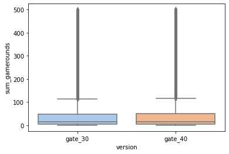
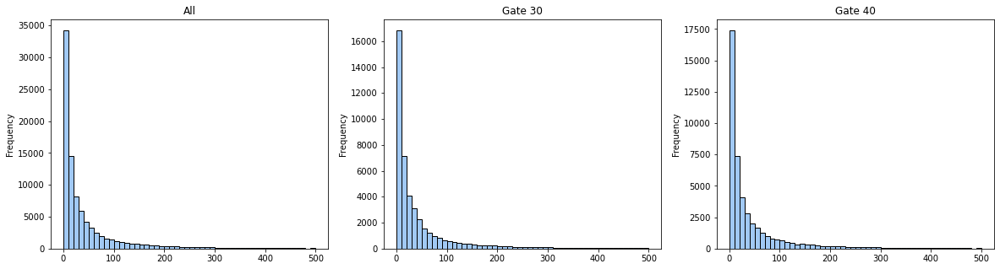
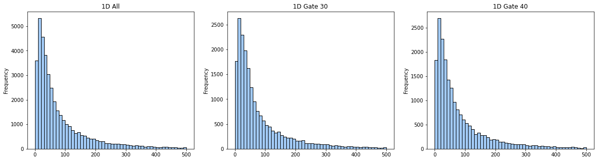
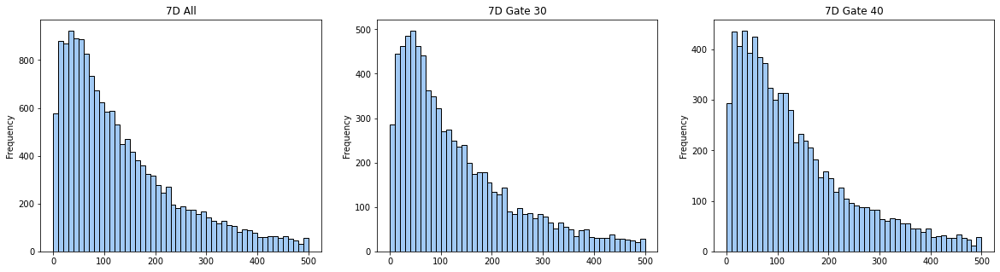
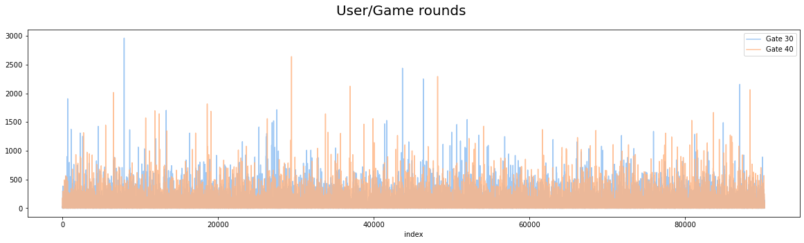
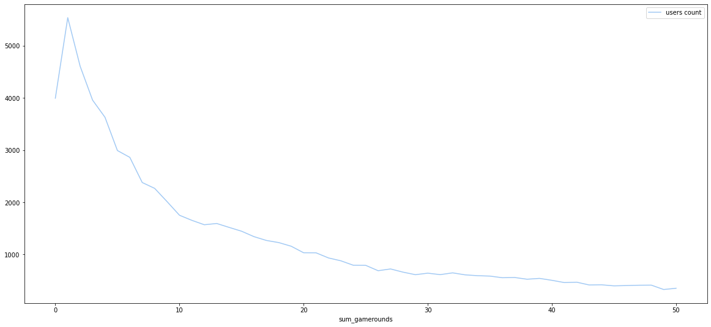
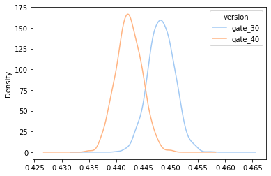
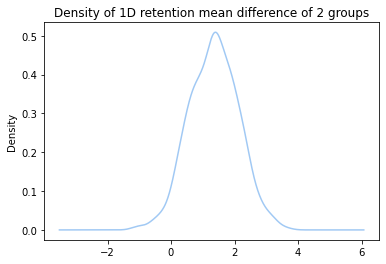
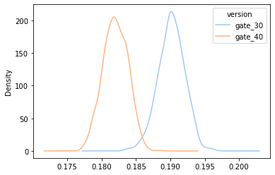
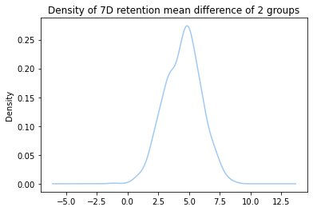

# Mobile Game A/B Testing

I will run do an A/B testing analysis on the cookie cats dataset.  The dataset can be found on Kaggle.<br>
Basically we would like to find out if there is a difference in user behavior when we place a gate at level 30 and at level 40<br>
The data contains a control group at gate 30 and a test group at gate 40.<br>
The user's behavior can be determined by number of games place, and also 1Day/7Day retention status


```python
import numpy as np
import pandas as pd
import seaborn as sns
from scipy import stats
import matplotlib.pyplot as plt
from sklearn.preprocessing import scale
from sklearn.model_selection import train_test_split
from sklearn.preprocessing import MinMaxScaler
from sklearn.ensemble import RandomForestClassifier
from sklearn.metrics import classification_report
from sklearn import metrics
from ml_data import utils
from scipy.stats import shapiro
import scipy.stats as stats
sns.set_palette("pastel")
from IPython.display import display
```

### Load dataset


```python
df = pd.read_csv('data/cookie_cats.csv')
```

### Display the usual data about this dataset


```python
display(df.head())
```


<div>
<table border="1" class="dataframe">
  <thead>
    <tr style="text-align: right;">
      <th></th>
      <th>userid</th>
      <th>version</th>
      <th>sum_gamerounds</th>
      <th>retention_1</th>
      <th>retention_7</th>
    </tr>
  </thead>
  <tbody>
    <tr>
      <th>0</th>
      <td>116</td>
      <td>gate_30</td>
      <td>3</td>
      <td>False</td>
      <td>False</td>
    </tr>
    <tr>
      <th>1</th>
      <td>337</td>
      <td>gate_30</td>
      <td>38</td>
      <td>True</td>
      <td>False</td>
    </tr>
    <tr>
      <th>2</th>
      <td>377</td>
      <td>gate_40</td>
      <td>165</td>
      <td>True</td>
      <td>False</td>
    </tr>
    <tr>
      <th>3</th>
      <td>483</td>
      <td>gate_40</td>
      <td>1</td>
      <td>False</td>
      <td>False</td>
    </tr>
    <tr>
      <th>4</th>
      <td>488</td>
      <td>gate_40</td>
      <td>179</td>
      <td>True</td>
      <td>True</td>
    </tr>
  </tbody>
</table>
</div>


```python
display(df.info())
```

    <class 'pandas.core.frame.DataFrame'>
    RangeIndex: 90189 entries, 0 to 90188
    Data columns (total 5 columns):
     #   Column          Non-Null Count  Dtype 
    ---  ------          --------------  ----- 
     0   userid          90189 non-null  int64 
     1   version         90189 non-null  object
     2   sum_gamerounds  90189 non-null  int64 
     3   retention_1     90189 non-null  bool  
     4   retention_7     90189 non-null  bool  
    dtypes: bool(2), int64(2), object(1)
    memory usage: 2.2+ MB


    None


```python
display(df.columns)
```


    Index(['userid', 'version', 'sum_gamerounds', 'retention_1', 'retention_7'], dtype='object')


```python
display(df.nunique())
```


    userid            90189
    version               2
    sum_gamerounds      942
    retention_1           2
    retention_7           2
    dtype: int64


```python
display(df.describe())
```


<div>
<table border="1" class="dataframe">
  <thead>
    <tr style="text-align: right;">
      <th></th>
      <th>userid</th>
      <th>sum_gamerounds</th>
    </tr>
  </thead>
  <tbody>
    <tr>
      <th>count</th>
      <td>9.018900e+04</td>
      <td>90189.000000</td>
    </tr>
    <tr>
      <th>mean</th>
      <td>4.998412e+06</td>
      <td>51.872457</td>
    </tr>
    <tr>
      <th>std</th>
      <td>2.883286e+06</td>
      <td>195.050858</td>
    </tr>
    <tr>
      <th>min</th>
      <td>1.160000e+02</td>
      <td>0.000000</td>
    </tr>
    <tr>
      <th>25%</th>
      <td>2.512230e+06</td>
      <td>5.000000</td>
    </tr>
    <tr>
      <th>50%</th>
      <td>4.995815e+06</td>
      <td>16.000000</td>
    </tr>
    <tr>
      <th>75%</th>
      <td>7.496452e+06</td>
      <td>51.000000</td>
    </tr>
    <tr>
      <th>max</th>
      <td>9.999861e+06</td>
      <td>49854.000000</td>
    </tr>
  </tbody>
</table>
</div>


**we have a outlier value of 49854**

### Check for null values


```python
assert df.isnull().values.sum() == 0, 'error null values'
display('no null value')
```


    'no null value'


### The range of values in different percentiles


```python
display(df.describe([0.01, 0.05, 0.10, 0.20, 0.80, 0.90, 0.95, 0.99])[["sum_gamerounds"]])
```


<div>
<table border="1" class="dataframe">
  <thead>
    <tr style="text-align: right;">
      <th></th>
      <th>sum_gamerounds</th>
    </tr>
  </thead>
  <tbody>
    <tr>
      <th>count</th>
      <td>90189.000000</td>
    </tr>
    <tr>
      <th>mean</th>
      <td>51.872457</td>
    </tr>
    <tr>
      <th>std</th>
      <td>195.050858</td>
    </tr>
    <tr>
      <th>min</th>
      <td>0.000000</td>
    </tr>
    <tr>
      <th>1%</th>
      <td>0.000000</td>
    </tr>
    <tr>
      <th>5%</th>
      <td>1.000000</td>
    </tr>
    <tr>
      <th>10%</th>
      <td>1.000000</td>
    </tr>
    <tr>
      <th>20%</th>
      <td>3.000000</td>
    </tr>
    <tr>
      <th>50%</th>
      <td>16.000000</td>
    </tr>
    <tr>
      <th>80%</th>
      <td>67.000000</td>
    </tr>
    <tr>
      <th>90%</th>
      <td>134.000000</td>
    </tr>
    <tr>
      <th>95%</th>
      <td>221.000000</td>
    </tr>
    <tr>
      <th>99%</th>
      <td>493.000000</td>
    </tr>
    <tr>
      <th>max</th>
      <td>49854.000000</td>
    </tr>
  </tbody>
</table>
</div>


**50% of the people played less than 16 games**

Clip data so that outlier points become boundary values<br>
df['sum_gamerounds'] = df['sum_gamerounds'].clip(lower=df['sum_gamerounds'].quantile(0.01), upper=df['sum_gamerounds'].quantile(0.99), axis=0)<br>
display(df.describe([0.01, 0.05, 0.10, 0.20, 0.80, 0.90, 0.95, 0.99])[["sum_gamerounds"]])

#### Remove the outlier in data<br>
49854 games played in the first 7 days is unlikely a normal behavior of a normal user


```python
df = df[df['sum_gamerounds'] < df['sum_gamerounds'].max()]
```

### Summary stats about the A/B groups


```python
summary_stats = df.groupby("version")['sum_gamerounds'].agg(["count", "median", "mean", "std", "max"])
display(summary_stats)
```


<div>
<table border="1" class="dataframe">
  <thead>
    <tr style="text-align: right;">
      <th></th>
      <th>count</th>
      <th>median</th>
      <th>mean</th>
      <th>std</th>
      <th>max</th>
    </tr>
    <tr>
      <th>version</th>
      <th></th>
      <th></th>
      <th></th>
      <th></th>
      <th></th>
    </tr>
  </thead>
  <tbody>
    <tr>
      <th>gate_30</th>
      <td>44699</td>
      <td>17.0</td>
      <td>51.342111</td>
      <td>102.057598</td>
      <td>2961</td>
    </tr>
    <tr>
      <th>gate_40</th>
      <td>45489</td>
      <td>16.0</td>
      <td>51.298776</td>
      <td>103.294416</td>
      <td>2640</td>
    </tr>
  </tbody>
</table>
</div>


### Distribution of game rounds values for the 2 groups

we plot values within the 99% percentile


```python
sns.boxplot(x=df['version'], y=df[df['sum_gamerounds'] <= 500]['sum_gamerounds'])
plt.show()
```


    

    


### Histograms for gate 30 and gate 40


```python
fig, axes = plt.subplots(1, 3, figsize=(20, 5))
df.query('sum_gamerounds <= 500')['sum_gamerounds'].plot.hist(title='All', histtype='bar', bins=50, ec='black', ax=axes[0])
df.query('version == "gate_30" & sum_gamerounds <= 500')['sum_gamerounds'].plot.hist(title='Gate 30', histtype='bar', bins=50, ec='black', ax=axes[1])
df.query('version == "gate_40" & sum_gamerounds <= 500')['sum_gamerounds'].plot.hist(title='Gate 40', histtype='bar', bins=50, ec='black', ax=axes[2])
```


    <AxesSubplot:title={'center':'Gate 40'}, ylabel='Frequency'>


    

    


### 1D retention for gate 30 and gate 40


```python
fig, axes = plt.subplots(1, 3, figsize=(20, 5))
df.query('retention_1 == True & sum_gamerounds <= 500')['sum_gamerounds'].plot.hist(title='1D All', histtype='bar', bins=50, ec='black', ax=axes[0])
df.query('retention_1 == True & version == "gate_30" & sum_gamerounds <= 500')['sum_gamerounds'].plot.hist(title='1D Gate 30', histtype='bar', bins=50, ec='black', ax=axes[1])
df.query('retention_1 == True & version == "gate_40" & sum_gamerounds <= 500')['sum_gamerounds'].plot.hist(title='1D Gate 40', histtype='bar', bins=50, ec='black', ax=axes[2])
```


    <AxesSubplot:title={'center':'1D Gate 40'}, ylabel='Frequency'>


    

    


### 7D retention for gate 30 and gate 40


```python
fig, axes = plt.subplots(1, 3, figsize=(20, 5))
df.query('retention_7 == True & sum_gamerounds <= 500')['sum_gamerounds'].plot.hist(title='7D All', histtype='bar', bins=50, ec='black', ax=axes[0])
df.query('retention_7 == True & version == "gate_30" & sum_gamerounds <= 500')['sum_gamerounds'].plot.hist(title='7D Gate 30', histtype='bar', bins=50, ec='black', ax=axes[1])
df.query('retention_7 == True & version == "gate_40" & sum_gamerounds <= 500')['sum_gamerounds'].plot.hist(title='7D Gate 40', histtype='bar', bins=50, ec='black', ax=axes[2])
```


    <AxesSubplot:title={'center':'7D Gate 40'}, ylabel='Frequency'>


    

    


### Plot User / Gamerounds value chart for the 2 groups


```python
df[df['version']=='gate_30'].reset_index().set_index('index')['sum_gamerounds'].plot(legend=True, label='Gate 30', figsize=(20, 5))
df[df['version']=='gate_40'].reset_index().set_index('index')['sum_gamerounds'].plot(legend=True, label='Gate 40', alpha=0.8)
plt.suptitle("User/Game rounds", fontsize=20)
plt.show()
```


    

    


### Transformation of retention data

retention_1 and retention_7 columns contain True or False values, we can transform the data into a value counts table


```python
df_retention = pd.DataFrame({'ret_1_count': df['retention_1'].value_counts(),
                             'ret_7_count': df['retention_7'].value_counts(),
                             'ret_1_ratio': df['retention_1'].value_counts() / len(df),
                             'ret_7_ratio': df['retention_7'].value_counts() / len(df),
                             })
display(df_retention)
```


<div>
<table border="1" class="dataframe">
  <thead>
    <tr style="text-align: right;">
      <th></th>
      <th>ret_1_count</th>
      <th>ret_7_count</th>
      <th>ret_1_ratio</th>
      <th>ret_7_ratio</th>
    </tr>
  </thead>
  <tbody>
    <tr>
      <th>False</th>
      <td>50035</td>
      <td>73408</td>
      <td>0.554786</td>
      <td>0.813944</td>
    </tr>
    <tr>
      <th>True</th>
      <td>40153</td>
      <td>16780</td>
      <td>0.445214</td>
      <td>0.186056</td>
    </tr>
  </tbody>
</table>
</div>


**1D retention rate is about 44%, 7D retention rate is about 18%**

### Group the games played by user, count the rank the result


```python
games_user_count = df.groupby("sum_gamerounds").userid.count().to_frame()
display(games_user_count.head(20))
games_user_count.loc[0:50]['userid'].plot(legend=True, label='users count', figsize=(20, 9))
plt.show()
```


<div>
<table border="1" class="dataframe">
  <thead>
    <tr style="text-align: right;">
      <th></th>
      <th>userid</th>
    </tr>
    <tr>
      <th>sum_gamerounds</th>
      <th></th>
    </tr>
  </thead>
  <tbody>
    <tr>
      <th>0</th>
      <td>3994</td>
    </tr>
    <tr>
      <th>1</th>
      <td>5538</td>
    </tr>
    <tr>
      <th>2</th>
      <td>4606</td>
    </tr>
    <tr>
      <th>3</th>
      <td>3958</td>
    </tr>
    <tr>
      <th>4</th>
      <td>3629</td>
    </tr>
    <tr>
      <th>5</th>
      <td>2992</td>
    </tr>
    <tr>
      <th>6</th>
      <td>2861</td>
    </tr>
    <tr>
      <th>7</th>
      <td>2379</td>
    </tr>
    <tr>
      <th>8</th>
      <td>2267</td>
    </tr>
    <tr>
      <th>9</th>
      <td>2013</td>
    </tr>
    <tr>
      <th>10</th>
      <td>1752</td>
    </tr>
    <tr>
      <th>11</th>
      <td>1654</td>
    </tr>
    <tr>
      <th>12</th>
      <td>1570</td>
    </tr>
    <tr>
      <th>13</th>
      <td>1594</td>
    </tr>
    <tr>
      <th>14</th>
      <td>1519</td>
    </tr>
    <tr>
      <th>15</th>
      <td>1446</td>
    </tr>
    <tr>
      <th>16</th>
      <td>1342</td>
    </tr>
    <tr>
      <th>17</th>
      <td>1269</td>
    </tr>
    <tr>
      <th>18</th>
      <td>1228</td>
    </tr>
    <tr>
      <th>19</th>
      <td>1158</td>
    </tr>
  </tbody>
</table>
</div>


    

    


### Number of people who did not open and play any game


```python
no_play = df.query('sum_gamerounds == 0')
display(no_play.head())
display(len(no_play))
```


<div>
<table border="1" class="dataframe">
  <thead>
    <tr style="text-align: right;">
      <th></th>
      <th>userid</th>
      <th>version</th>
      <th>sum_gamerounds</th>
      <th>retention_1</th>
      <th>retention_7</th>
    </tr>
  </thead>
  <tbody>
    <tr>
      <th>6</th>
      <td>1066</td>
      <td>gate_30</td>
      <td>0</td>
      <td>False</td>
      <td>False</td>
    </tr>
    <tr>
      <th>11</th>
      <td>2101</td>
      <td>gate_30</td>
      <td>0</td>
      <td>False</td>
      <td>False</td>
    </tr>
    <tr>
      <th>26</th>
      <td>3095</td>
      <td>gate_30</td>
      <td>0</td>
      <td>False</td>
      <td>False</td>
    </tr>
    <tr>
      <th>35</th>
      <td>4076</td>
      <td>gate_40</td>
      <td>0</td>
      <td>False</td>
      <td>False</td>
    </tr>
    <tr>
      <th>37</th>
      <td>4176</td>
      <td>gate_30</td>
      <td>0</td>
      <td>False</td>
      <td>False</td>
    </tr>
  </tbody>
</table>
</div>


    3994


### Number of people who have played 30 to 40 games


```python
gated = df.groupby("sum_gamerounds").userid.count().loc[[30, 40]]
display(gated)
```


    sum_gamerounds
    30    642
    40    505
    Name: userid, dtype: int64


### Summary statistics for the control and test group


```python
summary_stats = df.groupby("version")['sum_gamerounds'].agg(["count", "median", "mean", "std", "max"])
display(summary_stats)
```


<div>
<table border="1" class="dataframe">
  <thead>
    <tr style="text-align: right;">
      <th></th>
      <th>count</th>
      <th>median</th>
      <th>mean</th>
      <th>std</th>
      <th>max</th>
    </tr>
    <tr>
      <th>version</th>
      <th></th>
      <th></th>
      <th></th>
      <th></th>
      <th></th>
    </tr>
  </thead>
  <tbody>
    <tr>
      <th>gate_30</th>
      <td>44699</td>
      <td>17.0</td>
      <td>51.342111</td>
      <td>102.057598</td>
      <td>2961</td>
    </tr>
    <tr>
      <th>gate_40</th>
      <td>45489</td>
      <td>16.0</td>
      <td>51.298776</td>
      <td>103.294416</td>
      <td>2640</td>
    </tr>
  </tbody>
</table>
</div>


# Compare by retention days

## Compare 1D retention data for the 2 groups


```python
ret_1d_stat = df.groupby(["version", "retention_1"])['sum_gamerounds'].agg(["count", "median", "mean", "std", "max"])
display(ret_1d_stat)
```


<div>
<table border="1" class="dataframe">
  <thead>
    <tr style="text-align: right;">
      <th></th>
      <th></th>
      <th>count</th>
      <th>median</th>
      <th>mean</th>
      <th>std</th>
      <th>max</th>
    </tr>
    <tr>
      <th>version</th>
      <th>retention_1</th>
      <th></th>
      <th></th>
      <th></th>
      <th></th>
      <th></th>
    </tr>
  </thead>
  <tbody>
    <tr>
      <th rowspan="2" valign="top">gate_30</th>
      <th>False</th>
      <td>24665</td>
      <td>6.0</td>
      <td>16.359092</td>
      <td>36.528426</td>
      <td>1072</td>
    </tr>
    <tr>
      <th>True</th>
      <td>20034</td>
      <td>48.0</td>
      <td>94.411700</td>
      <td>135.037697</td>
      <td>2961</td>
    </tr>
    <tr>
      <th rowspan="2" valign="top">gate_40</th>
      <th>False</th>
      <td>25370</td>
      <td>6.0</td>
      <td>16.340402</td>
      <td>35.925756</td>
      <td>1241</td>
    </tr>
    <tr>
      <th>True</th>
      <td>20119</td>
      <td>49.0</td>
      <td>95.381182</td>
      <td>137.887256</td>
      <td>2640</td>
    </tr>
  </tbody>
</table>
</div>


```python
ret_1d = df.groupby("version")['retention_1'].mean()
display(ret_1d)
```


    version
    gate_30    0.448198
    gate_40    0.442283
    Name: retention_1, dtype: float64


**the 2 retention rate are very close**

## Compare at 7D retention data for the 2 groups


```python
ret_7d_stat = df.groupby(["version", "retention_7"])['sum_gamerounds'].agg(["count", "median", "mean", "std", "max"])
display(ret_7d_stat)
```


<div>
<table border="1" class="dataframe">
  <thead>
    <tr style="text-align: right;">
      <th></th>
      <th></th>
      <th>count</th>
      <th>median</th>
      <th>mean</th>
      <th>std</th>
      <th>max</th>
    </tr>
    <tr>
      <th>version</th>
      <th>retention_7</th>
      <th></th>
      <th></th>
      <th></th>
      <th></th>
      <th></th>
    </tr>
  </thead>
  <tbody>
    <tr>
      <th rowspan="2" valign="top">gate_30</th>
      <th>False</th>
      <td>36198</td>
      <td>11.0</td>
      <td>25.796508</td>
      <td>43.316158</td>
      <td>981</td>
    </tr>
    <tr>
      <th>True</th>
      <td>8501</td>
      <td>105.0</td>
      <td>160.117516</td>
      <td>179.358560</td>
      <td>2961</td>
    </tr>
    <tr>
      <th rowspan="2" valign="top">gate_40</th>
      <th>False</th>
      <td>37210</td>
      <td>11.0</td>
      <td>25.856356</td>
      <td>44.406112</td>
      <td>2640</td>
    </tr>
    <tr>
      <th>True</th>
      <td>8279</td>
      <td>111.0</td>
      <td>165.649837</td>
      <td>183.792499</td>
      <td>2294</td>
    </tr>
  </tbody>
</table>
</div>


```python
ret_7d = df.groupby("version")['retention_7'].mean()
display(ret_7d)
```


    version
    gate_30    0.190183
    gate_40    0.182000
    Name: retention_7, dtype: float64


### Combine 1D and 7D retention data we can create a new categorical variable


```python
df["RetentionStatus"] = list(map(lambda x, y: str(x)+"-"+str(y), df['retention_1'], df['retention_7']))
retention_status = df.groupby(["version", "RetentionStatus"])['sum_gamerounds'].agg(["count", "median", "mean", "std", "max"])
display(retention_status)
```


<div>
<table border="1" class="dataframe">
  <thead>
    <tr style="text-align: right;">
      <th></th>
      <th></th>
      <th>count</th>
      <th>median</th>
      <th>mean</th>
      <th>std</th>
      <th>max</th>
    </tr>
    <tr>
      <th>version</th>
      <th>RetentionStatus</th>
      <th></th>
      <th></th>
      <th></th>
      <th></th>
      <th></th>
    </tr>
  </thead>
  <tbody>
    <tr>
      <th rowspan="4" valign="top">gate_30</th>
      <th>False-False</th>
      <td>22840</td>
      <td>6.0</td>
      <td>11.819746</td>
      <td>21.642643</td>
      <td>981</td>
    </tr>
    <tr>
      <th>False-True</th>
      <td>1825</td>
      <td>43.0</td>
      <td>73.169315</td>
      <td>93.222330</td>
      <td>1072</td>
    </tr>
    <tr>
      <th>True-False</th>
      <td>13358</td>
      <td>33.0</td>
      <td>49.694490</td>
      <td>58.125396</td>
      <td>918</td>
    </tr>
    <tr>
      <th>True-True</th>
      <td>6676</td>
      <td>127.0</td>
      <td>183.886309</td>
      <td>189.626390</td>
      <td>2961</td>
    </tr>
    <tr>
      <th rowspan="4" valign="top">gate_40</th>
      <th>False-False</th>
      <td>23597</td>
      <td>6.0</td>
      <td>11.913294</td>
      <td>20.901020</td>
      <td>547</td>
    </tr>
    <tr>
      <th>False-True</th>
      <td>1773</td>
      <td>47.0</td>
      <td>75.261139</td>
      <td>94.478048</td>
      <td>1241</td>
    </tr>
    <tr>
      <th>True-False</th>
      <td>13613</td>
      <td>32.0</td>
      <td>50.025490</td>
      <td>60.924587</td>
      <td>2640</td>
    </tr>
    <tr>
      <th>True-True</th>
      <td>6506</td>
      <td>133.0</td>
      <td>190.282355</td>
      <td>194.220077</td>
      <td>2294</td>
    </tr>
  </tbody>
</table>
</div>


**we can see that for each grouping the summary stats are similar for gate 30 and 40**<br>
**next we need to do some tests to see if they are significantly not similar**

# Test for normality


```python
df = pd.read_csv('data/cookie_cats.csv')
df = df[df['sum_gamerounds'] < df['sum_gamerounds'].max()]
```


```python
group_a = df[df['version'] == 'gate_30']['sum_gamerounds']
group_b = df[df['version'] == 'gate_40']['sum_gamerounds']
display(group_a)
display(group_b)
```


    0         3
    1        38
    6         0
    11        0
    13       39
             ..
    90179    14
    90180     7
    90182    21
    90183    10
    90186    28
    Name: sum_gamerounds, Length: 44699, dtype: int64


    2        165
    3          1
    4        179
    5        187
    7          2
            ... 
    90181     10
    90184     97
    90185     30
    90187     51
    90188     16
    Name: sum_gamerounds, Length: 45489, dtype: int64


```python
shapiro_a = shapiro(group_a)
shapiro_b = shapiro(group_b)
if shapiro_a[1] < 0.05:
    display('group a is not normal')
else:
    display('group a is normal')
if shapiro_b[1] < 0.05:
    display('group b is not normal')
else:
    display('group b is normal')
```

    /opt/conda/lib/python3.9/site-packages/scipy/stats/_morestats.py:1761: UserWarning: p-value may not be accurate for N > 5000.
      warnings.warn("p-value may not be accurate for N > 5000.")


    'group a is not normal'


    'group b is not normal'


**the 2 groups are not normal**

### Run Mann-Whitney U Test


```python
utest = stats.mannwhitneyu(group_a, group_b)
display(utest)
```


    MannwhitneyuResult(statistic=1024285761.5, pvalue=0.05089155279145376)


# Test by bootstrapping

## Bootstrap 1D retention

### Creating an list with bootstrapped means for each gate group


```python
sample_means = []
for i in range(1000):
    boot_mean = df.sample(frac=1, replace=True).groupby('version')['retention_1'].mean()
    sample_means.append(boot_mean)
```

### plot kernel density of the bootstrap distributions


```python
sample_means = pd.DataFrame(sample_means)
sample_means.plot(kind='density')
plt.show()
```


    

    


### calculate difference of the means of gate 30 and gate 40


```python
sample_means['diff'] = (sample_means['gate_30'] - sample_means['gate_40']) / sample_means['gate_40'] * 100
ax = sample_means['diff'].plot(kind='density')
ax.set_title('Density of 1D retention mean difference of 2 groups')
plt.show()
ratio = (sample_means['diff'] > 0).mean() * 100
display(f'For 1D retention, gate 30 mean is larger around {ratio}% of the time')
```


    

    


    'For 1D retention, gate 30 mean is larger around 96.39999999999999% of the time'


## Bootstrap 7D retention

### Creating an list with bootstrapped means for each gate group


```python
sample_means = []
for i in range(1000):
    boot_mean = df.sample(frac=1, replace=True).groupby('version')['retention_7'].mean()
    sample_means.append(boot_mean)
```

### plot kernel density of the bootstrap distributions


```python
sample_means = pd.DataFrame(sample_means)
sample_means.plot(kind='density')
plt.show()
```


    

    


### calculate difference of the means of gate 30 and gate 40


```python
sample_means['diff'] = (sample_means['gate_30'] - sample_means['gate_40']) / sample_means['gate_40'] * 100
ax = sample_means['diff'].plot(kind='density')
ax.set_title('Density of 7D retention mean difference of 2 groups')
plt.show()
ratio = (sample_means['diff'] > 0).mean() * 100
display(f'For 7D retention, gate 30 mean is larger around {ratio}% of the time')
```


    

    


    'For 7D retention, gate 30 mean is larger around 99.8% of the time'


# Conclusion

**From the Mann-Whitney U test result, the p-value is around 0.05**<br>
**we can say the distributions for the 2 groups are different, but it is hard to say how different these groups are**

**We then perform the bootstrap method to sample the data**<br>
**From the bootstrap test result above, in terms of retention rate**<br>
**placing the gate at level 30 will yield higher 1D retention and 7D retention and is therefore the better strategy**
