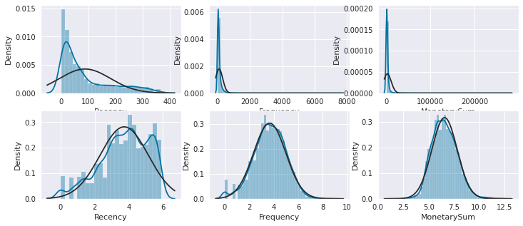
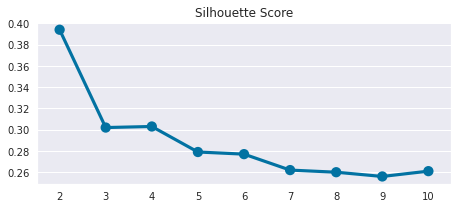
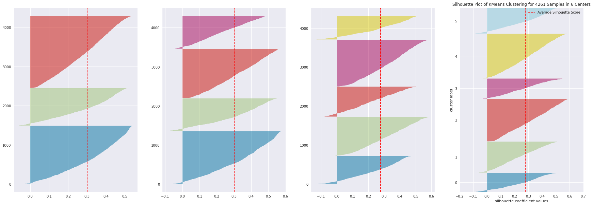
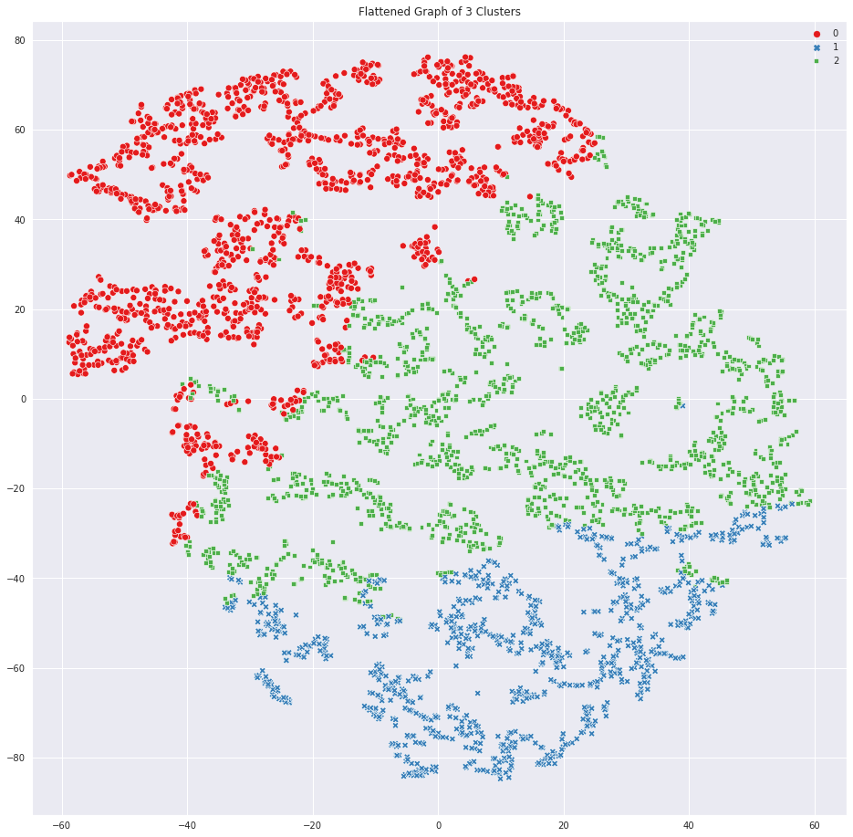
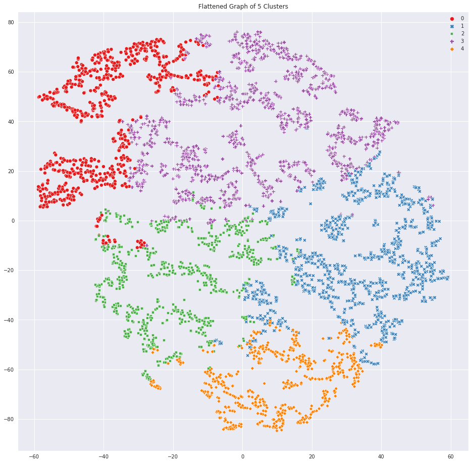
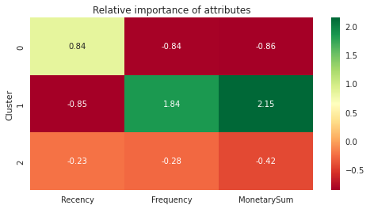
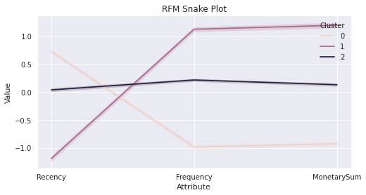

# Customer Segmentation Analysis

In this notebook I will demonstrate how to perform customer segmentation analysis using kmeans algorithm


```python
from math import pi
import pandas as pd
import numpy as np
from sklearn.metrics import mean_squared_error, silhouette_score
from sklearn.preprocessing import LabelEncoder
from sklearn.cluster import KMeans
from sklearn.decomposition import PCA
from sklearn.manifold import TSNE

from datetime import date, timedelta
import plotly.graph_objects as go
import plotly.offline as pyo

import matplotlib.pyplot as plt
import seaborn as sns
from scipy.stats import skew, norm, probplot
sns.set_style('darkgrid')

import utils as utils
```


```python
!pip install yellowbrick plotly
```

    Requirement already satisfied: yellowbrick in /opt/conda/lib/python3.9/site-packages (1.4)
    Collecting plotly
      Downloading plotly-5.8.0-py2.py3-none-any.whl (15.2 MB)
         ━━━━━━━━━━━━━━━━━━━━━━━━━━━━━━━━━━━━━━━━ 15.2/15.2 MB 6.4 MB/s eta 0:00:0000:0100:01
    [?25hRequirement already satisfied: scipy>=1.0.0 in /opt/conda/lib/python3.9/site-packages (from yellowbrick) (1.8.0)
    Requirement already satisfied: cycler>=0.10.0 in /opt/conda/lib/python3.9/site-packages (from yellowbrick) (0.11.0)
    Requirement already satisfied: numpy>=1.16.0 in /opt/conda/lib/python3.9/site-packages (from yellowbrick) (1.19.5)
    Requirement already satisfied: matplotlib!=3.0.0,>=2.0.2 in /opt/conda/lib/python3.9/site-packages (from yellowbrick) (3.5.2)
    Requirement already satisfied: scikit-learn>=1.0.0 in /opt/conda/lib/python3.9/site-packages (from yellowbrick) (1.0.2)
    Collecting tenacity>=6.2.0
      Downloading tenacity-8.0.1-py3-none-any.whl (24 kB)
    Requirement already satisfied: packaging>=20.0 in /opt/conda/lib/python3.9/site-packages (from matplotlib!=3.0.0,>=2.0.2->yellowbrick) (21.3)
    Requirement already satisfied: pillow>=6.2.0 in /opt/conda/lib/python3.9/site-packages (from matplotlib!=3.0.0,>=2.0.2->yellowbrick) (9.1.0)
    Requirement already satisfied: fonttools>=4.22.0 in /opt/conda/lib/python3.9/site-packages (from matplotlib!=3.0.0,>=2.0.2->yellowbrick) (4.33.3)
    Requirement already satisfied: python-dateutil>=2.7 in /opt/conda/lib/python3.9/site-packages (from matplotlib!=3.0.0,>=2.0.2->yellowbrick) (2.8.2)
    Requirement already satisfied: pyparsing>=2.2.1 in /opt/conda/lib/python3.9/site-packages (from matplotlib!=3.0.0,>=2.0.2->yellowbrick) (3.0.8)
    Requirement already satisfied: kiwisolver>=1.0.1 in /opt/conda/lib/python3.9/site-packages (from matplotlib!=3.0.0,>=2.0.2->yellowbrick) (1.4.2)
    Requirement already satisfied: joblib>=0.11 in /opt/conda/lib/python3.9/site-packages (from scikit-learn>=1.0.0->yellowbrick) (1.1.0)
    Requirement already satisfied: threadpoolctl>=2.0.0 in /opt/conda/lib/python3.9/site-packages (from scikit-learn>=1.0.0->yellowbrick) (3.1.0)
    Requirement already satisfied: six>=1.5 in /opt/conda/lib/python3.9/site-packages (from python-dateutil>=2.7->matplotlib!=3.0.0,>=2.0.2->yellowbrick) (1.15.0)
    Installing collected packages: tenacity, plotly
    Successfully installed plotly-5.8.0 tenacity-8.0.1


```python
from yellowbrick.cluster import SilhouetteVisualizer
```

## Load the dataset and use only the data from latest year


```python
#df = pd.read_excel('data/Online Retail.xlsx')
#pd.to_pickle(df, 'data/all_data.pkl')

df = pd.read_pickle('data/all_data.pkl')
df.dropna(axis=0, inplace=True, how='any')
end_date = df['InvoiceDate'].max()
start_date = end_date - pd.to_timedelta(364, unit='d')
df_rfm = df[(df['InvoiceDate'] >= start_date) & (df['InvoiceDate'] <= end_date)]
df_rfm.to_pickle('data/last_year_data.pkl')
```

## calculate a total sum value for each transaction

There are some transactions in the dataset with quantity less than zero, we are going to drop those transactions from this analysis for now.


```python
df_rfm = pd.read_pickle('data/last_year_data.pkl')
df_rfm['TotalSum'] = df_rfm['Quantity'] * df_rfm['UnitPrice']
df_rfm = df_rfm.drop(df_rfm.query("Quantity < 0").index)
```

## create a dataframe with the useful RFM data for later analysis


```python
end_date = df_rfm['InvoiceDate'].max()
snapshot_date = end_date + timedelta(days=1)
df_rfm = df_rfm.groupby(['CustomerID']).agg({
        'InvoiceDate': lambda x: (snapshot_date - x.max()).days,
        'InvoiceNo': 'count',
        'TotalSum': 'sum'})
df_rfm.rename(columns={'InvoiceDate': 'Recency',
                           'InvoiceNo': 'Frequency',
                           'TotalSum': 'MonetarySum'},
                  inplace=True)
df_rfm = df_rfm.drop(df_rfm[df_rfm.MonetarySum == 0].index)
df_cleaned = df_rfm.copy()
```


```python
df_cleaned.head()
```


<div>
<style scoped>
    .dataframe tbody tr th:only-of-type {
        vertical-align: middle;
    }

    .dataframe tbody tr th {
        vertical-align: top;
    }

    .dataframe thead th {
        text-align: right;
    }
</style>
<table border="1" class="dataframe">
  <thead>
    <tr style="text-align: right;">
      <th></th>
      <th>Recency</th>
      <th>Frequency</th>
      <th>MonetarySum</th>
    </tr>
    <tr>
      <th>CustomerID</th>
      <th></th>
      <th></th>
      <th></th>
    </tr>
  </thead>
  <tbody>
    <tr>
      <th>12346.0</th>
      <td>326</td>
      <td>1</td>
      <td>77183.60</td>
    </tr>
    <tr>
      <th>12347.0</th>
      <td>2</td>
      <td>151</td>
      <td>3598.21</td>
    </tr>
    <tr>
      <th>12348.0</th>
      <td>75</td>
      <td>31</td>
      <td>1797.24</td>
    </tr>
    <tr>
      <th>12349.0</th>
      <td>19</td>
      <td>73</td>
      <td>1757.55</td>
    </tr>
    <tr>
      <th>12350.0</th>
      <td>310</td>
      <td>17</td>
      <td>334.40</td>
    </tr>
  </tbody>
</table>
</div>


## Log transform the data for kmeans clustering


```python
f, axes = plt.subplots(2, 3, figsize=(12, 5))
sns.distplot(df_rfm['Recency'], fit=norm, ax=axes[0, 0])
sns.distplot(df_rfm['Frequency'], fit=norm, ax=axes[0, 1])
sns.distplot(df_rfm['MonetarySum'], fit=norm, ax=axes[0, 2])

df_rfm['Recency'] = np.log(df_rfm['Recency'])
df_rfm['Frequency'] = np.log(df_rfm['Frequency'])
df_rfm['MonetarySum'] = np.log(df_rfm['MonetarySum'])
assert len(df_rfm.index[np.isinf(df_rfm).any(1)]) == 0, 'inf was found in data'

sns.distplot(df_rfm['Recency'], fit=norm, ax=axes[1, 0])
sns.distplot(df_rfm['Frequency'], fit=norm, ax=axes[1, 1])
sns.distplot(df_rfm['MonetarySum'], fit=norm, ax=axes[1, 2])
df_rfm.head()
```

    /opt/conda/lib/python3.9/site-packages/seaborn/distributions.py:2619: FutureWarning:
    
    `distplot` is a deprecated function and will be removed in a future version. Please adapt your code to use either `displot` (a figure-level function with similar flexibility) or `histplot` (an axes-level function for histograms).
    
    /opt/conda/lib/python3.9/site-packages/seaborn/distributions.py:2619: FutureWarning:
    
    `distplot` is a deprecated function and will be removed in a future version. Please adapt your code to use either `displot` (a figure-level function with similar flexibility) or `histplot` (an axes-level function for histograms).
    
    /opt/conda/lib/python3.9/site-packages/seaborn/distributions.py:2619: FutureWarning:
    
    `distplot` is a deprecated function and will be removed in a future version. Please adapt your code to use either `displot` (a figure-level function with similar flexibility) or `histplot` (an axes-level function for histograms).
    
    /opt/conda/lib/python3.9/site-packages/seaborn/distributions.py:2619: FutureWarning:
    
    `distplot` is a deprecated function and will be removed in a future version. Please adapt your code to use either `displot` (a figure-level function with similar flexibility) or `histplot` (an axes-level function for histograms).
    
    /opt/conda/lib/python3.9/site-packages/seaborn/distributions.py:2619: FutureWarning:
    
    `distplot` is a deprecated function and will be removed in a future version. Please adapt your code to use either `displot` (a figure-level function with similar flexibility) or `histplot` (an axes-level function for histograms).
    
    /opt/conda/lib/python3.9/site-packages/seaborn/distributions.py:2619: FutureWarning:
    
    `distplot` is a deprecated function and will be removed in a future version. Please adapt your code to use either `displot` (a figure-level function with similar flexibility) or `histplot` (an axes-level function for histograms).
    


<div>
<style scoped>
    .dataframe tbody tr th:only-of-type {
        vertical-align: middle;
    }

    .dataframe tbody tr th {
        vertical-align: top;
    }

    .dataframe thead th {
        text-align: right;
    }
</style>
<table border="1" class="dataframe">
  <thead>
    <tr style="text-align: right;">
      <th></th>
      <th>Recency</th>
      <th>Frequency</th>
      <th>MonetarySum</th>
    </tr>
    <tr>
      <th>CustomerID</th>
      <th></th>
      <th></th>
      <th></th>
    </tr>
  </thead>
  <tbody>
    <tr>
      <th>12346.0</th>
      <td>5.786897</td>
      <td>0.000000</td>
      <td>11.253942</td>
    </tr>
    <tr>
      <th>12347.0</th>
      <td>0.693147</td>
      <td>5.017280</td>
      <td>8.188192</td>
    </tr>
    <tr>
      <th>12348.0</th>
      <td>4.317488</td>
      <td>3.433987</td>
      <td>7.494007</td>
    </tr>
    <tr>
      <th>12349.0</th>
      <td>2.944439</td>
      <td>4.290459</td>
      <td>7.471676</td>
    </tr>
    <tr>
      <th>12350.0</th>
      <td>5.736572</td>
      <td>2.833213</td>
      <td>5.812338</td>
    </tr>
  </tbody>
</table>
</div>


    

    


## Standardize data


```python
df_rfm_norm = (df_rfm - df_rfm.mean()) / df_rfm.std()
df_rfm_norm.describe()
```


<div>
<style scoped>
    .dataframe tbody tr th:only-of-type {
        vertical-align: middle;
    }

    .dataframe tbody tr th {
        vertical-align: top;
    }

    .dataframe thead th {
        text-align: right;
    }
</style>
<table border="1" class="dataframe">
  <thead>
    <tr style="text-align: right;">
      <th></th>
      <th>Recency</th>
      <th>Frequency</th>
      <th>MonetarySum</th>
    </tr>
  </thead>
  <tbody>
    <tr>
      <th>count</th>
      <td>4.261000e+03</td>
      <td>4.261000e+03</td>
      <td>4.261000e+03</td>
    </tr>
    <tr>
      <th>mean</th>
      <td>-1.339708e-14</td>
      <td>-1.632539e-14</td>
      <td>4.146153e-15</td>
    </tr>
    <tr>
      <th>std</th>
      <td>1.000000e+00</td>
      <td>1.000000e+00</td>
      <td>1.000000e+00</td>
    </tr>
    <tr>
      <th>min</th>
      <td>-2.633827e+00</td>
      <td>-2.784661e+00</td>
      <td>-4.183510e+00</td>
    </tr>
    <tr>
      <th>25%</th>
      <td>-6.325725e-01</td>
      <td>-6.334237e-01</td>
      <td>-6.836459e-01</td>
    </tr>
    <tr>
      <th>50%</th>
      <td>1.294501e-01</td>
      <td>3.502602e-02</td>
      <td>-5.832702e-02</td>
    </tr>
    <tr>
      <th>75%</th>
      <td>8.204957e-01</td>
      <td>6.966700e-01</td>
      <td>6.542867e-01</td>
    </tr>
    <tr>
      <th>max</th>
      <td>1.531657e+00</td>
      <td>4.006373e+00</td>
      <td>4.748219e+00</td>
    </tr>
  </tbody>
</table>
</div>


## Run KMeans algo and save the silhouette scores for plot


```python
cluster_list = []
km_sil_score = []

start = 2
end = 11
for n_clusters in range(start, end):

    kmeans = KMeans(n_clusters=n_clusters)
    labels = kmeans.fit_predict(df_rfm_norm)

    silhouette_avg = round(silhouette_score(df_rfm_norm, labels, random_state=42), 3)

    # Append score to lists
    km_sil_score.append(silhouette_avg)
    cluster_list.append(n_clusters)

    print("No. Clusters: {}, Silhouette Score: {}, Change from Previous Cluster: {}".format(
        n_clusters,
        silhouette_avg,
        (km_sil_score[n_clusters - start] - km_sil_score[n_clusters - start - 1]).round(3)))

    if n_clusters == end - 1:
        plt.figure(figsize=(6.47, 3))

        plt.title('Silhouette Score')
        sns.pointplot(x=cluster_list, y=km_sil_score)
        plt.savefig('silhouette_score.png', format='png', dpi=1000)
        plt.tight_layout()
        plt.show()
```

    No. Clusters: 2, Silhouette Score: 0.394, Change from Previous Cluster: 0.0
    No. Clusters: 3, Silhouette Score: 0.302, Change from Previous Cluster: -0.092
    No. Clusters: 4, Silhouette Score: 0.303, Change from Previous Cluster: 0.001
    No. Clusters: 5, Silhouette Score: 0.279, Change from Previous Cluster: -0.024
    No. Clusters: 6, Silhouette Score: 0.277, Change from Previous Cluster: -0.002
    No. Clusters: 7, Silhouette Score: 0.262, Change from Previous Cluster: -0.015
    No. Clusters: 8, Silhouette Score: 0.26, Change from Previous Cluster: -0.002
    No. Clusters: 9, Silhouette Score: 0.256, Change from Previous Cluster: -0.004
    No. Clusters: 10, Silhouette Score: 0.261, Change from Previous Cluster: 0.005


    

    


## Visualize the clusters for different n = 3, 4, 5, 6


```python
f, axes = plt.subplots(1, 4, figsize=(30, 10))
for n in [3, 4, 5, 6]:
    model = KMeans(n, random_state=42)
    visualizer = SilhouetteVisualizer(model, colors='yellowbrick', ax=axes[n-3])
    visualizer.fit(df_rfm_norm)
visualizer.show()
```


    

    


    <AxesSubplot:title={'center':'Silhouette Plot of KMeans Clustering for 4261 Samples in 6 Centers'}, xlabel='silhouette coefficient values', ylabel='cluster label'>


```python
def run_kmeans(df, clusters_number):
    kmeans = KMeans(n_clusters=clusters_number, random_state=42)
    kmeans.fit(df)

    cluster_labels = kmeans.labels_
    df_new = df.assign(Cluster=cluster_labels)

    model = TSNE(random_state=1)
    transformed = model.fit_transform(df)

    plt.figure(figsize=(16, 16))
    plt.title('Flattened Graph of {} Clusters'.format(clusters_number))
    sns.scatterplot(x=transformed[:, 0], y=transformed[:, 1], hue=cluster_labels, style=cluster_labels, palette="Set1")

    return df_new, cluster_labels
```


```python
df_new, labels = run_kmeans(df_rfm_norm, 3)
```

    /opt/conda/lib/python3.9/site-packages/sklearn/manifold/_t_sne.py:780: FutureWarning:
    
    The default initialization in TSNE will change from 'random' to 'pca' in 1.2.
    
    /opt/conda/lib/python3.9/site-packages/sklearn/manifold/_t_sne.py:790: FutureWarning:
    
    The default learning rate in TSNE will change from 200.0 to 'auto' in 1.2.
    


    

    


```python
df_new, labels = run_kmeans(df_rfm_norm, 5)
```

    /opt/conda/lib/python3.9/site-packages/sklearn/manifold/_t_sne.py:780: FutureWarning:
    
    The default initialization in TSNE will change from 'random' to 'pca' in 1.2.
    
    /opt/conda/lib/python3.9/site-packages/sklearn/manifold/_t_sne.py:790: FutureWarning:
    
    The default learning rate in TSNE will change from 200.0 to 'auto' in 1.2.
    


    

    


```python
# check the stats in each cluster
df_cleaned['Cluster'] = labels
df = df_cleaned.groupby('Cluster').agg({'Recency': 'mean',
                                        'Frequency': 'mean',
                                        'MonetarySum': ['mean', 'count']}).round(2)
df.head()
```


<div>
<style scoped>
    .dataframe tbody tr th:only-of-type {
        vertical-align: middle;
    }

    .dataframe tbody tr th {
        vertical-align: top;
    }

    .dataframe thead tr th {
        text-align: left;
    }

    .dataframe thead tr:last-of-type th {
        text-align: right;
    }
</style>
<table border="1" class="dataframe">
  <thead>
    <tr>
      <th></th>
      <th>Recency</th>
      <th>Frequency</th>
      <th colspan="2" halign="left">MonetarySum</th>
    </tr>
    <tr>
      <th></th>
      <th>mean</th>
      <th>mean</th>
      <th>mean</th>
      <th>count</th>
    </tr>
    <tr>
      <th>Cluster</th>
      <th></th>
      <th></th>
      <th></th>
      <th></th>
    </tr>
  </thead>
  <tbody>
    <tr>
      <th>0</th>
      <td>160.61</td>
      <td>7.27</td>
      <td>195.51</td>
      <td>710</td>
    </tr>
    <tr>
      <th>1</th>
      <td>57.66</td>
      <td>114.46</td>
      <td>2121.40</td>
      <td>996</td>
    </tr>
    <tr>
      <th>2</th>
      <td>16.45</td>
      <td>41.96</td>
      <td>643.47</td>
      <td>763</td>
    </tr>
    <tr>
      <th>3</th>
      <td>154.00</td>
      <td>31.48</td>
      <td>534.47</td>
      <td>1194</td>
    </tr>
    <tr>
      <th>4</th>
      <td>8.44</td>
      <td>324.05</td>
      <td>8692.46</td>
      <td>598</td>
    </tr>
  </tbody>
</table>
</div>


## Relative importance heatmap of RFM attributes when cluster n=3


```python
# Calculate average RFM values for each cluster
cluster_avg = df_cleaned.groupby('Cluster').mean()
population_avg = df_cleaned.drop('Cluster', axis=1).mean()
relative_importance = cluster_avg / population_avg - 1
plt.figure(figsize=(8, 4))
plt.title('Relative importance of attributes')
sns.heatmap(data=relative_importance, annot=True, fmt='.2f', cmap='RdYlGn')
```


    <AxesSubplot:title={'center':'Relative importance of attributes'}, ylabel='Cluster'>


    

    


## Snake plot for the 3 clusters


```python
df_normalized = pd.DataFrame(df_rfm_norm, columns=['Recency', 'Frequency', 'MonetarySum'])
df_normalized['ID'] = df_cleaned.index
df_normalized['Cluster'] = labels
df_nor_melt = pd.melt(df_normalized.reset_index(),
                      id_vars=['ID', 'Cluster'],
                      value_vars=['Recency', 'Frequency', 'MonetarySum'],
                      var_name='Attribute',
                      value_name='Value')
df_nor_melt.head()

plt.figure(figsize=(8, 4))
plt.title('RFM Snake Plot')
sns.lineplot('Attribute', 'Value', hue='Cluster', data=df_nor_melt)
```

    /opt/conda/lib/python3.9/site-packages/seaborn/_decorators.py:36: FutureWarning:
    
    Pass the following variables as keyword args: x, y. From version 0.12, the only valid positional argument will be `data`, and passing other arguments without an explicit keyword will result in an error or misinterpretation.
    


    <AxesSubplot:title={'center':'RFM Snake Plot'}, xlabel='Attribute', ylabel='Value'>


    

    


## Conclusion

### In the snake plot we can see that:

- Cluster 1 are loyal customers who have been to store recently and frequently, and they spend significantly more than the other clusters of customers
- Cluster 0 are customers who came to store a while back and have not frequent since, and they spend significant less than the other clusters
- Cluster 2 are customers whose characteristics are in between cluster 0 and cluster 1.

Therefore marketing promotions and customer retargeting strategies can be adjusted accordingly to this newly obtained info about the customers


```python

```
