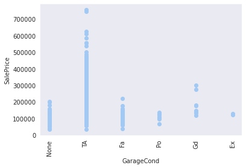

```python
%load_ext autoreload
%autoreload 2
```

    The autoreload extension is already loaded. To reload it, use:
      %reload_ext autoreload


```python
import pandas as pd
import numpy as np
import seaborn as sns

import tensorflow as tf
from tensorflow import keras
from keras.models import Sequential
from keras.layers import Dense
from keras.callbacks import EarlyStopping

sns.set_style('darkgrid')
from scipy.stats import skew, norm, probplot

from sklearn.preprocessing import StandardScaler
from sklearn.ensemble import IsolationForest
from sklearn.linear_model import Ridge, HuberRegressor, LinearRegression
from sklearn.preprocessing import OneHotEncoder

import matplotlib.pyplot as plt

from utils import one_hot_encode_categorical_cols
from utils import has_null, null_count, plot_simple, plot_values_distribution
from utils import get_mean, get_mode, get_col_names, get_col_dtype

pd.set_option('display.max_columns', None)
pd.set_option('display.max_rows', None)
```


```python
df = pd.read_csv('data/train.csv')
test = pd.read_csv('data/test.csv')
```


```python
y = df['SalePrice']
df = df.set_index('Id')
test = test.set_index('Id')
y.shape, df.shape, test.shape
```


    ((1460,), (1460, 80), (1459, 79))


```python
null_list = []
for col in df.columns:
    if col == 'SalePrice':
        continue
    null = df[col].isnull().sum()
    test_null = test[col].isnull().sum()
    if null != 0 or test_null != 0:
        null_list.append([col, null, test_null])
        
null_df = pd.DataFrame(null_list, columns=['Feature', 'Null', 'Test Null'])
null_df.set_index('Feature')
null_df['Total Null'] = null_df['Null'] + null_df['Test Null']

print("-------------------------")
print("Total columns with null:")
print(len(null_df))
print("-------------------------")
print("Total null values:")
print(null_df['Total Null'].sum(axis=0))
print("-------------------------")

sns.set_palette(sns.color_palette("pastel"))
sns.barplot(data=null_df.sort_values(by='Total Null', ascending = False).head(10), x='Feature', y='Total Null')
plt.xticks(rotation = 70)
plt.title("Total Nulls in Feature")
plt.show()
```

    -------------------------
    Total columns with null:
    34
    -------------------------
    Total null values:
    13965
    -------------------------


    

    


```python
full = pd.concat([df, test],axis=0).reset_index(drop=True)
```


```python
null_count([df, test], list(test.columns))
```

    /home/jovyan/workspace/utils.py:132: FutureWarning: Dropping of nuisance columns in DataFrame reductions (with 'numeric_only=None') is deprecated; in a future version this will raise TypeError.  Select only valid columns before calling the reduction.
      null_df['Total Null'] = null_df.sum(axis=1)


<div>
<table border="1" class="dataframe">
  <thead>
    <tr style="text-align: right;">
      <th></th>
      <th>feature</th>
      <th>df_0_null</th>
      <th>df_0_mode</th>
      <th>df_0_mean</th>
      <th>df_0_nuniq</th>
      <th>df_1_null</th>
      <th>df_1_mode</th>
      <th>df_1_mean</th>
      <th>df_1_nuniq</th>
      <th>dtype</th>
      <th>Total Null</th>
      <th>df_0_null_pct</th>
      <th>df_1_null_pct</th>
    </tr>
  </thead>
  <tbody>
    <tr>
      <th>30</th>
      <td>PoolQC</td>
      <td>1453</td>
      <td>Gd</td>
      <td></td>
      <td>3</td>
      <td>1456</td>
      <td>Ex</td>
      <td></td>
      <td>2</td>
      <td>object</td>
      <td>2909</td>
      <td>0.995205</td>
      <td>0.997944</td>
    </tr>
    <tr>
      <th>32</th>
      <td>MiscFeature</td>
      <td>1406</td>
      <td>Shed</td>
      <td></td>
      <td>4</td>
      <td>1408</td>
      <td>Shed</td>
      <td></td>
      <td>3</td>
      <td>object</td>
      <td>2814</td>
      <td>0.963014</td>
      <td>0.965045</td>
    </tr>
    <tr>
      <th>2</th>
      <td>Alley</td>
      <td>1369</td>
      <td>Grvl</td>
      <td></td>
      <td>2</td>
      <td>1352</td>
      <td>Grvl</td>
      <td></td>
      <td>2</td>
      <td>object</td>
      <td>2721</td>
      <td>0.937671</td>
      <td>0.926662</td>
    </tr>
    <tr>
      <th>31</th>
      <td>Fence</td>
      <td>1179</td>
      <td>MnPrv</td>
      <td></td>
      <td>4</td>
      <td>1169</td>
      <td>MnPrv</td>
      <td></td>
      <td>4</td>
      <td>object</td>
      <td>2348</td>
      <td>0.807534</td>
      <td>0.801234</td>
    </tr>
    <tr>
      <th>22</th>
      <td>FireplaceQu</td>
      <td>690</td>
      <td>Gd</td>
      <td></td>
      <td>5</td>
      <td>730</td>
      <td>Gd</td>
      <td></td>
      <td>5</td>
      <td>object</td>
      <td>1420</td>
      <td>0.472603</td>
      <td>0.500343</td>
    </tr>
    <tr>
      <th>1</th>
      <td>LotFrontage</td>
      <td>259</td>
      <td>60.0</td>
      <td>70.049958</td>
      <td></td>
      <td>227</td>
      <td>60.0</td>
      <td>68.580357</td>
      <td></td>
      <td>float64</td>
      <td>486</td>
      <td>0.177397</td>
      <td>0.155586</td>
    </tr>
    <tr>
      <th>25</th>
      <td>GarageFinish</td>
      <td>81</td>
      <td>Unf</td>
      <td></td>
      <td>3</td>
      <td>78</td>
      <td>Unf</td>
      <td></td>
      <td>3</td>
      <td>object</td>
      <td>159</td>
      <td>0.055479</td>
      <td>0.053461</td>
    </tr>
    <tr>
      <th>28</th>
      <td>GarageQual</td>
      <td>81</td>
      <td>TA</td>
      <td></td>
      <td>5</td>
      <td>78</td>
      <td>TA</td>
      <td></td>
      <td>4</td>
      <td>object</td>
      <td>159</td>
      <td>0.055479</td>
      <td>0.053461</td>
    </tr>
    <tr>
      <th>29</th>
      <td>GarageCond</td>
      <td>81</td>
      <td>TA</td>
      <td></td>
      <td>5</td>
      <td>78</td>
      <td>TA</td>
      <td></td>
      <td>5</td>
      <td>object</td>
      <td>159</td>
      <td>0.055479</td>
      <td>0.053461</td>
    </tr>
    <tr>
      <th>24</th>
      <td>GarageYrBlt</td>
      <td>81</td>
      <td>2005.0</td>
      <td>1978.506164</td>
      <td></td>
      <td>78</td>
      <td>2005.0</td>
      <td>1977.721217</td>
      <td></td>
      <td>float64</td>
      <td>159</td>
      <td>0.055479</td>
      <td>0.053461</td>
    </tr>
    <tr>
      <th>23</th>
      <td>GarageType</td>
      <td>81</td>
      <td>Attchd</td>
      <td></td>
      <td>6</td>
      <td>76</td>
      <td>Attchd</td>
      <td></td>
      <td>6</td>
      <td>object</td>
      <td>157</td>
      <td>0.055479</td>
      <td>0.052090</td>
    </tr>
    <tr>
      <th>10</th>
      <td>BsmtExposure</td>
      <td>38</td>
      <td>No</td>
      <td></td>
      <td>4</td>
      <td>44</td>
      <td>No</td>
      <td></td>
      <td>4</td>
      <td>object</td>
      <td>82</td>
      <td>0.026027</td>
      <td>0.030158</td>
    </tr>
    <tr>
      <th>9</th>
      <td>BsmtCond</td>
      <td>37</td>
      <td>TA</td>
      <td></td>
      <td>4</td>
      <td>45</td>
      <td>TA</td>
      <td></td>
      <td>4</td>
      <td>object</td>
      <td>82</td>
      <td>0.025342</td>
      <td>0.030843</td>
    </tr>
    <tr>
      <th>8</th>
      <td>BsmtQual</td>
      <td>37</td>
      <td>TA</td>
      <td></td>
      <td>4</td>
      <td>44</td>
      <td>TA</td>
      <td></td>
      <td>4</td>
      <td>object</td>
      <td>81</td>
      <td>0.025342</td>
      <td>0.030158</td>
    </tr>
    <tr>
      <th>13</th>
      <td>BsmtFinType2</td>
      <td>38</td>
      <td>Unf</td>
      <td></td>
      <td>6</td>
      <td>42</td>
      <td>Unf</td>
      <td></td>
      <td>6</td>
      <td>object</td>
      <td>80</td>
      <td>0.026027</td>
      <td>0.028787</td>
    </tr>
    <tr>
      <th>11</th>
      <td>BsmtFinType1</td>
      <td>37</td>
      <td>Unf</td>
      <td></td>
      <td>6</td>
      <td>42</td>
      <td>GLQ</td>
      <td></td>
      <td>6</td>
      <td>object</td>
      <td>79</td>
      <td>0.025342</td>
      <td>0.028787</td>
    </tr>
    <tr>
      <th>6</th>
      <td>MasVnrType</td>
      <td>8</td>
      <td>None</td>
      <td></td>
      <td>4</td>
      <td>16</td>
      <td>None</td>
      <td></td>
      <td>4</td>
      <td>object</td>
      <td>24</td>
      <td>0.005479</td>
      <td>0.010966</td>
    </tr>
    <tr>
      <th>7</th>
      <td>MasVnrArea</td>
      <td>8</td>
      <td>0.0</td>
      <td>103.685262</td>
      <td></td>
      <td>15</td>
      <td>0.0</td>
      <td>100.709141</td>
      <td></td>
      <td>float64</td>
      <td>23</td>
      <td>0.005479</td>
      <td>0.010281</td>
    </tr>
    <tr>
      <th>0</th>
      <td>MSZoning</td>
      <td>0</td>
      <td>RL</td>
      <td></td>
      <td>5</td>
      <td>4</td>
      <td>RL</td>
      <td></td>
      <td>5</td>
      <td>object</td>
      <td>4</td>
      <td>0.000000</td>
      <td>0.002742</td>
    </tr>
    <tr>
      <th>18</th>
      <td>BsmtFullBath</td>
      <td>0</td>
      <td>0</td>
      <td></td>
      <td>4</td>
      <td>2</td>
      <td>0.0</td>
      <td>0.434454</td>
      <td></td>
      <td>int64</td>
      <td>2</td>
      <td>0.000000</td>
      <td>0.001371</td>
    </tr>
    <tr>
      <th>19</th>
      <td>BsmtHalfBath</td>
      <td>0</td>
      <td>0</td>
      <td></td>
      <td>3</td>
      <td>2</td>
      <td>0.0</td>
      <td>0.065202</td>
      <td></td>
      <td>int64</td>
      <td>2</td>
      <td>0.000000</td>
      <td>0.001371</td>
    </tr>
    <tr>
      <th>21</th>
      <td>Functional</td>
      <td>0</td>
      <td>Typ</td>
      <td></td>
      <td>7</td>
      <td>2</td>
      <td>Typ</td>
      <td></td>
      <td>7</td>
      <td>object</td>
      <td>2</td>
      <td>0.000000</td>
      <td>0.001371</td>
    </tr>
    <tr>
      <th>3</th>
      <td>Utilities</td>
      <td>0</td>
      <td>AllPub</td>
      <td></td>
      <td>2</td>
      <td>2</td>
      <td>AllPub</td>
      <td></td>
      <td>1</td>
      <td>object</td>
      <td>2</td>
      <td>0.000000</td>
      <td>0.001371</td>
    </tr>
    <tr>
      <th>27</th>
      <td>GarageArea</td>
      <td>0</td>
      <td>0</td>
      <td></td>
      <td>441</td>
      <td>1</td>
      <td>0.0</td>
      <td>472.768861</td>
      <td></td>
      <td>int64</td>
      <td>1</td>
      <td>0.000000</td>
      <td>0.000685</td>
    </tr>
    <tr>
      <th>26</th>
      <td>GarageCars</td>
      <td>0</td>
      <td>2</td>
      <td></td>
      <td>5</td>
      <td>1</td>
      <td>2.0</td>
      <td>1.766118</td>
      <td></td>
      <td>int64</td>
      <td>1</td>
      <td>0.000000</td>
      <td>0.000685</td>
    </tr>
    <tr>
      <th>17</th>
      <td>Electrical</td>
      <td>1</td>
      <td>SBrkr</td>
      <td></td>
      <td>5</td>
      <td>0</td>
      <td>SBrkr</td>
      <td></td>
      <td>4</td>
      <td>object</td>
      <td>1</td>
      <td>0.000685</td>
      <td>0.000000</td>
    </tr>
    <tr>
      <th>20</th>
      <td>KitchenQual</td>
      <td>0</td>
      <td>TA</td>
      <td></td>
      <td>4</td>
      <td>1</td>
      <td>TA</td>
      <td></td>
      <td>4</td>
      <td>object</td>
      <td>1</td>
      <td>0.000000</td>
      <td>0.000685</td>
    </tr>
    <tr>
      <th>16</th>
      <td>TotalBsmtSF</td>
      <td>0</td>
      <td>0</td>
      <td></td>
      <td>721</td>
      <td>1</td>
      <td>0.0</td>
      <td>1046.11797</td>
      <td></td>
      <td>int64</td>
      <td>1</td>
      <td>0.000000</td>
      <td>0.000685</td>
    </tr>
    <tr>
      <th>15</th>
      <td>BsmtUnfSF</td>
      <td>0</td>
      <td>0</td>
      <td></td>
      <td>780</td>
      <td>1</td>
      <td>0.0</td>
      <td>554.294925</td>
      <td></td>
      <td>int64</td>
      <td>1</td>
      <td>0.000000</td>
      <td>0.000685</td>
    </tr>
    <tr>
      <th>14</th>
      <td>BsmtFinSF2</td>
      <td>0</td>
      <td>0</td>
      <td></td>
      <td>144</td>
      <td>1</td>
      <td>0.0</td>
      <td>52.619342</td>
      <td></td>
      <td>int64</td>
      <td>1</td>
      <td>0.000000</td>
      <td>0.000685</td>
    </tr>
    <tr>
      <th>12</th>
      <td>BsmtFinSF1</td>
      <td>0</td>
      <td>0</td>
      <td></td>
      <td>637</td>
      <td>1</td>
      <td>0.0</td>
      <td>439.203704</td>
      <td></td>
      <td>int64</td>
      <td>1</td>
      <td>0.000000</td>
      <td>0.000685</td>
    </tr>
    <tr>
      <th>5</th>
      <td>Exterior2nd</td>
      <td>0</td>
      <td>VinylSd</td>
      <td></td>
      <td>16</td>
      <td>1</td>
      <td>VinylSd</td>
      <td></td>
      <td>15</td>
      <td>object</td>
      <td>1</td>
      <td>0.000000</td>
      <td>0.000685</td>
    </tr>
    <tr>
      <th>4</th>
      <td>Exterior1st</td>
      <td>0</td>
      <td>VinylSd</td>
      <td></td>
      <td>15</td>
      <td>1</td>
      <td>VinylSd</td>
      <td></td>
      <td>13</td>
      <td>object</td>
      <td>1</td>
      <td>0.000000</td>
      <td>0.000685</td>
    </tr>
    <tr>
      <th>33</th>
      <td>SaleType</td>
      <td>0</td>
      <td>WD</td>
      <td></td>
      <td>9</td>
      <td>1</td>
      <td>WD</td>
      <td></td>
      <td>9</td>
      <td>object</td>
      <td>1</td>
      <td>0.000000</td>
      <td>0.000685</td>
    </tr>
  </tbody>
</table>
</div>


```python
df.head()
```


<div>
<style scoped>
    .dataframe tbody tr th:only-of-type {
        vertical-align: middle;
    }

    .dataframe tbody tr th {
        vertical-align: top;
    }

    .dataframe thead th {
        text-align: right;
    }
</style>
<table border="1" class="dataframe">
  <thead>
    <tr style="text-align: right;">
      <th></th>
      <th>MSSubClass</th>
      <th>MSZoning</th>
      <th>LotFrontage</th>
      <th>LotArea</th>
      <th>Street</th>
      <th>Alley</th>
      <th>LotShape</th>
      <th>LandContour</th>
      <th>Utilities</th>
      <th>LotConfig</th>
      <th>LandSlope</th>
      <th>Neighborhood</th>
      <th>Condition1</th>
      <th>Condition2</th>
      <th>BldgType</th>
      <th>HouseStyle</th>
      <th>OverallQual</th>
      <th>OverallCond</th>
      <th>YearBuilt</th>
      <th>YearRemodAdd</th>
      <th>RoofStyle</th>
      <th>RoofMatl</th>
      <th>Exterior1st</th>
      <th>Exterior2nd</th>
      <th>MasVnrType</th>
      <th>MasVnrArea</th>
      <th>ExterQual</th>
      <th>ExterCond</th>
      <th>Foundation</th>
      <th>BsmtQual</th>
      <th>BsmtCond</th>
      <th>BsmtExposure</th>
      <th>BsmtFinType1</th>
      <th>BsmtFinSF1</th>
      <th>BsmtFinType2</th>
      <th>BsmtFinSF2</th>
      <th>BsmtUnfSF</th>
      <th>TotalBsmtSF</th>
      <th>Heating</th>
      <th>HeatingQC</th>
      <th>CentralAir</th>
      <th>Electrical</th>
      <th>1stFlrSF</th>
      <th>2ndFlrSF</th>
      <th>LowQualFinSF</th>
      <th>GrLivArea</th>
      <th>BsmtFullBath</th>
      <th>BsmtHalfBath</th>
      <th>FullBath</th>
      <th>HalfBath</th>
      <th>BedroomAbvGr</th>
      <th>KitchenAbvGr</th>
      <th>KitchenQual</th>
      <th>TotRmsAbvGrd</th>
      <th>Functional</th>
      <th>Fireplaces</th>
      <th>FireplaceQu</th>
      <th>GarageType</th>
      <th>GarageYrBlt</th>
      <th>GarageFinish</th>
      <th>GarageCars</th>
      <th>GarageArea</th>
      <th>GarageQual</th>
      <th>GarageCond</th>
      <th>PavedDrive</th>
      <th>WoodDeckSF</th>
      <th>OpenPorchSF</th>
      <th>EnclosedPorch</th>
      <th>3SsnPorch</th>
      <th>ScreenPorch</th>
      <th>PoolArea</th>
      <th>PoolQC</th>
      <th>Fence</th>
      <th>MiscFeature</th>
      <th>MiscVal</th>
      <th>MoSold</th>
      <th>YrSold</th>
      <th>SaleType</th>
      <th>SaleCondition</th>
      <th>SalePrice</th>
    </tr>
    <tr>
      <th>Id</th>
      <th></th>
      <th></th>
      <th></th>
      <th></th>
      <th></th>
      <th></th>
      <th></th>
      <th></th>
      <th></th>
      <th></th>
      <th></th>
      <th></th>
      <th></th>
      <th></th>
      <th></th>
      <th></th>
      <th></th>
      <th></th>
      <th></th>
      <th></th>
      <th></th>
      <th></th>
      <th></th>
      <th></th>
      <th></th>
      <th></th>
      <th></th>
      <th></th>
      <th></th>
      <th></th>
      <th></th>
      <th></th>
      <th></th>
      <th></th>
      <th></th>
      <th></th>
      <th></th>
      <th></th>
      <th></th>
      <th></th>
      <th></th>
      <th></th>
      <th></th>
      <th></th>
      <th></th>
      <th></th>
      <th></th>
      <th></th>
      <th></th>
      <th></th>
      <th></th>
      <th></th>
      <th></th>
      <th></th>
      <th></th>
      <th></th>
      <th></th>
      <th></th>
      <th></th>
      <th></th>
      <th></th>
      <th></th>
      <th></th>
      <th></th>
      <th></th>
      <th></th>
      <th></th>
      <th></th>
      <th></th>
      <th></th>
      <th></th>
      <th></th>
      <th></th>
      <th></th>
      <th></th>
      <th></th>
      <th></th>
      <th></th>
      <th></th>
      <th></th>
    </tr>
  </thead>
  <tbody>
    <tr>
      <th>1</th>
      <td>60</td>
      <td>RL</td>
      <td>65.0</td>
      <td>8450</td>
      <td>Pave</td>
      <td>NaN</td>
      <td>Reg</td>
      <td>Lvl</td>
      <td>AllPub</td>
      <td>Inside</td>
      <td>Gtl</td>
      <td>CollgCr</td>
      <td>Norm</td>
      <td>Norm</td>
      <td>1Fam</td>
      <td>2Story</td>
      <td>7</td>
      <td>5</td>
      <td>2003</td>
      <td>2003</td>
      <td>Gable</td>
      <td>CompShg</td>
      <td>VinylSd</td>
      <td>VinylSd</td>
      <td>BrkFace</td>
      <td>196.0</td>
      <td>Gd</td>
      <td>TA</td>
      <td>PConc</td>
      <td>Gd</td>
      <td>TA</td>
      <td>No</td>
      <td>GLQ</td>
      <td>706</td>
      <td>Unf</td>
      <td>0</td>
      <td>150</td>
      <td>856</td>
      <td>GasA</td>
      <td>Ex</td>
      <td>Y</td>
      <td>SBrkr</td>
      <td>856</td>
      <td>854</td>
      <td>0</td>
      <td>1710</td>
      <td>1</td>
      <td>0</td>
      <td>2</td>
      <td>1</td>
      <td>3</td>
      <td>1</td>
      <td>Gd</td>
      <td>8</td>
      <td>Typ</td>
      <td>0</td>
      <td>NaN</td>
      <td>Attchd</td>
      <td>2003.0</td>
      <td>RFn</td>
      <td>2</td>
      <td>548</td>
      <td>TA</td>
      <td>TA</td>
      <td>Y</td>
      <td>0</td>
      <td>61</td>
      <td>0</td>
      <td>0</td>
      <td>0</td>
      <td>0</td>
      <td>NaN</td>
      <td>NaN</td>
      <td>NaN</td>
      <td>0</td>
      <td>2</td>
      <td>2008</td>
      <td>WD</td>
      <td>Normal</td>
      <td>208500</td>
    </tr>
    <tr>
      <th>2</th>
      <td>20</td>
      <td>RL</td>
      <td>80.0</td>
      <td>9600</td>
      <td>Pave</td>
      <td>NaN</td>
      <td>Reg</td>
      <td>Lvl</td>
      <td>AllPub</td>
      <td>FR2</td>
      <td>Gtl</td>
      <td>Veenker</td>
      <td>Feedr</td>
      <td>Norm</td>
      <td>1Fam</td>
      <td>1Story</td>
      <td>6</td>
      <td>8</td>
      <td>1976</td>
      <td>1976</td>
      <td>Gable</td>
      <td>CompShg</td>
      <td>MetalSd</td>
      <td>MetalSd</td>
      <td>None</td>
      <td>0.0</td>
      <td>TA</td>
      <td>TA</td>
      <td>CBlock</td>
      <td>Gd</td>
      <td>TA</td>
      <td>Gd</td>
      <td>ALQ</td>
      <td>978</td>
      <td>Unf</td>
      <td>0</td>
      <td>284</td>
      <td>1262</td>
      <td>GasA</td>
      <td>Ex</td>
      <td>Y</td>
      <td>SBrkr</td>
      <td>1262</td>
      <td>0</td>
      <td>0</td>
      <td>1262</td>
      <td>0</td>
      <td>1</td>
      <td>2</td>
      <td>0</td>
      <td>3</td>
      <td>1</td>
      <td>TA</td>
      <td>6</td>
      <td>Typ</td>
      <td>1</td>
      <td>TA</td>
      <td>Attchd</td>
      <td>1976.0</td>
      <td>RFn</td>
      <td>2</td>
      <td>460</td>
      <td>TA</td>
      <td>TA</td>
      <td>Y</td>
      <td>298</td>
      <td>0</td>
      <td>0</td>
      <td>0</td>
      <td>0</td>
      <td>0</td>
      <td>NaN</td>
      <td>NaN</td>
      <td>NaN</td>
      <td>0</td>
      <td>5</td>
      <td>2007</td>
      <td>WD</td>
      <td>Normal</td>
      <td>181500</td>
    </tr>
    <tr>
      <th>3</th>
      <td>60</td>
      <td>RL</td>
      <td>68.0</td>
      <td>11250</td>
      <td>Pave</td>
      <td>NaN</td>
      <td>IR1</td>
      <td>Lvl</td>
      <td>AllPub</td>
      <td>Inside</td>
      <td>Gtl</td>
      <td>CollgCr</td>
      <td>Norm</td>
      <td>Norm</td>
      <td>1Fam</td>
      <td>2Story</td>
      <td>7</td>
      <td>5</td>
      <td>2001</td>
      <td>2002</td>
      <td>Gable</td>
      <td>CompShg</td>
      <td>VinylSd</td>
      <td>VinylSd</td>
      <td>BrkFace</td>
      <td>162.0</td>
      <td>Gd</td>
      <td>TA</td>
      <td>PConc</td>
      <td>Gd</td>
      <td>TA</td>
      <td>Mn</td>
      <td>GLQ</td>
      <td>486</td>
      <td>Unf</td>
      <td>0</td>
      <td>434</td>
      <td>920</td>
      <td>GasA</td>
      <td>Ex</td>
      <td>Y</td>
      <td>SBrkr</td>
      <td>920</td>
      <td>866</td>
      <td>0</td>
      <td>1786</td>
      <td>1</td>
      <td>0</td>
      <td>2</td>
      <td>1</td>
      <td>3</td>
      <td>1</td>
      <td>Gd</td>
      <td>6</td>
      <td>Typ</td>
      <td>1</td>
      <td>TA</td>
      <td>Attchd</td>
      <td>2001.0</td>
      <td>RFn</td>
      <td>2</td>
      <td>608</td>
      <td>TA</td>
      <td>TA</td>
      <td>Y</td>
      <td>0</td>
      <td>42</td>
      <td>0</td>
      <td>0</td>
      <td>0</td>
      <td>0</td>
      <td>NaN</td>
      <td>NaN</td>
      <td>NaN</td>
      <td>0</td>
      <td>9</td>
      <td>2008</td>
      <td>WD</td>
      <td>Normal</td>
      <td>223500</td>
    </tr>
    <tr>
      <th>4</th>
      <td>70</td>
      <td>RL</td>
      <td>60.0</td>
      <td>9550</td>
      <td>Pave</td>
      <td>NaN</td>
      <td>IR1</td>
      <td>Lvl</td>
      <td>AllPub</td>
      <td>Corner</td>
      <td>Gtl</td>
      <td>Crawfor</td>
      <td>Norm</td>
      <td>Norm</td>
      <td>1Fam</td>
      <td>2Story</td>
      <td>7</td>
      <td>5</td>
      <td>1915</td>
      <td>1970</td>
      <td>Gable</td>
      <td>CompShg</td>
      <td>Wd Sdng</td>
      <td>Wd Shng</td>
      <td>None</td>
      <td>0.0</td>
      <td>TA</td>
      <td>TA</td>
      <td>BrkTil</td>
      <td>TA</td>
      <td>Gd</td>
      <td>No</td>
      <td>ALQ</td>
      <td>216</td>
      <td>Unf</td>
      <td>0</td>
      <td>540</td>
      <td>756</td>
      <td>GasA</td>
      <td>Gd</td>
      <td>Y</td>
      <td>SBrkr</td>
      <td>961</td>
      <td>756</td>
      <td>0</td>
      <td>1717</td>
      <td>1</td>
      <td>0</td>
      <td>1</td>
      <td>0</td>
      <td>3</td>
      <td>1</td>
      <td>Gd</td>
      <td>7</td>
      <td>Typ</td>
      <td>1</td>
      <td>Gd</td>
      <td>Detchd</td>
      <td>1998.0</td>
      <td>Unf</td>
      <td>3</td>
      <td>642</td>
      <td>TA</td>
      <td>TA</td>
      <td>Y</td>
      <td>0</td>
      <td>35</td>
      <td>272</td>
      <td>0</td>
      <td>0</td>
      <td>0</td>
      <td>NaN</td>
      <td>NaN</td>
      <td>NaN</td>
      <td>0</td>
      <td>2</td>
      <td>2006</td>
      <td>WD</td>
      <td>Abnorml</td>
      <td>140000</td>
    </tr>
    <tr>
      <th>5</th>
      <td>60</td>
      <td>RL</td>
      <td>84.0</td>
      <td>14260</td>
      <td>Pave</td>
      <td>NaN</td>
      <td>IR1</td>
      <td>Lvl</td>
      <td>AllPub</td>
      <td>FR2</td>
      <td>Gtl</td>
      <td>NoRidge</td>
      <td>Norm</td>
      <td>Norm</td>
      <td>1Fam</td>
      <td>2Story</td>
      <td>8</td>
      <td>5</td>
      <td>2000</td>
      <td>2000</td>
      <td>Gable</td>
      <td>CompShg</td>
      <td>VinylSd</td>
      <td>VinylSd</td>
      <td>BrkFace</td>
      <td>350.0</td>
      <td>Gd</td>
      <td>TA</td>
      <td>PConc</td>
      <td>Gd</td>
      <td>TA</td>
      <td>Av</td>
      <td>GLQ</td>
      <td>655</td>
      <td>Unf</td>
      <td>0</td>
      <td>490</td>
      <td>1145</td>
      <td>GasA</td>
      <td>Ex</td>
      <td>Y</td>
      <td>SBrkr</td>
      <td>1145</td>
      <td>1053</td>
      <td>0</td>
      <td>2198</td>
      <td>1</td>
      <td>0</td>
      <td>2</td>
      <td>1</td>
      <td>4</td>
      <td>1</td>
      <td>Gd</td>
      <td>9</td>
      <td>Typ</td>
      <td>1</td>
      <td>TA</td>
      <td>Attchd</td>
      <td>2000.0</td>
      <td>RFn</td>
      <td>3</td>
      <td>836</td>
      <td>TA</td>
      <td>TA</td>
      <td>Y</td>
      <td>192</td>
      <td>84</td>
      <td>0</td>
      <td>0</td>
      <td>0</td>
      <td>0</td>
      <td>NaN</td>
      <td>NaN</td>
      <td>NaN</td>
      <td>0</td>
      <td>12</td>
      <td>2008</td>
      <td>WD</td>
      <td>Normal</td>
      <td>250000</td>
    </tr>
  </tbody>
</table>
</div>


```python
categorical_cols = df.select_dtypes(include=["object"]).columns
print(categorical_cols)
print(len(categorical_cols))
```

    Index(['MSZoning', 'Street', 'Alley', 'LotShape', 'LandContour', 'Utilities',
           'LotConfig', 'LandSlope', 'Neighborhood', 'Condition1', 'Condition2',
           'BldgType', 'HouseStyle', 'RoofStyle', 'RoofMatl', 'Exterior1st',
           'Exterior2nd', 'MasVnrType', 'ExterQual', 'ExterCond', 'Foundation',
           'BsmtQual', 'BsmtCond', 'BsmtExposure', 'BsmtFinType1', 'BsmtFinType2',
           'Heating', 'HeatingQC', 'CentralAir', 'Electrical', 'KitchenQual',
           'Functional', 'FireplaceQu', 'GarageType', 'GarageFinish', 'GarageQual',
           'GarageCond', 'PavedDrive', 'PoolQC', 'Fence', 'MiscFeature',
           'SaleType', 'SaleCondition'],
          dtype='object')
    43


```python
numerical_cols = df.select_dtypes(include=['number']).columns
print(numerical_cols)
print(len(numerical_cols))
```

    Index(['MSSubClass', 'LotFrontage', 'LotArea', 'OverallQual', 'OverallCond',
           'YearBuilt', 'YearRemodAdd', 'MasVnrArea', 'BsmtFinSF1', 'BsmtFinSF2',
           'BsmtUnfSF', 'TotalBsmtSF', '1stFlrSF', '2ndFlrSF', 'LowQualFinSF',
           'GrLivArea', 'BsmtFullBath', 'BsmtHalfBath', 'FullBath', 'HalfBath',
           'BedroomAbvGr', 'KitchenAbvGr', 'TotRmsAbvGrd', 'Fireplaces',
           'GarageYrBlt', 'GarageCars', 'GarageArea', 'WoodDeckSF', 'OpenPorchSF',
           'EnclosedPorch', '3SsnPorch', 'ScreenPorch', 'PoolArea', 'MiscVal',
           'MoSold', 'YrSold', 'SalePrice'],
          dtype='object')
    37


```python
null = test[test['MSZoning'].isnull()][["Neighborhood","MSZoning"]]
display(null)
plot_data = pd.concat([full[full['Neighborhood'] == 'IDOTRR'], full[full['Neighborhood'] == 'Mitchel']], axis = 0)
sns.histplot(data=plot_data, x='MSZoning', hue='Neighborhood', multiple="dodge", shrink=.9)
plt.title("Distribution of Zoning Classification")
plt.show()
```


<div>
<style scoped>
    .dataframe tbody tr th:only-of-type {
        vertical-align: middle;
    }

    .dataframe tbody tr th {
        vertical-align: top;
    }

    .dataframe thead th {
        text-align: right;
    }
</style>
<table border="1" class="dataframe">
  <thead>
    <tr style="text-align: right;">
      <th></th>
      <th>Neighborhood</th>
      <th>MSZoning</th>
    </tr>
    <tr>
      <th>Id</th>
      <th></th>
      <th></th>
    </tr>
  </thead>
  <tbody>
    <tr>
      <th>1916</th>
      <td>IDOTRR</td>
      <td>NaN</td>
    </tr>
    <tr>
      <th>2217</th>
      <td>IDOTRR</td>
      <td>NaN</td>
    </tr>
    <tr>
      <th>2251</th>
      <td>IDOTRR</td>
      <td>NaN</td>
    </tr>
    <tr>
      <th>2905</th>
      <td>Mitchel</td>
      <td>NaN</td>
    </tr>
  </tbody>
</table>
</div>


    

    


```python
test.loc[(test['Neighborhood'] == 'IDOTRR') & (test['MSZoning'].isnull()), 'MSZoning'] = 'RM'
test.loc[(test['Neighborhood'] == 'Mitchel') & (test['MSZoning'].isnull()), 'MSZoning'] = 'RL'
```

## Modeling LotArea and LotFrontage relationship


```python
data = full[~full['LotFrontage'].isnull()]
sns.lmplot(data=data, x="LotArea", y="LotFrontage", line_kws={'color': 'black'})
plt.ylabel("LotFrontage")
plt.xlabel("LotArea")
plt.title("LotArea vs LotFrontage")
plt.show()
```


    

    


```python
full.query("LotFrontage <= 150 & LotArea <= 20000")['LotArea'].plot.hist(bins=100)
```


    <AxesSubplot:ylabel='Frequency'>


    

    


```python
# distribution of LotArea where LotFrontage is null
full.query("LotFrontage != LotFrontage & LotArea <= 20000")['LotArea'].plot.hist(bins=100)
```


    <AxesSubplot:ylabel='Frequency'>


    

    


```python
print(len(full[~full['LotFrontage'].isnull()]), 'not null values')
print(len(full[full['LotFrontage'] <= 150]))
print(len(full[full['LotArea'] <= 20000]))
```

    2433 not null values
    2419
    2829


```python
data = full[(~full['LotFrontage'].isnull()) & (full['LotFrontage'] <= 150) & (full['LotArea'] <= 20000)]
sns.lmplot(data=data, x="LotArea", y="LotFrontage", line_kws={'color': 'black'})
plt.ylabel("LotFrontage")
plt.xlabel("LotArea")
plt.title("LotArea vs LotFrontage")
plt.show()
```


    

    


```python
area_vs_frontage = LinearRegression()
area_vs_frontage_X = data['LotArea'].values.reshape(-1, 1)
area_vs_frontage_y = data['LotFrontage'].values
area_vs_frontage.fit(area_vs_frontage_X, area_vs_frontage_y)
for table in [df,test]:
    table['LotFrontage'].fillna(area_vs_frontage.intercept_ + table['LotArea'] * area_vs_frontage.coef_[0], inplace=True)
```


```python
for table in [df,test]:
    table['Alley'].fillna("None",inplace=True)
```


```python
full['Utilities'].value_counts()
```


    AllPub    2916
    NoSeWa       1
    Name: Utilities, dtype: int64


```python
null_count([df, test], list(test.columns)).query('feature == "Utilities"')
```

    /home/jovyan/workspace/utils.py:132: FutureWarning: Dropping of nuisance columns in DataFrame reductions (with 'numeric_only=None') is deprecated; in a future version this will raise TypeError.  Select only valid columns before calling the reduction.
      null_df['Total Null'] = null_df.sum(axis=1)


<div>
<style scoped>
    .dataframe tbody tr th:only-of-type {
        vertical-align: middle;
    }

    .dataframe tbody tr th {
        vertical-align: top;
    }

    .dataframe thead th {
        text-align: right;
    }
</style>
<table border="1" class="dataframe">
  <thead>
    <tr style="text-align: right;">
      <th></th>
      <th>feature</th>
      <th>df_0_null</th>
      <th>df_0_mode</th>
      <th>df_0_mean</th>
      <th>df_0_nuniq</th>
      <th>df_1_null</th>
      <th>df_1_mode</th>
      <th>df_1_mean</th>
      <th>df_1_nuniq</th>
      <th>dtype</th>
      <th>Total Null</th>
      <th>df_0_null_pct</th>
      <th>df_1_null_pct</th>
    </tr>
  </thead>
  <tbody>
    <tr>
      <th>1</th>
      <td>Utilities</td>
      <td>0</td>
      <td>AllPub</td>
      <td></td>
      <td>2</td>
      <td>2</td>
      <td>AllPub</td>
      <td></td>
      <td>1</td>
      <td>object</td>
      <td>2</td>
      <td>0.0</td>
      <td>0.001371</td>
    </tr>
  </tbody>
</table>
</div>


```python
test['Utilities'].fillna("AllPub", inplace=True)
```


```python
#df.drop(df[df['Utilities'] == 'NoSeWa'].index, inplace=True)
```


```python
for metrics in ['Exterior1st','Exterior2nd']:
    table = full[metrics].value_counts(normalize=True).head()
    sns.barplot(x=table.index,y=table.values)
    plt.title("Distribution plot of "+metrics)
    plt.show()
```


    

    


    

    


```python
test['Exterior1st'] = test['Exterior1st'].fillna(full['Exterior1st'].mode()[0])
test['Exterior2nd'] = test['Exterior2nd'].fillna(full['Exterior2nd'].mode()[0])
```


```python
test[test['MasVnrType'].isnull() & test['MasVnrArea'].notnull()][['MasVnrType','MasVnrArea']]
```


<div>
<style scoped>
    .dataframe tbody tr th:only-of-type {
        vertical-align: middle;
    }

    .dataframe tbody tr th {
        vertical-align: top;
    }

    .dataframe thead th {
        text-align: right;
    }
</style>
<table border="1" class="dataframe">
  <thead>
    <tr style="text-align: right;">
      <th></th>
      <th>MasVnrType</th>
      <th>MasVnrArea</th>
    </tr>
    <tr>
      <th>Id</th>
      <th></th>
      <th></th>
    </tr>
  </thead>
  <tbody>
    <tr>
      <th>2611</th>
      <td>NaN</td>
      <td>198.0</td>
    </tr>
  </tbody>
</table>
</div>


```python
table = full['MasVnrType'].value_counts(normalize=True).head()
sns.barplot(x=table.index,y=table.values)
plt.title("Distribution plot of MasVnrType")
plt.show()
```


    

    


```python
test['MasVnrType'][2611] = "BrkFace"
test['MasVnrType'] = test['MasVnrType'].fillna(full['MasVnrType'].mode()[0])
test['MasVnrArea'] = test['MasVnrArea'].fillna(0)
df['MasVnrType'] = df['MasVnrType'].fillna(full['MasVnrType'].mode()[0])
df['MasVnrArea'] = df['MasVnrArea'].fillna(0)
```

    /tmp/ipykernel_76/1477495461.py:1: SettingWithCopyWarning: 
    A value is trying to be set on a copy of a slice from a DataFrame
    
    See the caveats in the documentation: https://pandas.pydata.org/pandas-docs/stable/user_guide/indexing.html#returning-a-view-versus-a-copy
      test['MasVnrType'][2611] = "BrkFace"


```python
for col in ['BsmtExposure','BsmtCond','BsmtQual', 'BsmtFinType1']:
    print(full[col].value_counts())
```

    No    1904
    Av     418
    Gd     276
    Mn     239
    Name: BsmtExposure, dtype: int64
    TA    2606
    Gd     122
    Fa     104
    Po       5
    Name: BsmtCond, dtype: int64
    TA    1283
    Gd    1209
    Ex     258
    Fa      88
    Name: BsmtQual, dtype: int64
    Unf    851
    GLQ    849
    ALQ    429
    Rec    288
    BLQ    269
    LwQ    154
    Name: BsmtFinType1, dtype: int64


```python
for col in ['BsmtExposure','BsmtCond','BsmtQual']:
    query = full[col].notnull() & full['BsmtFinType1'].isnull()
    if len(full[query]) > 0 :
        print("\nRows with "+ col +" but BsmtFinType1 missing" )
        display(full[query])
```


```python
for col in ['BsmtExposure','BsmtCond','BsmtQual']:
    query = full[col].isnull() & full['BsmtFinType1'].notnull()
    if len(full[query]) > 0 :
        print("\nRows with missing "+ col +" but BsmtFinType1 has value" )
        display(full[query][[col, 'BsmtFinType1']])
```

    
    Rows with missing BsmtExposure but BsmtFinType1 has value


<div>
<style scoped>
    .dataframe tbody tr th:only-of-type {
        vertical-align: middle;
    }

    .dataframe tbody tr th {
        vertical-align: top;
    }

    .dataframe thead th {
        text-align: right;
    }
</style>
<table border="1" class="dataframe">
  <thead>
    <tr style="text-align: right;">
      <th></th>
      <th>BsmtExposure</th>
      <th>BsmtFinType1</th>
    </tr>
  </thead>
  <tbody>
    <tr>
      <th>948</th>
      <td>NaN</td>
      <td>Unf</td>
    </tr>
    <tr>
      <th>1487</th>
      <td>NaN</td>
      <td>Unf</td>
    </tr>
    <tr>
      <th>2348</th>
      <td>NaN</td>
      <td>Unf</td>
    </tr>
  </tbody>
</table>
</div>


    
    Rows with missing BsmtCond but BsmtFinType1 has value


<div>
<style scoped>
    .dataframe tbody tr th:only-of-type {
        vertical-align: middle;
    }

    .dataframe tbody tr th {
        vertical-align: top;
    }

    .dataframe thead th {
        text-align: right;
    }
</style>
<table border="1" class="dataframe">
  <thead>
    <tr style="text-align: right;">
      <th></th>
      <th>BsmtCond</th>
      <th>BsmtFinType1</th>
    </tr>
  </thead>
  <tbody>
    <tr>
      <th>2040</th>
      <td>NaN</td>
      <td>GLQ</td>
    </tr>
    <tr>
      <th>2185</th>
      <td>NaN</td>
      <td>BLQ</td>
    </tr>
    <tr>
      <th>2524</th>
      <td>NaN</td>
      <td>ALQ</td>
    </tr>
  </tbody>
</table>
</div>


    
    Rows with missing BsmtQual but BsmtFinType1 has value


<div>
<style scoped>
    .dataframe tbody tr th:only-of-type {
        vertical-align: middle;
    }

    .dataframe tbody tr th {
        vertical-align: top;
    }

    .dataframe thead th {
        text-align: right;
    }
</style>
<table border="1" class="dataframe">
  <thead>
    <tr style="text-align: right;">
      <th></th>
      <th>BsmtQual</th>
      <th>BsmtFinType1</th>
    </tr>
  </thead>
  <tbody>
    <tr>
      <th>2217</th>
      <td>NaN</td>
      <td>Unf</td>
    </tr>
    <tr>
      <th>2218</th>
      <td>NaN</td>
      <td>Unf</td>
    </tr>
  </tbody>
</table>
</div>


```python
# We assume missing basement exposure of unfinished basement is "No".
df.loc[((df['BsmtExposure'].isnull()) & (df['BsmtFinType1'].notnull())), 'BsmtExposure'] = 'No'
test.loc[((test['BsmtExposure'].isnull()) & (test['BsmtFinType1'].notnull())), 'BsmtExposure'] = 'No'

# We impute missing basement condition with "mean" value of Typical.
test.loc[((test['BsmtCond'].isnull()) & (test['BsmtFinType1'].notnull())), 'BsmtCond'] = 'TA'

# We impute unfinished basement quality with "mean" value of Typical.
test.loc[((test['BsmtQual'].isnull()) & (test['BsmtFinType1'].notnull())), 'BsmtQual'] = 'TA'
```


```python
test[test['BsmtFinSF1'].isnull()].filter(like='Bsmt')
```


<div>
<style scoped>
    .dataframe tbody tr th:only-of-type {
        vertical-align: middle;
    }

    .dataframe tbody tr th {
        vertical-align: top;
    }

    .dataframe thead th {
        text-align: right;
    }
</style>
<table border="1" class="dataframe">
  <thead>
    <tr style="text-align: right;">
      <th></th>
      <th>BsmtQual</th>
      <th>BsmtCond</th>
      <th>BsmtExposure</th>
      <th>BsmtFinType1</th>
      <th>BsmtFinSF1</th>
      <th>BsmtFinType2</th>
      <th>BsmtFinSF2</th>
      <th>BsmtUnfSF</th>
      <th>TotalBsmtSF</th>
      <th>BsmtFullBath</th>
      <th>BsmtHalfBath</th>
    </tr>
    <tr>
      <th>Id</th>
      <th></th>
      <th></th>
      <th></th>
      <th></th>
      <th></th>
      <th></th>
      <th></th>
      <th></th>
      <th></th>
      <th></th>
      <th></th>
    </tr>
  </thead>
  <tbody>
    <tr>
      <th>2121</th>
      <td>NaN</td>
      <td>NaN</td>
      <td>NaN</td>
      <td>NaN</td>
      <td>NaN</td>
      <td>NaN</td>
      <td>NaN</td>
      <td>NaN</td>
      <td>NaN</td>
      <td>NaN</td>
      <td>NaN</td>
    </tr>
  </tbody>
</table>
</div>


```python
for col in ['TotalBsmtSF','BsmtUnfSF','BsmtFinSF2','BsmtFinSF1']:
    test[col][2121] = 0
```

    /tmp/ipykernel_76/682951547.py:2: SettingWithCopyWarning: 
    A value is trying to be set on a copy of a slice from a DataFrame
    
    See the caveats in the documentation: https://pandas.pydata.org/pandas-docs/stable/user_guide/indexing.html#returning-a-view-versus-a-copy
      test[col][2121] = 0


```python
test[test['BsmtFullBath'].isnull()].filter(like='Bath')
```


<div>
<style scoped>
    .dataframe tbody tr th:only-of-type {
        vertical-align: middle;
    }

    .dataframe tbody tr th {
        vertical-align: top;
    }

    .dataframe thead th {
        text-align: right;
    }
</style>
<table border="1" class="dataframe">
  <thead>
    <tr style="text-align: right;">
      <th></th>
      <th>BsmtFullBath</th>
      <th>BsmtHalfBath</th>
      <th>FullBath</th>
      <th>HalfBath</th>
    </tr>
    <tr>
      <th>Id</th>
      <th></th>
      <th></th>
      <th></th>
      <th></th>
    </tr>
  </thead>
  <tbody>
    <tr>
      <th>2121</th>
      <td>NaN</td>
      <td>NaN</td>
      <td>1</td>
      <td>0</td>
    </tr>
    <tr>
      <th>2189</th>
      <td>NaN</td>
      <td>NaN</td>
      <td>3</td>
      <td>1</td>
    </tr>
  </tbody>
</table>
</div>


```python
for col in ['BsmtFullBath','BsmtHalfBath']:
    test[col][2121] = 0
    test[col][2189] = 0
```

    /tmp/ipykernel_76/3801676781.py:2: SettingWithCopyWarning: 
    A value is trying to be set on a copy of a slice from a DataFrame
    
    See the caveats in the documentation: https://pandas.pydata.org/pandas-docs/stable/user_guide/indexing.html#returning-a-view-versus-a-copy
      test[col][2121] = 0
    /tmp/ipykernel_76/3801676781.py:3: SettingWithCopyWarning: 
    A value is trying to be set on a copy of a slice from a DataFrame
    
    See the caveats in the documentation: https://pandas.pydata.org/pandas-docs/stable/user_guide/indexing.html#returning-a-view-versus-a-copy
      test[col][2189] = 0


```python
cols = get_col_names(df, 'Bsmt')
cols = list(get_col_dtype(df, cols)['feature'])
cols
```


    ['BsmtFinType2', 'BsmtQual', 'BsmtCond', 'BsmtExposure', 'BsmtFinType1']


```python
for table in [df,test]:
    table[cols] = table[cols].fillna("None")
```


```python
for col in ['Electrical','Functional','KitchenQual']:
    table = full[col].value_counts(normalize=True)
    sns.barplot(x=table.index,y=table.values)
    plt.title("Distribution plot of "+col)
    plt.show()
```


    

    


    

    


    

    


```python
df['Electrical'].fillna('SBrkr',inplace=True)
test['Functional'].fillna('Typ',inplace=True)
test['KitchenQual'].fillna('TA',inplace=True)
```


```python
has_null(test, 'Electrical')
```


    False


## Garage related null values


```python
full['GarageCars'].value_counts()
```


    2.0    1594
    1.0     776
    3.0     374
    0.0     157
    4.0      16
    5.0       1
    Name: GarageCars, dtype: int64


```python
for col in ['GarageType']:
    plot_values_distribution(full, col)
```


    

    


```python
plot_simple(full, 'GarageType', 'GarageArea')
```


    

    


```python
get_mode(full, "GarageType == 'Detchd'", 'GarageCars')
```


    0    2.0
    Name: GarageCars, dtype: float64


```python
get_mean(full, "GarageType == 'Detchd'", 'GarageArea')
```


    419.49228791773777


```python
full[full['GarageCars'].isnull()][sorted(full.columns)]
```


<div>
<style scoped>
    .dataframe tbody tr th:only-of-type {
        vertical-align: middle;
    }

    .dataframe tbody tr th {
        vertical-align: top;
    }

    .dataframe thead th {
        text-align: right;
    }
</style>
<table border="1" class="dataframe">
  <thead>
    <tr style="text-align: right;">
      <th></th>
      <th>1stFlrSF</th>
      <th>2ndFlrSF</th>
      <th>3SsnPorch</th>
      <th>Alley</th>
      <th>BedroomAbvGr</th>
      <th>BldgType</th>
      <th>BsmtCond</th>
      <th>BsmtExposure</th>
      <th>BsmtFinSF1</th>
      <th>BsmtFinSF2</th>
      <th>BsmtFinType1</th>
      <th>BsmtFinType2</th>
      <th>BsmtFullBath</th>
      <th>BsmtHalfBath</th>
      <th>BsmtQual</th>
      <th>BsmtUnfSF</th>
      <th>CentralAir</th>
      <th>Condition1</th>
      <th>Condition2</th>
      <th>Electrical</th>
      <th>EnclosedPorch</th>
      <th>ExterCond</th>
      <th>ExterQual</th>
      <th>Exterior1st</th>
      <th>Exterior2nd</th>
      <th>Fence</th>
      <th>FireplaceQu</th>
      <th>Fireplaces</th>
      <th>Foundation</th>
      <th>FullBath</th>
      <th>Functional</th>
      <th>GarageArea</th>
      <th>GarageCars</th>
      <th>GarageCond</th>
      <th>GarageFinish</th>
      <th>GarageQual</th>
      <th>GarageType</th>
      <th>GarageYrBlt</th>
      <th>GrLivArea</th>
      <th>HalfBath</th>
      <th>Heating</th>
      <th>HeatingQC</th>
      <th>HouseStyle</th>
      <th>KitchenAbvGr</th>
      <th>KitchenQual</th>
      <th>LandContour</th>
      <th>LandSlope</th>
      <th>LotArea</th>
      <th>LotConfig</th>
      <th>LotFrontage</th>
      <th>LotShape</th>
      <th>LowQualFinSF</th>
      <th>MSSubClass</th>
      <th>MSZoning</th>
      <th>MasVnrArea</th>
      <th>MasVnrType</th>
      <th>MiscFeature</th>
      <th>MiscVal</th>
      <th>MoSold</th>
      <th>Neighborhood</th>
      <th>OpenPorchSF</th>
      <th>OverallCond</th>
      <th>OverallQual</th>
      <th>PavedDrive</th>
      <th>PoolArea</th>
      <th>PoolQC</th>
      <th>RoofMatl</th>
      <th>RoofStyle</th>
      <th>SaleCondition</th>
      <th>SalePrice</th>
      <th>SaleType</th>
      <th>ScreenPorch</th>
      <th>Street</th>
      <th>TotRmsAbvGrd</th>
      <th>TotalBsmtSF</th>
      <th>Utilities</th>
      <th>WoodDeckSF</th>
      <th>YearBuilt</th>
      <th>YearRemodAdd</th>
      <th>YrSold</th>
    </tr>
  </thead>
  <tbody>
    <tr>
      <th>2576</th>
      <td>942</td>
      <td>886</td>
      <td>0</td>
      <td>NaN</td>
      <td>3</td>
      <td>1Fam</td>
      <td>TA</td>
      <td>No</td>
      <td>548.0</td>
      <td>0.0</td>
      <td>ALQ</td>
      <td>Unf</td>
      <td>0.0</td>
      <td>0.0</td>
      <td>Gd</td>
      <td>311.0</td>
      <td>Y</td>
      <td>Norm</td>
      <td>Norm</td>
      <td>SBrkr</td>
      <td>212</td>
      <td>TA</td>
      <td>TA</td>
      <td>Wd Sdng</td>
      <td>Plywood</td>
      <td>MnPrv</td>
      <td>NaN</td>
      <td>0</td>
      <td>BrkTil</td>
      <td>2</td>
      <td>Typ</td>
      <td>NaN</td>
      <td>NaN</td>
      <td>NaN</td>
      <td>NaN</td>
      <td>NaN</td>
      <td>Detchd</td>
      <td>NaN</td>
      <td>1828</td>
      <td>0</td>
      <td>GasA</td>
      <td>Ex</td>
      <td>2Story</td>
      <td>1</td>
      <td>Gd</td>
      <td>Lvl</td>
      <td>Gtl</td>
      <td>9060</td>
      <td>Inside</td>
      <td>50.0</td>
      <td>Reg</td>
      <td>0</td>
      <td>70</td>
      <td>RM</td>
      <td>0.0</td>
      <td>None</td>
      <td>NaN</td>
      <td>0</td>
      <td>3</td>
      <td>IDOTRR</td>
      <td>0</td>
      <td>6</td>
      <td>5</td>
      <td>Y</td>
      <td>0</td>
      <td>NaN</td>
      <td>CompShg</td>
      <td>Gable</td>
      <td>Alloca</td>
      <td>NaN</td>
      <td>WD</td>
      <td>0</td>
      <td>Pave</td>
      <td>6</td>
      <td>859.0</td>
      <td>AllPub</td>
      <td>174</td>
      <td>1923</td>
      <td>1999</td>
      <td>2007</td>
    </tr>
  </tbody>
</table>
</div>


```python
test['GarageCars'].fillna(2, inplace=True)
test['GarageArea'].fillna(get_mean(full, "GarageType == 'Detchd'", 'GarageArea'), inplace=True)
```


```python
test['SaleType'].fillna('WD',inplace=True)
```


```python
cols = get_col_names(df, '')
cols = get_col_dtype(df, cols)
```


```python
df['GarageYrBlt'].fillna(0,inplace=True)
test['GarageYrBlt'].fillna(0,inplace=True)


# fill all other null with None
df.fillna("None", inplace=True)
test.fillna("None", inplace=True)
```


```python
null_count([df, test], list(test.columns))
```


<div>
<style scoped>
    .dataframe tbody tr th:only-of-type {
        vertical-align: middle;
    }

    .dataframe tbody tr th {
        vertical-align: top;
    }

    .dataframe thead th {
        text-align: right;
    }
</style>
<table border="1" class="dataframe">
  <thead>
    <tr style="text-align: right;">
      <th></th>
      <th>feature</th>
      <th>df_0_null</th>
      <th>df_0_mode</th>
      <th>df_0_mean</th>
      <th>df_0_nuniq</th>
      <th>df_1_null</th>
      <th>df_1_mode</th>
      <th>df_1_mean</th>
      <th>df_1_nuniq</th>
      <th>dtype</th>
      <th>Total Null</th>
      <th>df_0_null_pct</th>
      <th>df_1_null_pct</th>
    </tr>
  </thead>
  <tbody>
  </tbody>
</table>
</div>


```python
def calc_extra_features(data):
    data['Total_Square_Feet'] = data['BsmtFinSF1'] + data['BsmtFinSF2'] + data['1stFlrSF'] + data['2ndFlrSF'] + data['TotalBsmtSF']
    data['Total_Bath'] = data['FullBath'] + (0.5 * data['HalfBath']) + data['BsmtFullBath'] + (0.5 * data['BsmtHalfBath'])
    data['Total_Porch_Area'] = data['OpenPorchSF'] + data['3SsnPorch'] + data['EnclosedPorch'] + data['ScreenPorch'] + data['WoodDeckSF']
    data['SqFtPerRoom'] = data['GrLivArea'] / (data['TotRmsAbvGrd'] + data['FullBath'] + data['HalfBath'] + data['KitchenAbvGr'])
    
calc_extra_features(df)
calc_extra_features(test)
```


```python

```


```python

```


```python
top_features = df.corr()[['SalePrice']].sort_values(by=['SalePrice'], ascending=False).head(30)
plt.figure(figsize=(5,10))
sns.heatmap(top_features,cmap='rainbow', annot=True, annot_kws={"size": 16}, vmin=-1)
```


    <AxesSubplot:>


    

    


```python
df.shape, test.shape, y.shape
```


    ((1460, 84), (1459, 83), (1460,))


```python
df['OverallQual'].dtype
```


    dtype('int64')


```python
plot_simple(df, 'YearBuilt', 'SalePrice', show_fit=True)
```


    

    


```python
plot_simple(df, 'Neighborhood', 'SalePrice', show_fit=True)
```


    

    


```python
plot_simple(df, 'OverallQual', 'SalePrice', rotation='v', show_fit=True)
```


    

    


```python
plot_simple(df, 'Fireplaces', 'SalePrice', show_fit=True)
```


    

    


```python
cols = list(test.columns)
for col in cols:
    plot_simple(df, col, 'SalePrice', show_fit=True)
```


    

    


    

    


    

    


    

    


    

    


    

    


    

    


    

    


    

    


    

    


    

    


    

    


    

    


    

    


    

    


    

    


    

    


    

    


    

    


    

    


    

    


    

    


    

    


    

    


    

    


    

    


    

    


    

    


    

    


    

    


    

    


    

    


    

    


    

    


    

    


    

    


    

    


    

    


    

    


    

    


    

    


    

    


    

    


    

    


    

    


    

    


    

    


    

    


    

    


    

    


    

    


    

    


    

    


    

    


    

    


    

    


    

    


    

    


    

    


    

    


    

    


    

    


    

    


    

    


    

    


    

    


    

    


    

    


    

    


    

    


    

    


    

    


    

    


    

    


    

    


    

    


    

    


    

    


    

    


    

    


    

    


    

    


    

    


```python
column_data_type = []
for col in df.columns:
    data_type = df[col].dtype
    if df[col].dtype in ['int64','float64']:
        column_data_type.append('numeric')
    else:
        column_data_type.append('categorical')
        
plt.figure(figsize=(5, 5))
sns.countplot(x=column_data_type)
plt.show()
```


    

    


## Distribution of SalePrice


```python
sns.distplot(y , fit=norm);

(mu, sigma) = norm.fit(y)
print( '\n mu = {:.2f} and sigma = {:.2f}\n'.format(mu, sigma))

plt.legend(['Normal dist. ($\mu=$ {:.2f} and $\sigma=$ {:.2f} )'.format(mu, sigma)], loc='best')
plt.ylabel('Frequency')
plt.title('SalePrice distribution')

# QQ-plot
fig = plt.figure()
res = probplot(y, plot=plt)
plt.show()
```

    /opt/conda/lib/python3.9/site-packages/seaborn/distributions.py:2619: FutureWarning: `distplot` is a deprecated function and will be removed in a future version. Please adapt your code to use either `displot` (a figure-level function with similar flexibility) or `histplot` (an axes-level function for histograms).
      warnings.warn(msg, FutureWarning)


    
     mu = 180921.20 and sigma = 79415.29
    


    

    


    

    


## Log Transformation


```python
y = np.log(y)
```


```python
sns.distplot(y , fit=norm);
(mu, sigma) = norm.fit(y)
print( '\n mu = {:.2f} and sigma = {:.2f}\n'.format(mu, sigma))
plt.legend(['Normal dist. ($\mu=$ {:.2f} and $\sigma=$ {:.2f} )'.format(mu, sigma)],
            loc='best')
plt.ylabel('Frequency')
plt.title('SalePrice distribution')

fig = plt.figure()
res = probplot(y, plot=plt)
plt.show()
```

    /opt/conda/lib/python3.9/site-packages/seaborn/distributions.py:2619: FutureWarning: `distplot` is a deprecated function and will be removed in a future version. Please adapt your code to use either `displot` (a figure-level function with similar flexibility) or `histplot` (an axes-level function for histograms).
      warnings.warn(msg, FutureWarning)


    
     mu = 12.02 and sigma = 0.40
    


    

    


    

    

