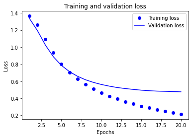
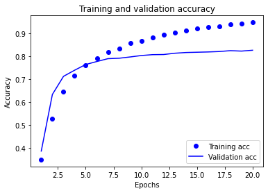

# Topic Classification On StackOverflow Dataset

- The stackoverflow dataset can be downloaded [here](https://storage.googleapis.com/download.tensorflow.org/data/stack_overflow_16k.tar.gz)
- after download, extract the content of zip file to your local directory


```python
import matplotlib.pyplot as plt
import os
import re
import shutil
import string
import tensorflow as tf
import numpy as np

from tensorflow.keras import layers
from tensorflow.keras import losses

```


```python
print(tf.__version__)
```

    2.6.2


```python
dataset_dir = os.path.join(os.path.dirname('.'), 'stackoverflow')
```


```python
train_dir = os.path.join(dataset_dir, 'train')
os.listdir(train_dir)
```


    ['csharp', 'java', 'javascript', 'python']


```python
sample_file = os.path.join(train_dir, 'java/2.txt')
with open(sample_file) as f:
  print(f.read())
```

    "identifier required when invoking a private method i am calling a private method for testing and for that i am using the following code to invoke private method. repeat() is the private method of class diamond..import org.junit.test;.import static org.junit.assert.*;.import blank.lang.stringbuilder;.import blank.lang.reflect.method;.public class diamondunit {.        stringbuilder expect = new stringbuilder();.        diamond test = new diamond();.        method m = test.getclass().getdeclaredmethod(""repeat"");.        m.setaccessible(true);.        m.invoke(test);..    @test.        public void testrepeatneg() {.            assertequals("""", test.repeat(expect,""a"",-1));.        }.}...while compiling it is giving error ..diamondunit.blank:11: error: expected.m.setaccessible(true);.^.diamondunit.blank:11: error: illegal start of type.m.setaccessible(true);.^.diamondunit.blank:12: error: expected.m.invoke(test);.^.diamondunit.blank:12: error: expected.m.invoke(test);.^...i had cop pasted the exact error message which i am getting"
    


```python
batch_size = 32
seed = 42

raw_train_ds = tf.keras.utils.text_dataset_from_directory('stackoverflow/train', 
                                                          batch_size=batch_size, 
                                                          validation_split=0.2, 
                                                          subset='training', 
                                                          seed=seed)
```

    Found 8000 files belonging to 4 classes.
    Using 6400 files for training.


    2022-04-16 06:17:42.030883: W tensorflow/stream_executor/platform/default/dso_loader.cc:64] Could not load dynamic library 'libcuda.so.1'; dlerror: libcuda.so.1: cannot open shared object file: No such file or directory
    2022-04-16 06:17:42.030976: W tensorflow/stream_executor/cuda/cuda_driver.cc:269] failed call to cuInit: UNKNOWN ERROR (303)
    2022-04-16 06:17:42.030996: I tensorflow/stream_executor/cuda/cuda_diagnostics.cc:156] kernel driver does not appear to be running on this host (7cba28e36cbd): /proc/driver/nvidia/version does not exist
    2022-04-16 06:17:42.031285: I tensorflow/core/platform/cpu_feature_guard.cc:142] This TensorFlow binary is optimized with oneAPI Deep Neural Network Library (oneDNN) to use the following CPU instructions in performance-critical operations:  SSE4.1 SSE4.2 AVX AVX2 AVX512F FMA
    To enable them in other operations, rebuild TensorFlow with the appropriate compiler flags.


```python
for text_batch, label_batch in raw_train_ds.take(1):
  for i in range(3):
    print("Review", text_batch.numpy()[i])
    print("Label", label_batch.numpy()[i])
```

    2022-04-16 06:17:45.747776: I tensorflow/compiler/mlir/mlir_graph_optimization_pass.cc:185] None of the MLIR Optimization Passes are enabled (registered 2)


    Review b'"my tester is going to the wrong constructor i am new to programming so if i ask a question that can be easily fixed, please forgive me. my program has a tester class with a main. when i send that to my regularpolygon class, it sends it to the wrong constructor. i have two constructors. 1 without perameters..public regularpolygon().    {.       mynumsides = 5;.       mysidelength = 30;.    }//end default constructor...and my second, with perameters. ..public regularpolygon(int numsides, double sidelength).    {.        mynumsides = numsides;.        mysidelength = sidelength;.    }// end constructor...in my tester class i have these two lines:..regularpolygon shape = new regularpolygon(numsides, sidelength);.        shape.menu();...numsides and sidelength were declared and initialized earlier in the testing class...so what i want to happen, is the tester class sends numsides and sidelength to the second constructor and use it in that class. but it only uses the default constructor, which therefor ruins the whole rest of the program. can somebody help me?..for those of you who want to see more of my code: here you go..public double vertexangle().    {.        system.out.println(""the vertex angle method: "" + mynumsides);// prints out 5.        system.out.println(""the vertex angle method: "" + mysidelength); // prints out 30..        double vertexangle;.        vertexangle = ((mynumsides - 2.0) / mynumsides) * 180.0;.        return vertexangle;.    }//end method vertexangle..public void menu().{.    system.out.println(mynumsides); // prints out what the user puts in.    system.out.println(mysidelength); // prints out what the user puts in.    gotographic();.    calcr(mynumsides, mysidelength);.    calcr(mynumsides, mysidelength);.    print(); .}// end menu...this is my entire tester class:..public static void main(string[] arg).{.    int numsides;.    double sidelength;.    scanner keyboard = new scanner(system.in);..    system.out.println(""welcome to the regular polygon program!"");.    system.out.println();..    system.out.print(""enter the number of sides of the polygon ==&gt; "");.    numsides = keyboard.nextint();.    system.out.println();..    system.out.print(""enter the side length of each side ==&gt; "");.    sidelength = keyboard.nextdouble();.    system.out.println();..    regularpolygon shape = new regularpolygon(numsides, sidelength);.    shape.menu();.}//end main...for testing it i sent it numsides 4 and sidelength 100."\n'
    Label 1
    Review b'"blank code slow skin detection this code changes the color space to lab and using a threshold finds the skin area of an image. but it\'s ridiculously slow. i don\'t know how to make it faster ?    ..from colormath.color_objects import *..def skindetection(img, treshold=80, color=[255,20,147]):..    print img.shape.    res=img.copy().    for x in range(img.shape[0]):.        for y in range(img.shape[1]):.            rgbimg=rgbcolor(img[x,y,0],img[x,y,1],img[x,y,2]).            labimg=rgbimg.convert_to(\'lab\', debug=false).            if (labimg.lab_l &gt; treshold):.                res[x,y,:]=color.            else: .                res[x,y,:]=img[x,y,:]..    return res"\n'
    Label 3
    Review b'"option and validation in blank i want to add a new option on my system where i want to add two text files, both rental.txt and customer.txt. inside each text are id numbers of the customer, the videotape they need and the price...i want to place it as an option on my code. right now i have:...add customer.rent return.view list.search.exit...i want to add this as my sixth option. say for example i ordered a video, it would display the price and would let me confirm the price and if i am going to buy it or not...here is my current code:..  import blank.io.*;.    import blank.util.arraylist;.    import static blank.lang.system.out;..    public class rentalsystem{.    static bufferedreader input = new bufferedreader(new inputstreamreader(system.in));.    static file file = new file(""file.txt"");.    static arraylist&lt;string&gt; list = new arraylist&lt;string&gt;();.    static int rows;..    public static void main(string[] args) throws exception{.        introduction();.        system.out.print(""nn"");.        login();.        system.out.print(""nnnnnnnnnnnnnnnnnnnnnn"");.        introduction();.        string repeat;.        do{.            loadfile();.            system.out.print(""nwhat do you want to do?nn"");.            system.out.print(""n                    - - - - - - - - - - - - - - - - - - - - - - -"");.            system.out.print(""nn                    |     1. add customer    |   2. rent return |n"");.            system.out.print(""n                    - - - - - - - - - - - - - - - - - - - - - - -"");.            system.out.print(""nn                    |     3. view list       |   4. search      |n"");.            system.out.print(""n                    - - - - - - - - - - - - - - - - - - - - - - -"");.            system.out.print(""nn                                             |   5. exit        |n"");.            system.out.print(""n                                              - - - - - - - - - -"");.            system.out.print(""nnchoice:"");.            int choice = integer.parseint(input.readline());.            switch(choice){.                case 1:.                    writedata();.                    break;.                case 2:.                    rentdata();.                    break;.                case 3:.                    viewlist();.                    break;.                case 4:.                    search();.                    break;.                case 5:.                    system.out.println(""goodbye!"");.                    system.exit(0);.                default:.                    system.out.print(""invalid choice: "");.                    break;.            }.            system.out.print(""ndo another task? [y/n] "");.            repeat = input.readline();.        }while(repeat.equals(""y""));..        if(repeat!=""y"") system.out.println(""ngoodbye!"");..    }..    public static void writedata() throws exception{.        system.out.print(""nname: "");.        string cname = input.readline();.        system.out.print(""address: "");.        string add = input.readline();.        system.out.print(""phone no.: "");.        string pno = input.readline();.        system.out.print(""rental amount: "");.        string ramount = input.readline();.        system.out.print(""tapenumber: "");.        string tno = input.readline();.        system.out.print(""title: "");.        string title = input.readline();.        system.out.print(""date borrowed: "");.        string dborrowed = input.readline();.        system.out.print(""due date: "");.        string ddate = input.readline();.        createline(cname, add, pno, ramount,tno, title, dborrowed, ddate);.        rentdata();.    }..    public static void createline(string name, string address, string phone , string rental, string tapenumber, string title, string borrowed, string due) throws exception{.        filewriter fw = new filewriter(file, true);.        fw.write(""nname: ""+name + ""naddress: "" + address +""nphone no.: ""+ phone+""nrentalamount: ""+rental+""ntape no.: ""+ tapenumber+""ntitle: ""+ title+""ndate borrowed: ""+borrowed +""ndue date: ""+ due+"":rn"");.        fw.close();.    }..    public static void loadfile() throws exception{.        try{.            list.clear();.            fileinputstream fstream = new fileinputstream(file);.            bufferedreader br = new bufferedreader(new inputstreamreader(fstream));.            rows = 0;.            while( br.ready()).            {.                list.add(br.readline());.                rows++;.            }.            br.close();.        } catch(exception e){.            system.out.println(""list not yet loaded."");.        }.    }..    public static void viewlist(){.        system.out.print(""n~ ~ ~ ~ ~ ~ ~ ~ ~ ~ ~"");.        system.out.print("" |list of all costumers|"");.        system.out.print(""~ ~ ~ ~ ~ ~ ~ ~ ~ ~ ~"");.        for(int i = 0; i &lt;rows; i++){.            system.out.println(list.get(i));.        }.    }.        public static void rentdata()throws exception.    {   system.out.print(""n~ ~ ~ ~ ~ ~ ~ ~ ~ ~ ~"");.        system.out.print("" |rent data list|"");.        system.out.print(""~ ~ ~ ~ ~ ~ ~ ~ ~ ~ ~"");.        system.out.print(""nenter customer name: "");.        string cname = input.readline();.        system.out.print(""date borrowed: "");.        string dborrowed = input.readline();.        system.out.print(""due date: "");.        string ddate = input.readline();.        system.out.print(""return date: "");.        string rdate = input.readline();.        system.out.print(""rent amount: "");.        string ramount = input.readline();..        system.out.print(""you pay:""+ramount);...    }.    public static void search()throws exception.    {   system.out.print(""n~ ~ ~ ~ ~ ~ ~ ~ ~ ~ ~"");.        system.out.print("" |search costumers|"");.        system.out.print(""~ ~ ~ ~ ~ ~ ~ ~ ~ ~ ~"");.        system.out.print(""nenter costumer name: "");.        string cname = input.readline();.        boolean found = false;..        for(int i=0; i &lt; rows; i++){.            string temp[] = list.get(i).split("","");..            if(cname.equals(temp[0])){.            system.out.println(""search result:nyou are "" + temp[0] + "" from "" + temp[1] + "".""+ temp[2] + "".""+ temp[3] + "".""+ temp[4] + "".""+ temp[5] + "" is "" + temp[6] + "".""+ temp[7] + "" is "" + temp[8] + ""."");.                found = true;.            }.        }..        if(!found){.            system.out.print(""no results."");.        }..    }..        public static boolean evaluate(string uname, string pass){.        if (uname.equals(""admin"")&amp;&amp;pass.equals(""12345"")) return true;.        else return false;.    }..    public static string login()throws exception{.        bufferedreader input=new bufferedreader(new inputstreamreader(system.in));.        int counter=0;.        do{.            system.out.print(""username:"");.            string uname =input.readline();.            system.out.print(""password:"");.            string pass =input.readline();..            boolean accept= evaluate(uname,pass);..            if(accept){.                break;.                }else{.                    system.out.println(""incorrect username or password!"");.                    counter ++;.                    }.        }while(counter&lt;3);..            if(counter !=3) return ""login successful"";.            else return ""login failed"";.            }.        public static void introduction() throws exception{..        system.out.println(""                  - - - - - - - - - - - - - - - - - - - - - - - - -"");.        system.out.println(""                  !                  r e n t a l                  !"");.        system.out.println(""                   ! ~ ~ ~ ~ ~ !  =================  ! ~ ~ ~ ~ ~ !"");.        system.out.println(""                  !                  s y s t e m                  !"");.        system.out.println(""                  - - - - - - - - - - - - - - - - - - - - - - - - -"");.        }..}"\n'
    Label 1


```python
print("Label 0 corresponds to", raw_train_ds.class_names[0])
print("Label 1 corresponds to", raw_train_ds.class_names[1])
print("Label 2 corresponds to", raw_train_ds.class_names[2])
print("Label 3 corresponds to", raw_train_ds.class_names[3])
```

    Label 0 corresponds to csharp
    Label 1 corresponds to java
    Label 2 corresponds to javascript
    Label 3 corresponds to python


```python
raw_val_ds = tf.keras.utils.text_dataset_from_directory(
    'stackoverflow/train', 
    batch_size=batch_size, 
    validation_split=0.2, 
    subset='validation', 
    seed=seed)
```

    Found 8000 files belonging to 4 classes.
    Using 1600 files for validation.


```python
raw_test_ds = tf.keras.utils.text_dataset_from_directory('stackoverflow/test', 
                                                         batch_size=batch_size)
```

    Found 8000 files belonging to 4 classes.


```python
def custom_standardization(input_data):
  lowercase = tf.strings.lower(input_data)
  stripped_html = tf.strings.regex_replace(lowercase, '<br />', ' ')
  return tf.strings.regex_replace(stripped_html,
                                  '[%s]' % re.escape(string.punctuation),
                                  '')
```

Next, you will create a `TextVectorization` layer. You will use this layer to standardize, tokenize, and vectorize our data. You set the `output_mode` to `int` to create unique integer indices for each token.

Note that you're using the default split function, and the custom standardization function you defined above. You'll also define some constants for the model, like an explicit maximum `sequence_length`, which will cause the layer to pad or truncate sequences to exactly `sequence_length` values.


```python
max_features = 15000
sequence_length = 500

vectorize_layer = layers.TextVectorization(
    standardize=custom_standardization,
    max_tokens=max_features,
    output_mode='int',
    output_sequence_length=sequence_length)
```

Next, you will call `adapt` to fit the state of the preprocessing layer to the dataset. This will cause the model to build an index of strings to integers.

Note: It's important to only use your training data when calling adapt (using the test set would leak information).


```python
# Make a text-only dataset (without labels), then call adapt
train_text = raw_train_ds.map(lambda x, y: x)
vectorize_layer.adapt(train_text)
```


```python
vocab_list = vectorize_layer.get_vocabulary()
print(vocab_list[0:20])
len(vocab_list)
```

    ['', '[UNK]', 'the', 'i', 'to', 'a', 'is', 'in', 'and', 'of', 'if', 'it', 'for', 'this', 'that', 'new', 'blank', 'have', 'string', '0']


    15000


```python
def vectorize_text(text, label):
  text = tf.expand_dims(text, -1)
  return vectorize_layer(text), label
```


```python
# retrieve a batch (of 32 reviews and labels) from the dataset
text_batch, label_batch = next(iter(raw_train_ds))
first_review, first_label = text_batch[0], label_batch[0]
print("first review", first_review)
print("first label", first_label)
print("Label", raw_train_ds.class_names[first_label])
print("Vectorized review", vectorize_text(first_review, first_label))
```

    first review tf.Tensor(b'"trying to convert a list of date(actrived from database) to format(yyyy-mm) public list&lt;date&gt; getdate(){.    @suppresswarnings(""unchecked"").    list&lt;string&gt; cr =          (list&lt;string&gt;)getsession().createcriteria(orderentity.class).            .setprojection(projections.projectionlist().                    .add(property.forname(""ordertime"")).                    ).            .list();.    system.out.println(""zxcv"");.    system.out.println(cr);//the output is here [2017-10-23 15:15:53.0, 2017-10-25 11:53:56.0, 2017-10-25 11:54:35.0}.    list&lt;date&gt; dates = new arraylist(cr.size());.    simpledateformat sdf = new simpledateformat(""yyyy-mm"");.    for (string datestring : cr) {.        dates.add(sdf.parse(datestring));.    }.    system.out.println(dates);.    return dates;.}...there is the error :...  blank.sql.timestamp cannot be cast to blank.lang.string....please tell me how to solve this error,.thank you so much."\n', shape=(), dtype=string)
    first label tf.Tensor(1, shape=(), dtype=int32)
    Label java
    Vectorized review (<tf.Tensor: shape=(1, 500), dtype=int64, numpy=
    array([[   81,     4,   213,     5,    54,     9,     1,    31,   349,
                4,     1,    22,  9547,  5196,  8775,   897, 10195,     1,
                1,     1,    54,     1,     1,   126,     6,   101,     1,
                1,     1,     1,     1,     1,  9547,  1052,    15,     1,
             1844,  4497,    15,     1,    12,    18,  4313, 10195,     1,
                1,    27,     1,     6,     2,    65,     1,   208,    33,
             1247,     4,     1,   412,    74,    24,     4,   478,    13,
                1,    58,    50,   406,     0,     0,     0,     0,     0,
                0,     0,     0,     0,     0,     0,     0,     0,     0,
                0,     0,     0,     0,     0,     0,     0,     0,     0,
                0,     0,     0,     0,     0,     0,     0,     0,     0,
                0,     0,     0,     0,     0,     0,     0,     0,     0,
                0,     0,     0,     0,     0,     0,     0,     0,     0,
                0,     0,     0,     0,     0,     0,     0,     0,     0,
                0,     0,     0,     0,     0,     0,     0,     0,     0,
                0,     0,     0,     0,     0,     0,     0,     0,     0,
                0,     0,     0,     0,     0,     0,     0,     0,     0,
                0,     0,     0,     0,     0,     0,     0,     0,     0,
                0,     0,     0,     0,     0,     0,     0,     0,     0,
                0,     0,     0,     0,     0,     0,     0,     0,     0,
                0,     0,     0,     0,     0,     0,     0,     0,     0,
                0,     0,     0,     0,     0,     0,     0,     0,     0,
                0,     0,     0,     0,     0,     0,     0,     0,     0,
                0,     0,     0,     0,     0,     0,     0,     0,     0,
                0,     0,     0,     0,     0,     0,     0,     0,     0,
                0,     0,     0,     0,     0,     0,     0,     0,     0,
                0,     0,     0,     0,     0,     0,     0,     0,     0,
                0,     0,     0,     0,     0,     0,     0,     0,     0,
                0,     0,     0,     0,     0,     0,     0,     0,     0,
                0,     0,     0,     0,     0,     0,     0,     0,     0,
                0,     0,     0,     0,     0,     0,     0,     0,     0,
                0,     0,     0,     0,     0,     0,     0,     0,     0,
                0,     0,     0,     0,     0,     0,     0,     0,     0,
                0,     0,     0,     0,     0,     0,     0,     0,     0,
                0,     0,     0,     0,     0,     0,     0,     0,     0,
                0,     0,     0,     0,     0,     0,     0,     0,     0,
                0,     0,     0,     0,     0,     0,     0,     0,     0,
                0,     0,     0,     0,     0,     0,     0,     0,     0,
                0,     0,     0,     0,     0,     0,     0,     0,     0,
                0,     0,     0,     0,     0,     0,     0,     0,     0,
                0,     0,     0,     0,     0,     0,     0,     0,     0,
                0,     0,     0,     0,     0,     0,     0,     0,     0,
                0,     0,     0,     0,     0,     0,     0,     0,     0,
                0,     0,     0,     0,     0,     0,     0,     0,     0,
                0,     0,     0,     0,     0,     0,     0,     0,     0,
                0,     0,     0,     0,     0,     0,     0,     0,     0,
                0,     0,     0,     0,     0,     0,     0,     0,     0,
                0,     0,     0,     0,     0,     0,     0,     0,     0,
                0,     0,     0,     0,     0,     0,     0,     0,     0,
                0,     0,     0,     0,     0,     0,     0,     0,     0,
                0,     0,     0,     0,     0,     0,     0,     0,     0,
                0,     0,     0,     0,     0,     0,     0,     0,     0,
                0,     0,     0,     0,     0,     0,     0,     0,     0,
                0,     0,     0,     0,     0,     0,     0,     0,     0,
                0,     0,     0,     0,     0,     0,     0,     0,     0,
                0,     0,     0,     0,     0]])>, <tf.Tensor: shape=(), dtype=int32, numpy=1>)


```python
print("1287 ---> ",vectorize_layer.get_vocabulary()[1287])
print(" 313 ---> ",vectorize_layer.get_vocabulary()[313])
print('Vocabulary size: {}'.format(len(vectorize_layer.get_vocabulary())))
```

    1287 --->  scissors
     313 --->  source
    Vocabulary size: 15000


```python
train_ds = raw_train_ds.map(vectorize_text)
val_ds = raw_val_ds.map(vectorize_text)
test_ds = raw_test_ds.map(vectorize_text)
```


```python
AUTOTUNE = tf.data.AUTOTUNE

train_ds = train_ds.cache().prefetch(buffer_size=AUTOTUNE)
val_ds = val_ds.cache().prefetch(buffer_size=AUTOTUNE)
test_ds = test_ds.cache().prefetch(buffer_size=AUTOTUNE)
```

### Create the model

It's time to create your neural network:


```python
embedding_dim = 300
model = tf.keras.Sequential([
  layers.Embedding(max_features+1, embedding_dim),
  layers.Dropout(0.2),
  layers.GlobalAveragePooling1D(),
  layers.Dropout(0.2),
  layers.Dense(4, activation='sigmoid')])

model.summary()
```

    Model: "sequential_5"
    _________________________________________________________________
    Layer (type)                 Output Shape              Param #   
    =================================================================
    embedding_5 (Embedding)      (None, None, 300)         4500300   
    _________________________________________________________________
    dropout_10 (Dropout)         (None, None, 300)         0         
    _________________________________________________________________
    global_average_pooling1d_5 ( (None, 300)               0         
    _________________________________________________________________
    dropout_11 (Dropout)         (None, 300)               0         
    _________________________________________________________________
    dense_5 (Dense)              (None, 4)                 1204      
    =================================================================
    Total params: 4,501,504
    Trainable params: 4,501,504
    Non-trainable params: 0
    _________________________________________________________________


```python
model.compile(loss=tf.keras.losses.SparseCategoricalCrossentropy(),
              optimizer='adam',
              metrics=['accuracy'])
```

### Train the model

You will train the model by passing the `dataset` object to the fit method.


```python
epochs = 20
history = model.fit(
    train_ds,
    validation_data=val_ds,
    epochs=epochs)
```

    Epoch 1/20
    200/200 [==============================] - 15s 72ms/step - loss: 1.3643 - accuracy: 0.3477 - val_loss: 1.3336 - val_accuracy: 0.3850
    Epoch 2/20
    200/200 [==============================] - 13s 63ms/step - loss: 1.2638 - accuracy: 0.5264 - val_loss: 1.1917 - val_accuracy: 0.6331
    Epoch 3/20
    200/200 [==============================] - 13s 64ms/step - loss: 1.0950 - accuracy: 0.6461 - val_loss: 1.0219 - val_accuracy: 0.7125
    Epoch 4/20
    200/200 [==============================] - 14s 69ms/step - loss: 0.9342 - accuracy: 0.7166 - val_loss: 0.8858 - val_accuracy: 0.7394
    Epoch 5/20
    200/200 [==============================] - 13s 66ms/step - loss: 0.8035 - accuracy: 0.7603 - val_loss: 0.7856 - val_accuracy: 0.7644
    Epoch 6/20
    200/200 [==============================] - 18s 88ms/step - loss: 0.7024 - accuracy: 0.7925 - val_loss: 0.7134 - val_accuracy: 0.7775
    Epoch 7/20
    200/200 [==============================] - 15s 73ms/step - loss: 0.6250 - accuracy: 0.8180 - val_loss: 0.6591 - val_accuracy: 0.7900
    Epoch 8/20
    200/200 [==============================] - 14s 69ms/step - loss: 0.5634 - accuracy: 0.8333 - val_loss: 0.6181 - val_accuracy: 0.7919
    Epoch 9/20
    200/200 [==============================] - 14s 71ms/step - loss: 0.5099 - accuracy: 0.8583 - val_loss: 0.5870 - val_accuracy: 0.7975
    Epoch 10/20
    200/200 [==============================] - 14s 69ms/step - loss: 0.4648 - accuracy: 0.8689 - val_loss: 0.5623 - val_accuracy: 0.8037
    Epoch 11/20
    200/200 [==============================] - 14s 69ms/step - loss: 0.4257 - accuracy: 0.8822 - val_loss: 0.5428 - val_accuracy: 0.8075
    Epoch 12/20
    200/200 [==============================] - 14s 70ms/step - loss: 0.3926 - accuracy: 0.8944 - val_loss: 0.5263 - val_accuracy: 0.8081
    Epoch 13/20
    200/200 [==============================] - 14s 70ms/step - loss: 0.3617 - accuracy: 0.9027 - val_loss: 0.5147 - val_accuracy: 0.8138
    Epoch 14/20
    200/200 [==============================] - 15s 73ms/step - loss: 0.3354 - accuracy: 0.9127 - val_loss: 0.5044 - val_accuracy: 0.8169
    Epoch 15/20
    200/200 [==============================] - 13s 67ms/step - loss: 0.3094 - accuracy: 0.9216 - val_loss: 0.4957 - val_accuracy: 0.8181
    Epoch 16/20
    200/200 [==============================] - 14s 69ms/step - loss: 0.2872 - accuracy: 0.9270 - val_loss: 0.4889 - val_accuracy: 0.8194
    Epoch 17/20
    200/200 [==============================] - 15s 75ms/step - loss: 0.2672 - accuracy: 0.9323 - val_loss: 0.4845 - val_accuracy: 0.8213
    Epoch 18/20
    200/200 [==============================] - 15s 74ms/step - loss: 0.2487 - accuracy: 0.9391 - val_loss: 0.4820 - val_accuracy: 0.8250
    Epoch 19/20
    200/200 [==============================] - 14s 69ms/step - loss: 0.2313 - accuracy: 0.9434 - val_loss: 0.4789 - val_accuracy: 0.8231
    Epoch 20/20
    200/200 [==============================] - 13s 65ms/step - loss: 0.2148 - accuracy: 0.9489 - val_loss: 0.4762 - val_accuracy: 0.8269


### Evaluate the model


```python
loss, accuracy = model.evaluate(test_ds)

print("Loss: ", loss)
print("Accuracy: ", accuracy)
```

    250/250 [==============================] - 6s 24ms/step - loss: 0.5491 - accuracy: 0.7961
    Loss:  0.549095630645752
    Accuracy:  0.7961249947547913


### Create a plot of accuracy and loss over time

`model.fit()` returns a `History` object that contains a dictionary with everything that happened during training:


```python
history_dict = history.history
history_dict.keys()
```


    dict_keys(['loss', 'accuracy', 'val_loss', 'val_accuracy'])


```python
acc = history_dict['accuracy']
val_acc = history_dict['val_accuracy']
loss = history_dict['loss']
val_loss = history_dict['val_loss']

epochs = range(1, len(acc) + 1)

# "bo" is for "blue dot"
plt.plot(epochs, loss, 'bo', label='Training loss')
# b is for "solid blue line"
plt.plot(epochs, val_loss, 'b', label='Validation loss')
plt.title('Training and validation loss')
plt.xlabel('Epochs')
plt.ylabel('Loss')
plt.legend()

plt.show()
```


    

    


```python
plt.plot(epochs, acc, 'bo', label='Training acc')
plt.plot(epochs, val_acc, 'b', label='Validation acc')
plt.title('Training and validation accuracy')
plt.xlabel('Epochs')
plt.ylabel('Accuracy')
plt.legend(loc='lower right')

plt.show()
```


    

    


## Export the model

In the code above, you applied the `TextVectorization` layer to the dataset before feeding text to the model. If you want to make your model capable of processing raw strings (for example, to simplify deploying it), you can include the `TextVectorization` layer inside your model. To do so, you can create a new model using the weights you just trained.


```python
export_model = tf.keras.Sequential([
  vectorize_layer,
  model,
  layers.Activation('sigmoid')
])

export_model.compile(
    loss=tf.keras.losses.SparseCategoricalCrossentropy(), 
    optimizer="adam",
    metrics=['accuracy']
)

# Test it with `raw_test_ds`, which yields raw strings
loss, accuracy = export_model.evaluate(raw_test_ds)
print(accuracy)
```

    250/250 [==============================] - 6s 21ms/step - loss: 1.0594 - accuracy: 0.7951
    0.7951250076293945


### Inference on new data

To get predictions for new examples, you can simply call `model.predict()`.


```python
examples = [
  "The movie was great!",
  "The movie was okay.",
  "The movie was terrible..."
]

export_model.predict(examples)
```


    array([[0.620148  , 0.6312625 , 0.65349984, 0.5737578 ],
           [0.6073457 , 0.64249974, 0.64941573, 0.5789184 ],
           [0.61449695, 0.630679  , 0.6513164 , 0.5819906 ]], dtype=float32)


