# Momentum Factor Analysis using Zipline, Pyfolio and Alphalens


```python
import os
from datetime import datetime, timedelta
import pickle
import pytz

import numpy as np
import pandas as pd
import scipy.stats as stats

import alphalens as al
import pyfolio as pf
import empyrical
import matplotlib.pyplot as plt

sys.path = ['/app/src'] + sys.path
os.environ['ZIPLINE_ROOT'] = os.path.join(os.getcwd(), '/app/.zipline')
```

## Load the required modules

The US equity daily historical market data has already been downloaded and ingested in the .zipline directory

I ingest the data bundle with data obtained using the Alpaca API


```python
from zipline import run_algorithm
from zipline.utils.calendar_utils import get_calendar

from zipline.pipeline.data import USEquityPricing
from zipline.pipeline.loaders import USEquityPricingLoader
from zipline.pipeline.factors import CustomFactor, Returns
from zipline.pipeline.engine import SimplePipelineEngine
from zipline.pipeline.domain import US_EQUITIES
from zipline.pipeline.factors import AverageDollarVolume
from zipline.pipeline import Pipeline

from zipline.data import bundles
from zipline.data.data_portal import DataPortal

from zipline_patch.sector import ZiplineTraderSector, get_tickers_from_bundle, download_nasdaq_company_list
from zipline_patch.sector import create_sid_table_from_file, SECTOR_LABELS
from zipline.api import order_target, record, symbol
from zipline.api import (
    attach_pipeline,
    order_target_percent,
    pipeline_output,
    record,
    schedule_function,
    date_rules,
    time_rules
)
```


```python
def choose_loader(column):
    """ Define the function for the get_loader parameter
     Set the dataloader"""

    if column not in USEquityPricing.columns:
        raise Exception('Column not in USEquityPricing')
    return PRICING_LOADER

def _slope(ts, x=None):
    if x is None:
        x = np.arange(len(ts))
    log_ts = np.log(ts)
    slope, intercept, r_value, p_value, std_err = stats.linregress(x, log_ts)
    return slope


class MyFactor(CustomFactor):
    """
    12 months Momentum
    Run a linear regression over one year (252 trading days) stocks log returns
    and the slope will be the factor value
    """
    inputs = [USEquityPricing.close]
    window_length = 252

    def compute(self, today, assets, out, close):
        x = np.arange(len(close))
        slope = np.apply_along_axis(_slope, 0, close, x.T)
        out[:] = slope

```

## Register the data bundle


```python
bundles.register('alpaca_api',
                 None,
                 calendar_name='NYSE')

tickers = get_tickers_from_bundle('alpaca_api')
print('tickers count = %s' % len(tickers))
```

    /tmp/ipykernel_72/3136278320.py:1: UserWarning: Overwriting bundle with name 'alpaca_api'
      bundles.register('alpaca_api',


    tickers count = 505


## Group the ticker symbols with sector id


```python
sector_sid_path = 'data/NASDAQ_sids.npy'
os.environ['SECTOR_SID_PATH'] = sector_sid_path
sector = ZiplineTraderSector()
print(sector.data)
```

    [-1  1  7  7  7  8 10 -1 10  8  4  9  6  1  6  0  8 11  0  4  7  4  9  6
     10 10  3  4  2 10  9 11  9  6  6  9  6  7  2  7  1 10 10  7  6  5 10  1
      1 10  6  4  9 10 -1  4  8  5  2  6  8  7  7  6 -1  4  1  7  7  6  6  1
     11  1  4  7  7 10  8  6 -1 11 10  4  3  6  7  4  4  1  7  1  6  6 10  0
      7  9 10  7  0  4  6  4  5  4  6  3  7  6  8 10  6  6 10  2  6  9  3 10
      3  4  6  3  5  9  3 -1  7  4  1  0  4  5  4 11  1  7 -1  7  4  7  1 11
      7  5  7  5  4  6  4  4  4  4  4  4  9  4  1  0  9  9  4  1 10  0  1  4
      3  9  7 10  1  1  9  5 10 10  4  4  4  3  4  6  9  9  9 11 11  4  5 10
     10 -1  4 11  6  6  9  8 10 10  0  1  8  1  2  4  4  6  0  6  1  6  2  2
      1  4  1  7  6  8  1  6  3  5  6  3  7  4  7  3  5  1  4  7  4 -1  3  4
      1 10  7  1  6  1  7  1  7  7  1 10  6 10  0 10  0 10  7  6 10  7  4 11
     10  1  7  1  6 10  3  6  1  0  4  9  1  3  4  1  7 10  3  4 10  4  7  6
      0  4  1  1  6  4  9  0  6  5  5  6  4  6  1  1  8 -1  3  4  7  7  7 10
      6  7  4 10 10 10  4  7  2  7  3  3 10  3 10  6  0 10 10  6 10  4  3  0
      4  4  9  8  3  9  1 11  6  8 10 11  9  0 10  1 10  4  5 11 10  9 10  7
     -1  1  0  4  1  8 10  8  4  1  6  3  7  7  3  5  9  5  6  3  0  9  6  3
      6  4  6  9 10  4 -1 -1  1  1 10  7  3  6  1  4  4  7  6  9  7 10  1 10
      1  4 -1 10 10  4  5 10  0  9 10  0  6  4 10  3  1 10  9 11  1 -1  6  7
      7  6  6 10  3  9  6 10  3  4  1  1  7  1  1 10  1  1  4  4  1  1  6  1
      6 10 10  3  6  4 -1  3  3 11 11  7 11 10  7  5  4 10  8  9  7  3  2  8
      4 -1  1  4  7  9  7  9  6  4  7 10 -1  4  2  9  6  4  9  1  4 10  7  6
      7]


```python
trading_calendar = get_calendar('NYSE')
bundle_name = 'alpaca_api'
start_date = pd.Timestamp('2017-12-29', tz='utc')

# start_date = pd.Timestamp('2015-12-31', tz='utc')
start_date = pd.Timestamp('2017-12-29', tz='utc')
pipeline_start_date = start_date + timedelta(days=365 * 2)
while not trading_calendar.is_session(pipeline_start_date):
    pipeline_start_date += timedelta(days=1)
pipeline_end_date = pd.Timestamp('2022-03-04', tz='utc')

print(f"start date: {pipeline_start_date}")
print(f"end date: {pipeline_end_date}")
```

    start date: 2019-12-30 00:00:00+00:00
    end date: 2022-03-04 00:00:00+00:00


## Custom factor definition


```python
def choose_loader(column):
    """ Define the function for the get_loader parameter
     Set the dataloader"""

    if column not in USEquityPricing.columns:
        raise Exception('Column not in USEquityPricing')
    return PRICING_LOADER


def _slope(ts, x=None):
    if x is None:
        x = np.arange(len(ts))
    log_ts = np.log(ts)
    slope, intercept, r_value, p_value, std_err = stats.linregress(x, log_ts)
    return slope


class MyFactor(CustomFactor):
    """
    12 months Momentum
    Run a linear regression over one year (252 trading days) stocks log returns
    and the slope will be the factor value
    """
    inputs = [USEquityPricing.close]
    window_length = 252

    def compute(self, today, assets, out, close):
        x = np.arange(len(close))
        slope = np.apply_along_axis(_slope, 0, close, x.T)
        out[:] = slope
```

## Load data and initiate pipeline engine


```python
bundle = bundles.load(bundle_name)

PRICING_LOADER = USEquityPricingLoader.without_fx(bundle.equity_daily_bar_reader,
                                                  bundle.adjustment_reader)

data_portal = DataPortal(bundle.asset_finder,
                         trading_calendar=trading_calendar,
                         first_trading_day=start_date,
                         equity_daily_reader=bundle.equity_daily_bar_reader,
                         adjustment_reader=bundle.adjustment_reader)

engine = SimplePipelineEngine(get_loader=choose_loader,
                              asset_finder=bundle.asset_finder)

universe = AverageDollarVolume(window_length=30).top(20)
my_factor = MyFactor()

pipeline = Pipeline(columns={'MyFactor': my_factor,'Sector': ZiplineTraderSector()},
                    domain=US_EQUITIES,
                    screen=universe)
```

## Calculate and save the custom factor data


```python
factor_data = engine.run_pipeline(pipeline, pipeline_start_date, pipeline_end_date)
pd.to_pickle(factor_data, 'factor_data.pk')
factor_data = pd.read_pickle('factor_data.pk')
asset_list = factors.index.levels[1].unique()

print(factor_data.head())
print('days = {}'.format(len(factor_data.index.levels[0].unique())))
print('tickers = {}'.format(len(asset_list)))
```

                                                  MyFactor  Sector
    2019-12-30 00:00:00+00:00 Equity(24 [GOOGL])  0.000680      10
                              Equity(25 [GOOG])   0.000716      10
                              Equity(27 [AMZN])   0.000280       4
                              Equity(29 [AMD])    0.002455      10
                              Equity(46 [AAPL])   0.002080      10
    days = 550
    tickers = 505


## Get the prices in range


```python
start_loc = trading_calendar.closes.index.get_loc(pipeline_start_date)
end_loc = trading_calendar.closes.index.get_loc(pipeline_end_date)

# return the historical data for the given window
prices = data_portal.get_history_window(assets=asset_list,
                                        end_dt=pipeline_end_date,
                                        bar_count=end_loc - start_loc + 1,
                                        frequency='1d',
                                        field='close',
                                        data_frequency='daily')
print(prices)
```

                               Equity(0 [MMM])  Equity(1 [AOS])  Equity(2 [ABT])  \
    2019-12-30 00:00:00+00:00           175.83            47.57            86.80   
    2019-12-31 00:00:00+00:00           176.42            47.64            86.86   
    2020-01-02 00:00:00+00:00           180.00            47.77            86.95   
    2020-01-03 00:00:00+00:00           178.45            47.35            85.89   
    2020-01-06 00:00:00+00:00           178.62            47.65            86.34   
    ...                                    ...              ...              ...   
    2022-02-28 00:00:00+00:00           148.65            68.58           120.62   
    2022-03-01 00:00:00+00:00           144.75            66.63           118.17   
    2022-03-02 00:00:00+00:00           147.22            69.40           120.36   
    2022-03-03 00:00:00+00:00           148.30            68.68           120.97   
    2022-03-04 00:00:00+00:00           146.73            68.39           121.41   
    
                               Equity(3 [ABBV])  Equity(4 [ABMD])  \
    2019-12-30 00:00:00+00:00             88.52            167.29   
    2019-12-31 00:00:00+00:00             88.54            170.59   
    2020-01-02 00:00:00+00:00             89.55            168.81   
    2020-01-03 00:00:00+00:00             88.70            166.82   
    2020-01-06 00:00:00+00:00             89.40            179.04   
    ...                                     ...               ...   
    2022-02-28 00:00:00+00:00            147.77            310.74   
    2022-03-01 00:00:00+00:00            147.69            313.49   
    2022-03-02 00:00:00+00:00            149.57            315.85   
    2022-03-03 00:00:00+00:00            150.41            311.18   
    2022-03-04 00:00:00+00:00            150.56            313.72   
    
                               Equity(5 [ACN])  Equity(6 [ATVI])  Equity(7 [ADM])  \
    2019-12-30 00:00:00+00:00           210.64             58.88            46.12   
    2019-12-31 00:00:00+00:00           210.57             59.42            46.35   
    2020-01-02 00:00:00+00:00           210.15             58.65            46.11   
    2020-01-03 00:00:00+00:00           209.80             58.67            46.02   
    2020-01-06 00:00:00+00:00           208.43             59.74            45.66   
    ...                                    ...               ...              ...   
    2022-02-28 00:00:00+00:00           316.02             81.50            78.45   
    2022-03-01 00:00:00+00:00           311.35             80.88            77.99   
    2022-03-02 00:00:00+00:00           318.33             81.48            80.28   
    2022-03-03 00:00:00+00:00           318.95             81.50            81.93   
    2022-03-04 00:00:00+00:00           314.16             81.43            82.80   
    
                               Equity(8 [ADBE])  Equity(9 [ADP])  ...  \
    2019-12-30 00:00:00+00:00            328.34           169.59  ...   
    2019-12-31 00:00:00+00:00            329.81           170.50  ...   
    2020-01-02 00:00:00+00:00            334.43           170.32  ...   
    2020-01-03 00:00:00+00:00            331.81           169.96  ...   
    2020-01-06 00:00:00+00:00            333.71           170.19  ...   
    ...                                     ...              ...  ...   
    2022-02-28 00:00:00+00:00            467.68           204.44  ...   
    2022-03-01 00:00:00+00:00            466.68           202.31  ...   
    2022-03-02 00:00:00+00:00            471.18           206.29  ...   
    2022-03-03 00:00:00+00:00            459.08           204.70  ...   
    2022-03-04 00:00:00+00:00            452.13           208.46  ...   
    
                               Equity(495 [WMB])  Equity(496 [WTW])  \
    2019-12-30 00:00:00+00:00              23.20              19.07   
    2019-12-31 00:00:00+00:00              23.72              19.07   
    2020-01-02 00:00:00+00:00              23.49              19.07   
    2020-01-03 00:00:00+00:00              23.59              19.07   
    2020-01-06 00:00:00+00:00              23.90              19.07   
    ...                                      ...                ...   
    2022-02-28 00:00:00+00:00              31.28             222.30   
    2022-03-01 00:00:00+00:00              31.67             218.93   
    2022-03-02 00:00:00+00:00              32.69             223.88   
    2022-03-03 00:00:00+00:00              32.80             224.74   
    2022-03-04 00:00:00+00:00              33.47             222.24   
    
                               Equity(497 [WYNN])  Equity(498 [XEL])  \
    2019-12-30 00:00:00+00:00              139.38              63.29   
    2019-12-31 00:00:00+00:00              138.87              63.49   
    2020-01-02 00:00:00+00:00              143.60              62.38   
    2020-01-03 00:00:00+00:00              141.47              62.68   
    2020-01-06 00:00:00+00:00              141.19              62.59   
    ...                                       ...                ...   
    2022-02-28 00:00:00+00:00               86.52              67.33   
    2022-03-01 00:00:00+00:00               81.64              66.51   
    2022-03-02 00:00:00+00:00               88.63              67.56   
    2022-03-03 00:00:00+00:00               85.29              69.13   
    2022-03-04 00:00:00+00:00               81.27              71.26   
    
                               Equity(499 [XYL])  Equity(500 [YUM])  \
    2019-12-30 00:00:00+00:00              78.74             100.64   
    2019-12-31 00:00:00+00:00              78.79             100.73   
    2020-01-02 00:00:00+00:00              79.85             102.17   
    2020-01-03 00:00:00+00:00              80.32             101.85   
    2020-01-06 00:00:00+00:00              79.80             101.79   
    ...                                      ...                ...   
    2022-02-28 00:00:00+00:00              88.95             122.58   
    2022-03-01 00:00:00+00:00              86.76             120.02   
    2022-03-02 00:00:00+00:00              88.13             122.00   
    2022-03-03 00:00:00+00:00              88.92             119.70   
    2022-03-04 00:00:00+00:00              85.25             118.73   
    
                               Equity(501 [ZBRA])  Equity(502 [ZBH])  \
    2019-12-30 00:00:00+00:00              254.11             148.75   
    2019-12-31 00:00:00+00:00              255.44             149.68   
    2020-01-02 00:00:00+00:00              259.14             149.20   
    2020-01-03 00:00:00+00:00              256.05             148.81   
    2020-01-06 00:00:00+00:00              258.01             147.95   
    ...                                       ...                ...   
    2022-02-28 00:00:00+00:00              413.34             127.19   
    2022-03-01 00:00:00+00:00              405.58             124.14   
    2022-03-02 00:00:00+00:00              415.27             122.69   
    2022-03-03 00:00:00+00:00              407.29             122.13   
    2022-03-04 00:00:00+00:00              394.24             120.44   
    
                               Equity(503 [ZION])  Equity(504 [ZTS])  
    2019-12-30 00:00:00+00:00               51.77             132.21  
    2019-12-31 00:00:00+00:00               51.92             132.35  
    2020-01-02 00:00:00+00:00               52.44             134.14  
    2020-01-03 00:00:00+00:00               51.70             134.16  
    2020-01-06 00:00:00+00:00               51.07             133.13  
    ...                                       ...                ...  
    2022-02-28 00:00:00+00:00               70.89             193.65  
    2022-03-01 00:00:00+00:00               64.94             192.54  
    2022-03-02 00:00:00+00:00               68.38             196.07  
    2022-03-03 00:00:00+00:00               68.00             195.87  
    2022-03-04 00:00:00+00:00               65.39             196.84  
    
    [550 rows x 505 columns]


## Calculate forward returns


```python
clean_factor_data = al.utils.get_clean_factor_and_forward_returns(factor=factor_data["MyFactor"],
                                                                  prices=prices,
                                                                  quantiles=5,
                                                                  periods=[1, 5, 10],
                                                                  groupby=factor_data["Sector"],
                                                                  binning_by_group=True,
                                                                  groupby_labels=SECTOR_LABELS,
                                                                  max_loss=0.8)
print(clean_factor_data.head())
```

    /usr/local/lib/python3.8/dist-packages/alphalens/utils.py:178: FutureWarning: The default dtype for empty Series will be 'object' instead of 'float64' in a future version. Specify a dtype explicitly to silence this warning.
      return pd.Series(index=x.index)


    Dropped 7.7% entries from factor data: 1.8% in forward returns computation and 5.9% in binning phase (set max_loss=0 to see potentially suppressed Exceptions).
    max_loss is 80.0%, not exceeded: OK!
                                                        1D        5D       10D  \
    date                      asset                                              
    2019-12-30 00:00:00+00:00 Equity(24 [GOOGL]) -0.000239  0.041352  0.067836   
                              Equity(25 [GOOG])   0.000659  0.042810  0.070906   
                              Equity(27 [AMZN])   0.000514  0.032471  0.012210   
                              Equity(29 [AMD])    0.007469  0.059974  0.059095   
                              Equity(46 [AAPL])   0.007307  0.023566  0.072585   
    
                                                    factor              group  \
    date                      asset                                             
    2019-12-30 00:00:00+00:00 Equity(24 [GOOGL])  0.000680         Technology   
                              Equity(25 [GOOG])   0.000716         Technology   
                              Equity(27 [AMZN])   0.000280  Consumer Services   
                              Equity(29 [AMD])    0.002455         Technology   
                              Equity(46 [AAPL])   0.002080         Technology   
    
                                                  factor_quantile  
    date                      asset                                
    2019-12-30 00:00:00+00:00 Equity(24 [GOOGL])              1.0  
                              Equity(25 [GOOG])               1.0  
                              Equity(27 [AMZN])               2.0  
                              Equity(29 [AMD])                5.0  
                              Equity(46 [AAPL])               5.0  


```python
al.tears.create_full_tear_sheet(clean_factor_data, long_short=True, group_neutral=True, by_group=True)
```

    Quantiles Statistics


    /usr/local/lib/python3.8/dist-packages/alphalens/plotting.py:190: FutureWarning: ['group'] did not aggregate successfully. If any error is raised this will raise in a future version of pandas. Drop these columns/ops to avoid this warning.
      quantile_stats = factor_data.groupby("factor_quantile").agg(
    /usr/local/lib/python3.8/dist-packages/alphalens/plotting.py:193: SettingWithCopyWarning: 
    A value is trying to be set on a copy of a slice from a DataFrame.
    Try using .loc[row_indexer,col_indexer] = value instead
    
    See the caveats in the documentation: https://pandas.pydata.org/pandas-docs/stable/user_guide/indexing.html#returning-a-view-versus-a-copy
      quantile_stats["count %"] = (


<div>

<table border="1" class="dataframe">
  <thead>
    <tr style="text-align: right;">
      <th></th>
      <th>min</th>
      <th>max</th>
      <th>mean</th>
      <th>std</th>
      <th>count</th>
      <th>count %</th>
    </tr>
    <tr>
      <th>factor_quantile</th>
      <th></th>
      <th></th>
      <th></th>
      <th></th>
      <th></th>
      <th></th>
    </tr>
  </thead>
  <tbody>
    <tr>
      <th>1.0</th>
      <td>-0.005909</td>
      <td>0.002650</td>
      <td>-0.000541</td>
      <td>0.001852</td>
      <td>3354</td>
      <td>33.050847</td>
    </tr>
    <tr>
      <th>2.0</th>
      <td>-0.001991</td>
      <td>0.001997</td>
      <td>0.000868</td>
      <td>0.000455</td>
      <td>978</td>
      <td>9.637367</td>
    </tr>
    <tr>
      <th>3.0</th>
      <td>-0.004695</td>
      <td>0.002779</td>
      <td>0.001156</td>
      <td>0.001021</td>
      <td>1484</td>
      <td>14.623571</td>
    </tr>
    <tr>
      <th>4.0</th>
      <td>-0.001277</td>
      <td>0.003389</td>
      <td>0.001832</td>
      <td>0.000560</td>
      <td>978</td>
      <td>9.637367</td>
    </tr>
    <tr>
      <th>5.0</th>
      <td>-0.004720</td>
      <td>0.008154</td>
      <td>0.002327</td>
      <td>0.001847</td>
      <td>3354</td>
      <td>33.050847</td>
    </tr>
  </tbody>
</table>
</div>


    Returns Analysis


    /usr/local/lib/python3.8/dist-packages/alphalens/plotting.py:140: FutureWarning: The frame.append method is deprecated and will be removed from pandas in a future version. Use pandas.concat instead.
      returns_table = returns_table.append(alpha_beta)


<div>

<table border="1" class="dataframe">
  <thead>
    <tr style="text-align: right;">
      <th></th>
      <th>1D</th>
      <th>5D</th>
      <th>10D</th>
    </tr>
  </thead>
  <tbody>
    <tr>
      <th>Ann. alpha</th>
      <td>0.032</td>
      <td>0.024</td>
      <td>0.044</td>
    </tr>
    <tr>
      <th>beta</th>
      <td>0.069</td>
      <td>0.112</td>
      <td>0.119</td>
    </tr>
    <tr>
      <th>Mean Period Wise Return Top Quantile (bps)</th>
      <td>1.666</td>
      <td>1.498</td>
      <td>2.255</td>
    </tr>
    <tr>
      <th>Mean Period Wise Return Bottom Quantile (bps)</th>
      <td>-1.842</td>
      <td>-1.768</td>
      <td>-1.952</td>
    </tr>
    <tr>
      <th>Mean Period Wise Spread (bps)</th>
      <td>3.508</td>
      <td>3.319</td>
      <td>4.283</td>
    </tr>
  </tbody>
</table>
</div>


    <Figure size 432x288 with 0 Axes>


    
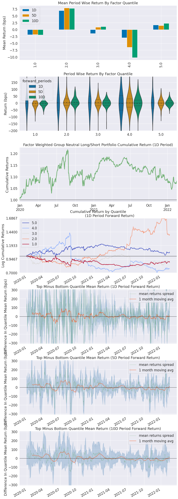
    


    
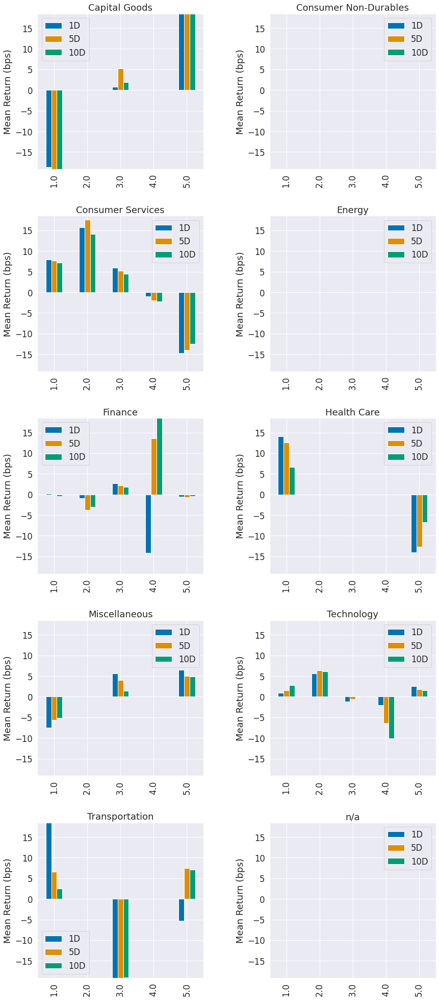
    


    Information Analysis


<div>

<table border="1" class="dataframe">
  <thead>
    <tr style="text-align: right;">
      <th></th>
      <th>1D</th>
      <th>5D</th>
      <th>10D</th>
    </tr>
  </thead>
  <tbody>
    <tr>
      <th>IC Mean</th>
      <td>-0.002</td>
      <td>0.003</td>
      <td>-0.002</td>
    </tr>
    <tr>
      <th>IC Std.</th>
      <td>0.308</td>
      <td>0.301</td>
      <td>0.301</td>
    </tr>
    <tr>
      <th>Risk-Adjusted IC</th>
      <td>-0.006</td>
      <td>0.011</td>
      <td>-0.006</td>
    </tr>
    <tr>
      <th>t-stat(IC)</th>
      <td>-0.139</td>
      <td>0.260</td>
      <td>-0.140</td>
    </tr>
    <tr>
      <th>p-value(IC)</th>
      <td>0.890</td>
      <td>0.795</td>
      <td>0.888</td>
    </tr>
    <tr>
      <th>IC Skew</th>
      <td>-0.055</td>
      <td>-0.175</td>
      <td>0.082</td>
    </tr>
    <tr>
      <th>IC Kurtosis</th>
      <td>-0.605</td>
      <td>-0.268</td>
      <td>-0.587</td>
    </tr>
  </tbody>
</table>
</div>


    
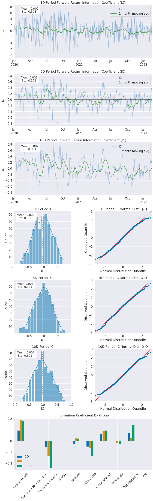
    


    /usr/local/lib/python3.8/dist-packages/alphalens/utils.py:951: UserWarning: Skipping return periods that aren't exact multiples of days.
      warnings.warn(


    Turnover Analysis


<div>

<table border="1" class="dataframe">
  <thead>
    <tr style="text-align: right;">
      <th></th>
      <th>1D</th>
      <th>5D</th>
      <th>10D</th>
    </tr>
  </thead>
  <tbody>
    <tr>
      <th>Quantile 1.0 Mean Turnover</th>
      <td>0.026</td>
      <td>0.097</td>
      <td>0.167</td>
    </tr>
    <tr>
      <th>Quantile 2.0 Mean Turnover</th>
      <td>0.055</td>
      <td>0.187</td>
      <td>0.256</td>
    </tr>
    <tr>
      <th>Quantile 3.0 Mean Turnover</th>
      <td>0.062</td>
      <td>0.220</td>
      <td>0.329</td>
    </tr>
    <tr>
      <th>Quantile 4.0 Mean Turnover</th>
      <td>0.050</td>
      <td>0.185</td>
      <td>0.274</td>
    </tr>
    <tr>
      <th>Quantile 5.0 Mean Turnover</th>
      <td>0.021</td>
      <td>0.083</td>
      <td>0.145</td>
    </tr>
  </tbody>
</table>
</div>


<div>

<table border="1" class="dataframe">
  <thead>
    <tr style="text-align: right;">
      <th></th>
      <th>1D</th>
      <th>5D</th>
      <th>10D</th>
    </tr>
  </thead>
  <tbody>
    <tr>
      <th>Mean Factor Rank Autocorrelation</th>
      <td>0.998</td>
      <td>0.99</td>
      <td>0.975</td>
    </tr>
  </tbody>
</table>
</div>


    
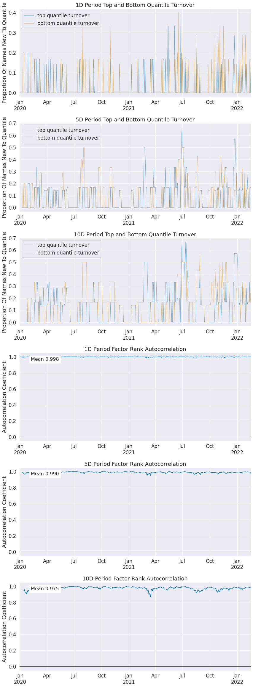
    


## Full tear sheet using Pyfolio


```python
pf_returns, pf_positions, pf_benchmark = al.performance.create_pyfolio_input(clean_factor_data,
                                                                             period='1D',
                                                                             capital=100000,
                                                                             long_short=True,
                                                                             group_neutral=False,
                                                                             equal_weight=True,
                                                                             quantiles=[1, 5],
                                                                             groups=None,
                                                                             benchmark_period='1D')

pf.tears.create_full_tear_sheet(pf_returns,
                                positions=pf_positions,
                                benchmark_rets=pf_benchmark,
                                hide_positions=True)
```

    /usr/local/lib/python3.8/dist-packages/alphalens/performance.py:421: UserWarning: 'freq' not set, using business day calendar
      warnings.warn(
    /usr/local/lib/python3.8/dist-packages/pyfolio/timeseries.py:734: FutureWarning: The default dtype for empty Series will be 'object' instead of 'float64' in a future version. Specify a dtype explicitly to silence this warning.
      stats = pd.Series()


<table border="1" class="dataframe">
  <thead>
    <tr style="text-align: right;"><th>Start date</th><td colspan=2>2019-12-30</td></tr>
    <tr style="text-align: right;"><th>End date</th><td colspan=2>2022-02-17</td></tr>
    <tr style="text-align: right;"><th>Total months</th><td colspan=2>37</td></tr>
    <tr style="text-align: right;">
      <th></th>
      <th>Backtest</th>
    </tr>
  </thead>
  <tbody>
    <tr>
      <th>Annual return</th>
      <td>1.91%</td>
    </tr>
    <tr>
      <th>Cumulative returns</th>
      <td>6.038%</td>
    </tr>
    <tr>
      <th>Annual volatility</th>
      <td>13.25%</td>
    </tr>
    <tr>
      <th>Sharpe ratio</th>
      <td>0.21</td>
    </tr>
    <tr>
      <th>Calmar ratio</th>
      <td>0.10</td>
    </tr>
    <tr>
      <th>Stability</th>
      <td>0.00</td>
    </tr>
    <tr>
      <th>Max drawdown</th>
      <td>-19.862%</td>
    </tr>
    <tr>
      <th>Omega ratio</th>
      <td>1.05</td>
    </tr>
    <tr>
      <th>Sortino ratio</th>
      <td>0.30</td>
    </tr>
    <tr>
      <th>Skew</th>
      <td>-0.30</td>
    </tr>
    <tr>
      <th>Kurtosis</th>
      <td>8.05</td>
    </tr>
    <tr>
      <th>Tail ratio</th>
      <td>1.14</td>
    </tr>
    <tr>
      <th>Daily value at risk</th>
      <td>-1.658%</td>
    </tr>
    <tr>
      <th>Gross leverage</th>
      <td>0.69</td>
    </tr>
    <tr>
      <th>Alpha</th>
      <td>0.02</td>
    </tr>
    <tr>
      <th>Beta</th>
      <td>0.04</td>
    </tr>
  </tbody>
</table>


<table border="1" class="dataframe">
  <thead>
    <tr style="text-align: right;">
      <th>Worst drawdown periods</th>
      <th>Net drawdown in %</th>
      <th>Peak date</th>
      <th>Valley date</th>
      <th>Recovery date</th>
      <th>Duration</th>
    </tr>
  </thead>
  <tbody>
    <tr>
      <th>0</th>
      <td>19.86</td>
      <td>2020-08-25</td>
      <td>2022-02-15</td>
      <td>NaT</td>
      <td>NaN</td>
    </tr>
    <tr>
      <th>1</th>
      <td>14.67</td>
      <td>2020-05-14</td>
      <td>2020-06-05</td>
      <td>2020-07-06</td>
      <td>38</td>
    </tr>
    <tr>
      <th>2</th>
      <td>5.72</td>
      <td>2020-08-03</td>
      <td>2020-08-10</td>
      <td>2020-08-17</td>
      <td>11</td>
    </tr>
    <tr>
      <th>3</th>
      <td>4.29</td>
      <td>2020-07-08</td>
      <td>2020-07-14</td>
      <td>2020-07-28</td>
      <td>15</td>
    </tr>
    <tr>
      <th>4</th>
      <td>3.06</td>
      <td>2020-03-24</td>
      <td>2020-04-08</td>
      <td>2020-04-13</td>
      <td>15</td>
    </tr>
  </tbody>
</table>


    /usr/local/lib/python3.8/dist-packages/pyfolio/plotting.py:835: FutureWarning: The default dtype for empty Series will be 'object' instead of 'float64' in a future version. Specify a dtype explicitly to silence this warning.
      oos_cum_returns = pd.Series([])
    /usr/local/lib/python3.8/dist-packages/pyfolio/plotting.py:835: FutureWarning: The default dtype for empty Series will be 'object' instead of 'float64' in a future version. Specify a dtype explicitly to silence this warning.
      oos_cum_returns = pd.Series([])
    /usr/local/lib/python3.8/dist-packages/pyfolio/plotting.py:835: FutureWarning: The default dtype for empty Series will be 'object' instead of 'float64' in a future version. Specify a dtype explicitly to silence this warning.
      oos_cum_returns = pd.Series([])
    /usr/local/lib/python3.8/dist-packages/pyfolio/timeseries.py:541: FutureWarning: The default dtype for empty Series will be 'object' instead of 'float64' in a future version. Specify a dtype explicitly to silence this warning.
      out = pd.Series(index=returns.index)
    /usr/local/lib/python3.8/dist-packages/pyfolio/timeseries.py:541: FutureWarning: The default dtype for empty Series will be 'object' instead of 'float64' in a future version. Specify a dtype explicitly to silence this warning.
      out = pd.Series(index=returns.index)
    /usr/local/lib/python3.8/dist-packages/pyfolio/timeseries.py:1258: FutureWarning: Indexing a timezone-aware DatetimeIndex with a timezone-naive datetime is deprecated and will raise KeyError in a future version. Use a timezone-aware object instead.
      period = returns_dupe.loc[start:end]


<table border="1" class="dataframe">
  <thead>
    <tr style="text-align: right;">
      <th>Stress Events</th>
      <th>mean</th>
      <th>min</th>
      <th>max</th>
    </tr>
  </thead>
  <tbody>
    <tr>
      <th>New Normal</th>
      <td>0.01%</td>
      <td>-5.12%</td>
      <td>4.22%</td>
    </tr>
  </tbody>
</table>


    /usr/local/lib/python3.8/dist-packages/pyfolio/timeseries.py:1258: FutureWarning: Indexing a timezone-aware DatetimeIndex with a timezone-naive datetime is deprecated and will raise KeyError in a future version. Use a timezone-aware object instead.
      period = returns_dupe.loc[start:end]


    
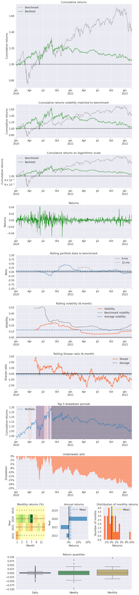
    


    
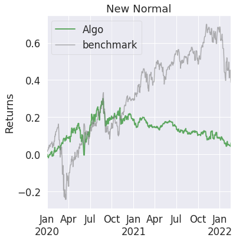
    


    
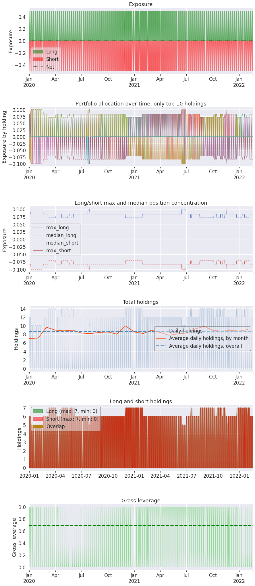
    


## A simple trading algorithm

long the top 5 stocks and short the bottom 5 stocks daily


```python
def initialize(context):
    attach_pipeline(pipeline, 'my_pipeline', chunks=1)


def rebalance(context, data):
    my_pipe = context.pipeline_data.sort_values('MyFactor', ascending=False).MyFactor
    for equity in my_pipe[:5].index:
        if equity not in context.get_open_orders():
            order_target_percent(equity, 0.2)
    for equity in my_pipe[-5:].index:
        if equity not in context.get_open_orders():
            order_target_percent(equity, -0.2)


def close_positions(context, data):
    my_pipe = context.pipeline_data.sort_values('MyFactor', ascending=False).MyFactor
    for equity in context.portfolio.positions:
        if equity not in my_pipe[:5] and equity not in my_pipe[-5:]:
            if equity not in context.get_open_orders():
                order_target(equity, 0)


def handle_data(context, data):
    pass


def before_trading_start(context, data):
    context.pipeline_data = pipeline_output('my_pipeline')
    schedule_function(rebalance, date_rules.every_day(), time_rules.market_open(minutes=10))
    schedule_function(close_positions, date_rules.every_day(), time_rules.market_open(minutes=5))
```


```python
with open('data/spy_prices.pickle', 'rb') as f:
    df = pickle.load(f)

start = pd.Timestamp(datetime(2020, 1, 2, tzinfo=pytz.UTC))
end = pd.Timestamp(datetime(2020, 12, 1, tzinfo=pytz.UTC))

df_spy = df['Close'].loc[start:end].copy()
df_spy.index = df_spy.index.tz_localize('UTC')
benchmark_rtns = df_spy.pct_change(periods=1).fillna(0)

r = run_algorithm(start,
                  end,
                  initialize=initialize,
                  capital_base=100000,
                  handle_data=handle_data,
                  benchmark_returns=benchmark_rtns,
                  bundle='alpaca_api',
                  trading_calendar=trading_calendar,
                  before_trading_start=before_trading_start,
                  data_frequency='daily')
```

    /tmp/ipykernel_72/2324462113.py:7: FutureWarning: Indexing a timezone-naive DatetimeIndex with a timezone-aware datetime is deprecated and will raise KeyError in a future version.  Use a timezone-naive object instead.
      df_spy = df['Close'].loc[start:end].copy()


```python
r.algorithm_period_return.plot(color='red')
r.benchmark_period_return.plot(color='black')
plt.legend(['Algo', 'Benchmark'])
plt.ylabel("Returns", color='black', size=25)
plt.show()
```


    
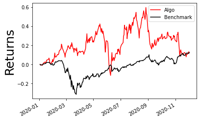
    


```python
returns, positions, transactions = pf.utils.extract_rets_pos_txn_from_zipline(r)
benchmark_returns = r.benchmark_period_return

print(f"returns sharp ratio: {empyrical.sharpe_ratio(returns):.2}")
print("beta ratio: {:.2}".format(empyrical.beta(returns, benchmark_returns)))
print("alpha ratio: {:.2}".format(empyrical.alpha(returns, benchmark_returns)))

pf.create_returns_tear_sheet(returns,
                             positions=positions,
                             transactions=transactions,
                             benchmark_rets=benchmark_returns)
```

    returns sharp ratio: 0.51
    beta ratio: -0.012
    alpha ratio: 0.24


    /usr/local/lib/python3.8/dist-packages/pyfolio/timeseries.py:734: FutureWarning: The default dtype for empty Series will be 'object' instead of 'float64' in a future version. Specify a dtype explicitly to silence this warning.
      stats = pd.Series()


<table border="1" class="dataframe">
  <thead>
    <tr style="text-align: right;"><th>Start date</th><td colspan=2>2020-01-02</td></tr>
    <tr style="text-align: right;"><th>End date</th><td colspan=2>2020-12-01</td></tr>
    <tr style="text-align: right;"><th>Total months</th><td colspan=2>11</td></tr>
    <tr style="text-align: right;">
      <th></th>
      <th>Backtest</th>
    </tr>
  </thead>
  <tbody>
    <tr>
      <th>Annual return</th>
      <td>13.321%</td>
    </tr>
    <tr>
      <th>Cumulative returns</th>
      <td>12.202%</td>
    </tr>
    <tr>
      <th>Annual volatility</th>
      <td>56.682%</td>
    </tr>
    <tr>
      <th>Sharpe ratio</th>
      <td>0.51</td>
    </tr>
    <tr>
      <th>Calmar ratio</th>
      <td>0.35</td>
    </tr>
    <tr>
      <th>Stability</th>
      <td>0.21</td>
    </tr>
    <tr>
      <th>Max drawdown</th>
      <td>-37.902%</td>
    </tr>
    <tr>
      <th>Omega ratio</th>
      <td>1.09</td>
    </tr>
    <tr>
      <th>Sortino ratio</th>
      <td>0.69</td>
    </tr>
    <tr>
      <th>Skew</th>
      <td>-0.59</td>
    </tr>
    <tr>
      <th>Kurtosis</th>
      <td>1.46</td>
    </tr>
    <tr>
      <th>Tail ratio</th>
      <td>0.94</td>
    </tr>
    <tr>
      <th>Daily value at risk</th>
      <td>-7.027%</td>
    </tr>
    <tr>
      <th>Gross leverage</th>
      <td>2.00</td>
    </tr>
    <tr>
      <th>Daily turnover</th>
      <td>8.402%</td>
    </tr>
    <tr>
      <th>Alpha</th>
      <td>0.24</td>
    </tr>
    <tr>
      <th>Beta</th>
      <td>-0.01</td>
    </tr>
  </tbody>
</table>


<table border="1" class="dataframe">
  <thead>
    <tr style="text-align: right;">
      <th>Worst drawdown periods</th>
      <th>Net drawdown in %</th>
      <th>Peak date</th>
      <th>Valley date</th>
      <th>Recovery date</th>
      <th>Duration</th>
    </tr>
  </thead>
  <tbody>
    <tr>
      <th>0</th>
      <td>37.90</td>
      <td>2020-05-15</td>
      <td>2020-06-08</td>
      <td>2020-07-27</td>
      <td>52</td>
    </tr>
    <tr>
      <th>1</th>
      <td>32.42</td>
      <td>2020-08-26</td>
      <td>2020-11-24</td>
      <td>NaT</td>
      <td>NaN</td>
    </tr>
    <tr>
      <th>2</th>
      <td>17.46</td>
      <td>2020-08-04</td>
      <td>2020-08-11</td>
      <td>2020-08-21</td>
      <td>14</td>
    </tr>
    <tr>
      <th>3</th>
      <td>11.32</td>
      <td>2020-02-19</td>
      <td>2020-02-27</td>
      <td>2020-03-13</td>
      <td>18</td>
    </tr>
    <tr>
      <th>4</th>
      <td>11.19</td>
      <td>2020-03-13</td>
      <td>2020-03-26</td>
      <td>2020-04-14</td>
      <td>23</td>
    </tr>
  </tbody>
</table>


    /usr/local/lib/python3.8/dist-packages/pyfolio/plotting.py:835: FutureWarning: The default dtype for empty Series will be 'object' instead of 'float64' in a future version. Specify a dtype explicitly to silence this warning.
      oos_cum_returns = pd.Series([])
    /usr/local/lib/python3.8/dist-packages/pyfolio/plotting.py:835: FutureWarning: The default dtype for empty Series will be 'object' instead of 'float64' in a future version. Specify a dtype explicitly to silence this warning.
      oos_cum_returns = pd.Series([])
    /usr/local/lib/python3.8/dist-packages/pyfolio/plotting.py:835: FutureWarning: The default dtype for empty Series will be 'object' instead of 'float64' in a future version. Specify a dtype explicitly to silence this warning.
      oos_cum_returns = pd.Series([])
    /usr/local/lib/python3.8/dist-packages/pyfolio/timeseries.py:541: FutureWarning: The default dtype for empty Series will be 'object' instead of 'float64' in a future version. Specify a dtype explicitly to silence this warning.
      out = pd.Series(index=returns.index)
    /usr/local/lib/python3.8/dist-packages/pyfolio/timeseries.py:541: FutureWarning: The default dtype for empty Series will be 'object' instead of 'float64' in a future version. Specify a dtype explicitly to silence this warning.
      out = pd.Series(index=returns.index)


    
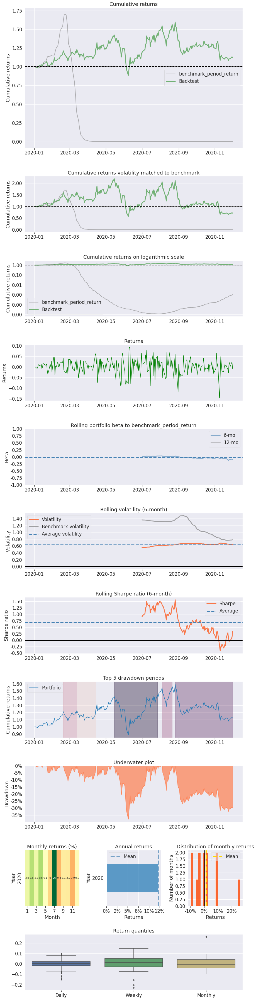
    


```python
pf.create_full_tear_sheet(returns)
```

    /usr/local/lib/python3.8/dist-packages/pyfolio/timeseries.py:734: FutureWarning: The default dtype for empty Series will be 'object' instead of 'float64' in a future version. Specify a dtype explicitly to silence this warning.
      stats = pd.Series()


<table border="1" class="dataframe">
  <thead>
    <tr style="text-align: right;"><th>Start date</th><td colspan=2>2020-01-02</td></tr>
    <tr style="text-align: right;"><th>End date</th><td colspan=2>2020-12-01</td></tr>
    <tr style="text-align: right;"><th>Total months</th><td colspan=2>11</td></tr>
    <tr style="text-align: right;">
      <th></th>
      <th>Backtest</th>
    </tr>
  </thead>
  <tbody>
    <tr>
      <th>Annual return</th>
      <td>13.321%</td>
    </tr>
    <tr>
      <th>Cumulative returns</th>
      <td>12.202%</td>
    </tr>
    <tr>
      <th>Annual volatility</th>
      <td>56.682%</td>
    </tr>
    <tr>
      <th>Sharpe ratio</th>
      <td>0.51</td>
    </tr>
    <tr>
      <th>Calmar ratio</th>
      <td>0.35</td>
    </tr>
    <tr>
      <th>Stability</th>
      <td>0.21</td>
    </tr>
    <tr>
      <th>Max drawdown</th>
      <td>-37.902%</td>
    </tr>
    <tr>
      <th>Omega ratio</th>
      <td>1.09</td>
    </tr>
    <tr>
      <th>Sortino ratio</th>
      <td>0.69</td>
    </tr>
    <tr>
      <th>Skew</th>
      <td>-0.59</td>
    </tr>
    <tr>
      <th>Kurtosis</th>
      <td>1.46</td>
    </tr>
    <tr>
      <th>Tail ratio</th>
      <td>0.94</td>
    </tr>
    <tr>
      <th>Daily value at risk</th>
      <td>-7.027%</td>
    </tr>
  </tbody>
</table>


<table border="1" class="dataframe">
  <thead>
    <tr style="text-align: right;">
      <th>Worst drawdown periods</th>
      <th>Net drawdown in %</th>
      <th>Peak date</th>
      <th>Valley date</th>
      <th>Recovery date</th>
      <th>Duration</th>
    </tr>
  </thead>
  <tbody>
    <tr>
      <th>0</th>
      <td>37.90</td>
      <td>2020-05-15</td>
      <td>2020-06-08</td>
      <td>2020-07-27</td>
      <td>52</td>
    </tr>
    <tr>
      <th>1</th>
      <td>32.42</td>
      <td>2020-08-26</td>
      <td>2020-11-24</td>
      <td>NaT</td>
      <td>NaN</td>
    </tr>
    <tr>
      <th>2</th>
      <td>17.46</td>
      <td>2020-08-04</td>
      <td>2020-08-11</td>
      <td>2020-08-21</td>
      <td>14</td>
    </tr>
    <tr>
      <th>3</th>
      <td>11.32</td>
      <td>2020-02-19</td>
      <td>2020-02-27</td>
      <td>2020-03-13</td>
      <td>18</td>
    </tr>
    <tr>
      <th>4</th>
      <td>11.19</td>
      <td>2020-03-13</td>
      <td>2020-03-26</td>
      <td>2020-04-14</td>
      <td>23</td>
    </tr>
  </tbody>
</table>


    /usr/local/lib/python3.8/dist-packages/pyfolio/plotting.py:835: FutureWarning: The default dtype for empty Series will be 'object' instead of 'float64' in a future version. Specify a dtype explicitly to silence this warning.
      oos_cum_returns = pd.Series([])
    /usr/local/lib/python3.8/dist-packages/pyfolio/plotting.py:835: FutureWarning: The default dtype for empty Series will be 'object' instead of 'float64' in a future version. Specify a dtype explicitly to silence this warning.
      oos_cum_returns = pd.Series([])
    /usr/local/lib/python3.8/dist-packages/pyfolio/plotting.py:835: FutureWarning: The default dtype for empty Series will be 'object' instead of 'float64' in a future version. Specify a dtype explicitly to silence this warning.
      oos_cum_returns = pd.Series([])
    /usr/local/lib/python3.8/dist-packages/pyfolio/timeseries.py:1258: FutureWarning: Indexing a timezone-aware DatetimeIndex with a timezone-naive datetime is deprecated and will raise KeyError in a future version. Use a timezone-aware object instead.
      period = returns_dupe.loc[start:end]


<table border="1" class="dataframe">
  <thead>
    <tr style="text-align: right;">
      <th>Stress Events</th>
      <th>mean</th>
      <th>min</th>
      <th>max</th>
    </tr>
  </thead>
  <tbody>
    <tr>
      <th>New Normal</th>
      <td>0.11%</td>
      <td>-14.76%</td>
      <td>9.31%</td>
    </tr>
  </tbody>
</table>


    
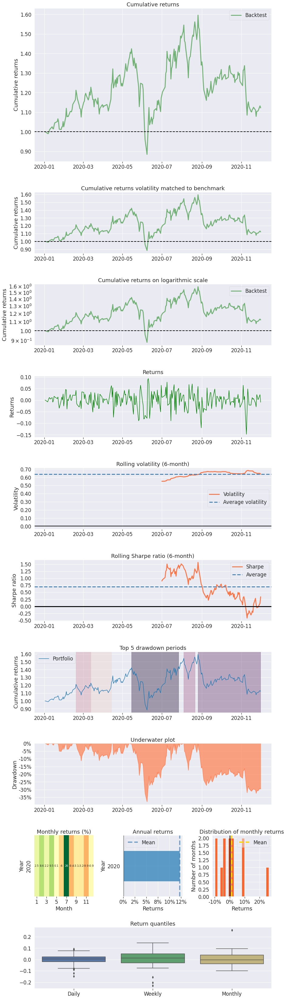
    


    
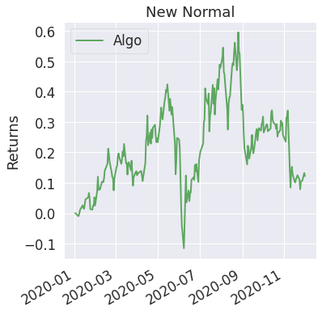
    

