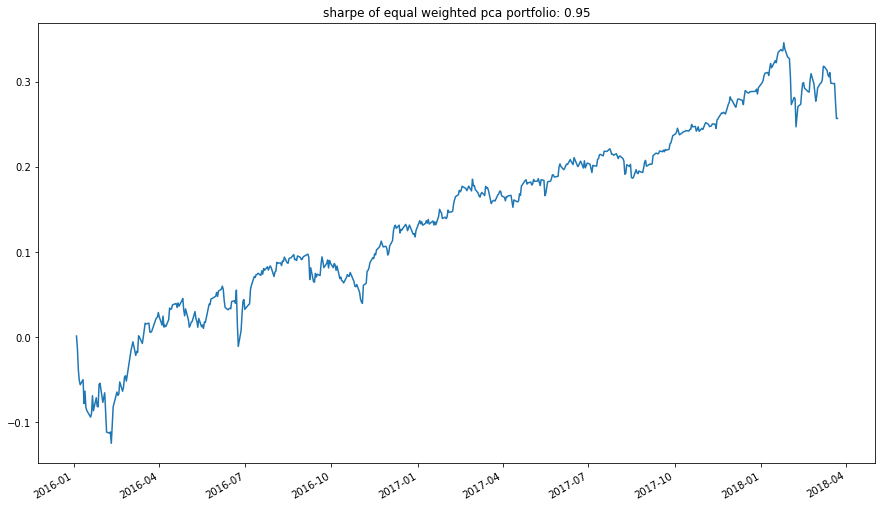
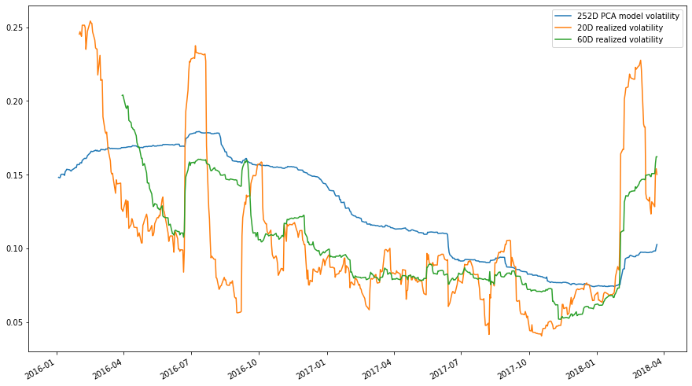
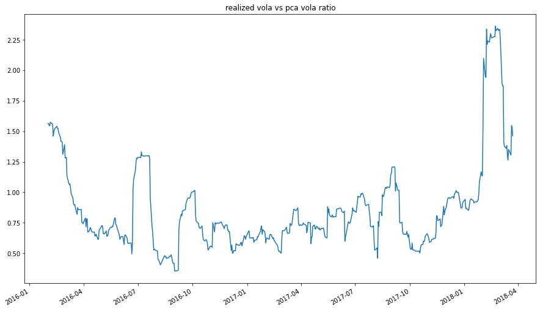

# PCA Risk Model

* constructed using zipline data bundle and numpy linalg module
* uses the numpy eig method to get the eigenvectors instead of the pca svd method


```python
import os
import numpy as np
import pandas as pd
import matplotlib.pyplot as plt

from zipline.utils.calendar_utils import get_calendar
from zipline.data.bundles import register
from zipline.data import bundles
from zipline.data.data_portal import DataPortal
from tqdm import tqdm

from mltrade.risk_model.utils import calculate_risk_model, calculate_risk
from mltrade.utils import get_prices
```


```python
!pip install tqdm
```

    Collecting tqdm
      Downloading tqdm-4.64.0-py2.py3-none-any.whl (78 kB)
         |████████████████████████████████| 78 kB 1.1 MB/s             
    [?25hInstalling collected packages: tqdm
    Successfully installed tqdm-4.64.0
    WARNING: Running pip as the 'root' user can result in broken permissions and conflicting behaviour with the system package manager. It is recommended to use a virtual environment instead: https://pip.pypa.io/warnings/venv
    WARNING: You are using pip version 21.3.1; however, version 22.1.2 is available.
    You should consider upgrading via the '/usr/bin/python3 -m pip install --upgrade pip' command.


```python
!pip install pyarrow
```

    Collecting pyarrow
      Downloading pyarrow-8.0.0-cp38-cp38-manylinux_2_17_x86_64.manylinux2014_x86_64.whl (29.4 MB)
         |████████████████████████████████| 29.4 MB 5.0 MB/s             
    [?25hRequirement already satisfied: numpy>=1.16.6 in /usr/local/lib/python3.8/dist-packages (from pyarrow) (1.22.3)
    Installing collected packages: pyarrow
    Successfully installed pyarrow-8.0.0
    WARNING: Running pip as the 'root' user can result in broken permissions and conflicting behaviour with the system package manager. It is recommended to use a virtual environment instead: https://pip.pypa.io/warnings/venv
    WARNING: You are using pip version 21.3.1; however, version 22.1.2 is available.
    You should consider upgrading via the '/usr/bin/python3 -m pip install --upgrade pip' command.


```python
plt.rcParams["figure.figsize"] = (15, 9)
data_dir = '../mltrade_data'
os.environ['ZIPLINE_ROOT'] = os.path.join('/app/.zipline')
```


```python
sp500_data = pd.read_pickle(f'{data_dir}/sp500_table.pkl')
sp500_tickers = sp500_data['Symbol'].tolist()
sp500_tickers[0:10]
```


    ['MMM', 'AOS', 'ABT', 'ABBV', 'ABMD', 'ACN', 'ATVI', 'ADM', 'ADBE', 'ADP']


### Get sp500 ticker prices from zipline bundle


```python
start_date = pd.Timestamp('2015-01-02', tz='utc')
end_date = pd.Timestamp('2018-03-23', tz='utc')
prices = get_prices('csvdir-wiki', 'NYSE', sp500_tickers, start_date, end_date)
prices.index = [t.tz_convert(tz=None) for t in prices.index]
prices.columns = [x.symbol for x in prices.columns]
```

    /app/src/mltrade/utils.py:131: UserWarning: Overwriting bundle with name 'csvdir-wiki'
      register(


```python
prices.drop(prices[prices['A'].isna()].index, axis=0, inplace=True)
```


```python
lookback_window = 1 * 252
returns = prices.apply(np.log).diff(1).fillna(0)
dates = returns.index[lookback_window:]
```

### Load the basic factor model data


```python
factor_covariances = pd.read_parquet(f'{data_dir}/risk_model/factor_covariances.parquet')
factor_exposures = pd.read_parquet(f'{data_dir}/risk_model/factor_exposures.parquet')
residual_vols = pd.read_parquet(f'{data_dir}/risk_model/residual_vols.parquet')
```

### Calculate equal weights for the tickers


```python
backtest_dates = sorted(residual_vols.index.get_level_values(0).unique())
weights = pd.DataFrame(False, index=returns.index, columns=returns.columns)
for date in tqdm(backtest_dates):
    weights.loc[date, residual_vols.loc[date, :].index] = True
```

    100%|█████████████████████████████████████████████████████████████████████████████████████████████████████████████████████████████████████████████████████████████████████| 559/559 [00:00<00:00, 894.63it/s]


```python
weights = weights.astype(int)
weights = weights.div(weights.sum(axis=1), axis=0).replace(0, np.nan)
```

### Plot cumulative returns based on weights


```python
rets = (weights * returns.shift(-1)).sum(axis=1).loc[backtest_dates]
realized_vol_20 = rets.rolling(20).std()
realized_vol_40 = rets.rolling(40).std()
realized_vol_60 = rets.rolling(60).std()
print(f'20d realized vol, {realized_vol_20 * np.sqrt(252)}')
rets.cumsum().plot(title=f"sharpe of equal weighted pca portfolio: {round(rets.mean() * np.sqrt(252) / rets.std(), 2)}")
plt.show()
```

    20d realized vol, 2016-01-04         NaN
    2016-01-05         NaN
    2016-01-06         NaN
    2016-01-07         NaN
    2016-01-08         NaN
                    ...   
    2018-03-19    0.129374
    2018-03-20    0.128255
    2018-03-21    0.152030
    2018-03-22    0.154000
    2018-03-23    0.150126
    Length: 559, dtype: float64


    

    


### Calculate risk based on model factors and betas


```python
pca_risk = calculate_risk(backtest_dates, weights, factor_exposures, factor_covariances, residual_vols)
(pca_risk * np.sqrt(252)).plot(label='252D PCA model volatility')
(realized_vol_20 * np.sqrt(252)).plot(label='20D realized volatility')
(realized_vol_60 * np.sqrt(252)).plot(label='60D realized volatility')
plt.legend()
plt.show()
```

    100%|█████████████████████████████████████████████████████████████████████████████████████████████████████████████████████████████████████████████████████████████████████| 559/559 [00:04<00:00, 112.30it/s]


    

    


### Take a look at the ratio between realized volatility and pca volatility


```python
(realized_vol_20 / pca_risk).plot(title='realized vola vs pca vola ratio')
plt.show()
```


    

    


```python
avg_vol_ratio = round((realized_vol_20 / pca_risk).mean(), 2)
print(avg_vol_ratio)
```

    0.86


```python

```
